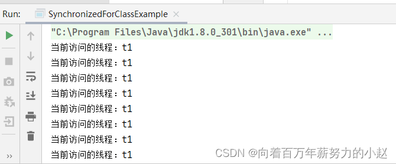
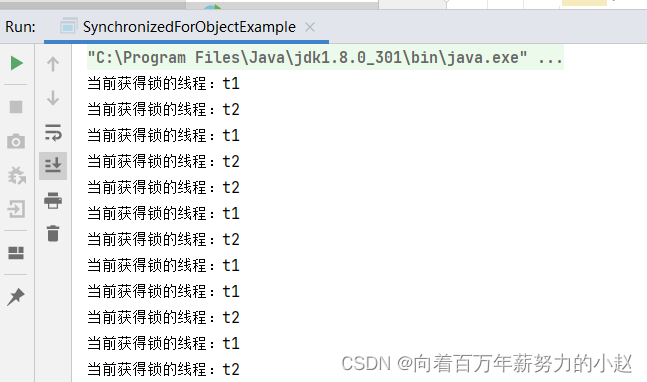

 我们对一个方法 **增加Synchronized关键字后，当多个线程访问该方法时，整个执行过程会变成串行执行**，这种执行方式很明显会影响程序的性能，那么如何做好安全性及性能的平衡呢？
  实际上，Synchronized关键字只需保护可能存在线程安全问题的代码，因此，我们可以通过控制同步锁的作用范围来实现这个平衡机制。在Synchronized中，提供两种锁，一是类锁，二是对象锁。

# 类锁

  类锁是全局锁，当多个线程调用不同对象实例的同步方法时会产生互斥，具体实现方式如下。

## 修饰静态方法

```java
    public static synchronized void m1(){
        //省略业务代码
    }

```

## 修饰代码块

synchronized 中的锁对象是类，也就是Lock.class

```java
public class Lock {
    public void m2(){
        synchronized (Lock.class){
            //省略业务代码
        }
    }
}

```

## 实战演练

下面这段程序使用类锁来实现跨对象实例，从而实现互斥的功能。

```java
public class SynchronizedForClassExample {

    public void m1() {
        synchronized(SynchronizedForClassExample.class) {
            while (true) {
                System.out.println("当前访问的线程：" + Thread.currentThread().getName());
                try {
                    Thread.sleep(1000);
                } catch (InterruptedException e) {
                    e.printStackTrace();
                }
            }
        }
    }
    public static void main(String[] args) {
        SynchronizedForClassExample se1=new SynchronizedForClassExample();
        SynchronizedForClassExample se2=new SynchronizedForClassExample();
        new Thread(()->se1.m1(),"t1").start();
        new Thread(()->se2.m1(),"t2").start();
    }
}

```

- 该程序定义了一个m1()方法，该方法中实现了一个循环打印当前线程名称的逻辑，并且这段逻辑是用类锁来保护的。
- 在main()方法中定义了两个SynchronizedForClassExample对象实例se1和se2，又分别定义了两个线程来调用这两个实例的m1()方法。

根据类锁的作用范围可以指导，即便是多个对象实例，也能够达到互斥的目的，因此最终输出的结果是：那个线程抢到了锁，哪个线程就持续打印自己的线程名字。


# 对象锁

对象锁是实例锁，当多个线程调用同一个对象实例的同步方法时会产生互斥，具体实现方式如下。

## 修饰普通方法

```java
    public synchronized void m1(){
        //省略业务代码
    }

```

## 修饰代码块

synchronized 的锁对象是普通对象实例

```java
public class Lock {
    Object lock = new Lock();
    public void m2(){
        synchronized (lock){
            //省略业务代码
        }
    }
}

```

## 实战演练

下面这段程序演示了对象锁的使用方法，代码如下。

```java
public class SynchronizedForObjectExample {
    static Object lock=new Object();
    public void m1(){
        synchronized (lock){
            while(true){
                System.out.println("当前获得锁的线程："+Thread.currentThread().getName());
                try {
                    Thread.sleep(1000);
                } catch (InterruptedException e) {
                    e.printStackTrace();
                }
            }
        }
    }

    public static void main(String[] args) {
        SynchronizedForObjectExample se1=new SynchronizedForObjectExample();
        SynchronizedForObjectExample se2=new SynchronizedForObjectExample();
        new Thread(()->se1.m1(),"t1").start();
        new Thread(()->se2.m1(),"t2").start();
    }

}

```

我们先看一下执行结果：


# 分析

  从以上结果中我们发现，对于几乎相同的代码，在使用对象锁的情况下，当两个线程分别访问两个不同对象实例的m1()方法时，并没有达到两者互斥的目的，看起来好像锁没有生效，实际上并不是锁没有生效，问题的根源在于synchronized (lock)中锁对象lock的作用范围过小。
  Class是在JVM启动过程中加载的，每个.class文件被装载后会产生一个Class对象，Class对象在JVM进程中是全局唯一的。通过static修饰的成员对象及方法的生命周期都属于类级别，他们会随着类的定义被分配和装载到内存，随着类被卸载而回收。
  实例对象的生命周期伴随着实例对象的创建而开始，同时伴随着实例对象的回收而结束。
  因此，类锁和对象锁最大的区别就是锁对象lock的生命周期不同，如果要达到多个线程互斥，那么多个线程必须要竞争同一个锁。
  在上诉代码中，通过 `Object lock=new Object();`构建的锁对象的生命周期是由`SynchronizedForObjectExample` 对象的实例来决定的，不同的`SynchronizedForObjectExample` 实例会有不同的lock锁对象，由于没有形成竞争，所以不会实现互斥的效果。
  如果想要让上诉程序达到同步的目的，那么我们可以对lock锁对象增加`static`关键字

```java
static Object lock=new Object();//增加`static`关键字
```