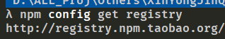
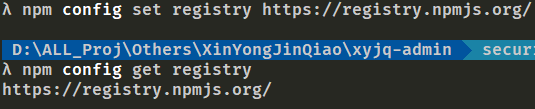
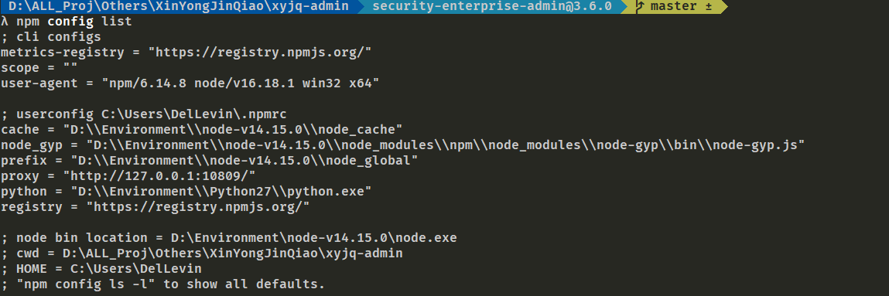

##  cb() never called!的解决办法

```bash
npm ERR! cb() never called!

npm ERR! This is an error with npm itself. Please report this error at:

npm ERR!     <https://npm.community>

npm ERR! A complete log of this run can be found in:

npm ERR!     /Users/geekchief/.npm/_logs/2021-07-12T06_56_29_399Z-debug.log
```

github的issue的讨论：https://github.com/npm/cli/issues/417

错误的意思是，npm程序执行到未知流程节点中然后没有调用回调通知任务已执行完成，导致进程异常退出，据官方说法他们也没有太好的方式解决，不过网上的东西大多数不靠谱，但是有挺多人用的淘宝源，出这个错误的概率会大大提高。


先尝试清楚npm缓存再安装试试

`npm cache clean -force`

然后

`npm install`

不过这个办法多数时候不管用

造成这个办法的情况是使用的淘宝的源，建议换回官方的源，然后再次安装

**查看是什么源**

```bash
npm config get registry
```



淘宝的源，好的，果断替换

**换回官方源**

```bash
npm config set registry https://registry.npmjs.org/
```

再次查看



替换成功了，多数时候下载会失败或者很慢，这就需要我们科学上网了，设置npm代理的端口。

```bash
npm config set proxy=http://127.0.0.1:10809
```

然后如果想查看npm配置的话可以使用这个命令查看`npm config list`



再次`npm install`安装就会成功了


