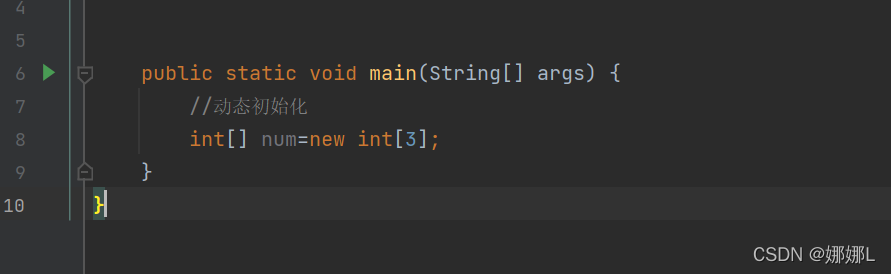
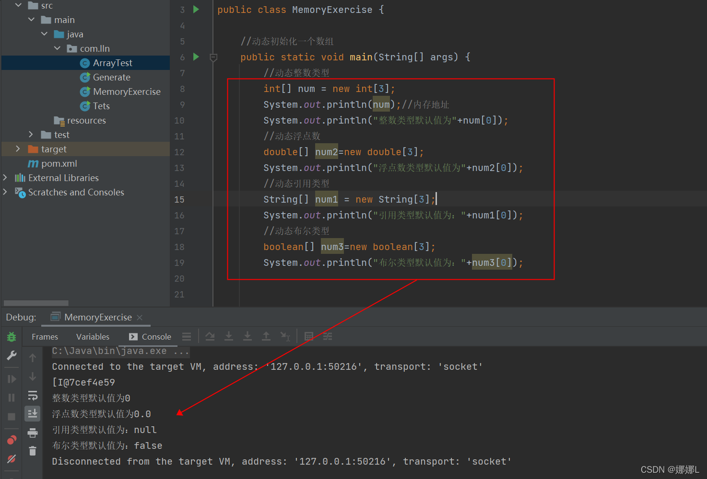
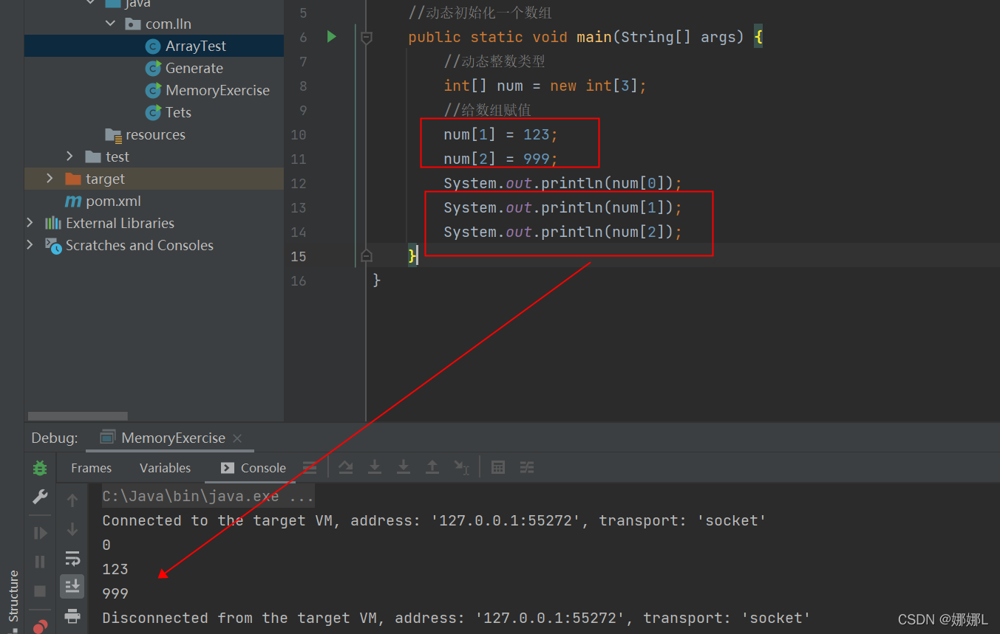
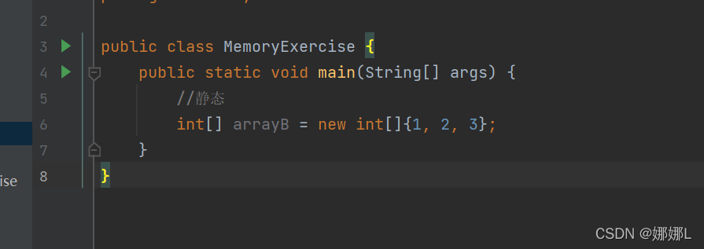
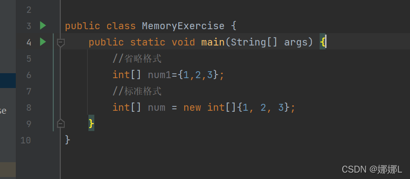
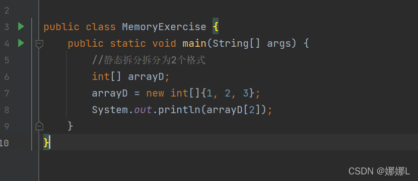

简述：

1.[数组](https://so.csdn.net/so/search?q=数组&spm=1001.2101.3001.7020)是指有序的元素序列。如果将有限个类型相同的变量的集合命名，那么这个名称就是数组名，而组成数组的各个变量称为数组的分量，也称为数组的元素，有时也称为下标变量。

 \* 数组是一个引用类型

 \* 数组当中的多个数据类型必须统一

 \* 数组长度在程序运行中不可改变

2.数组的初始化：在内存当中创建一个数组，并且向其中赋值一些默认值

3.解析含义：

  左侧数据类型：也就是数组当做保存的数据：全是统一类型

  左侧的中括号：代表我是一个数组 

  左侧数组名称：给数组取一个名字

  右侧的new：代表创建数组的动作 

  右侧的数据类型：必须和左侧的数据类型保持一致 

  右侧中括号的长度，也就是数组当中，到底可以保存多少个数据，是一个int数字

4.两种常见的初始化方式：

  1.动态初始化（指定长度）

  2.静态初始化（指定内容）

 \* 动态初始化:指定长度：在创建数组时候 直接指定数组当中的数据元素个数  

 \* 静态初始化:指定长度：在创建数组的时候，不直接指定数据个数多少，而是直接将具体数据内容进行指定

5.动态初始化数组的格式：

  数据类型[] 数组名称 =new 数据类型【数组长度】;

例：

 6.使用动态数组初始化数组时候，其中的元素将会自动拥有一个默认值：

  \* 如果是整数类型：那么默认为0；

  \* 如果是浮点数类型：那么默认为0.0;

  \* 如果是布尔类型：那么默认为false；

  \* 如果是引用类型：那么默认为null；

例:

 给动态初始化数组赋值：

7.静态初始化数组的格式：

  静态类型[ ] 数组名称=new 数据类型 [ ] {元素1，元素2.。。。};

例：

8.使用静态初始化数组时候:标准格式和省略格式：

 标准格式：  

   数据类型[ ] 数组名称=new 数据类型[ ] {元素1，元素2.。。};  

 省略格式： 

  数据类型[ ] 数组名称={元素1.元素2，元素3.。。};

注意事项：    

 1.静态初始没有指定长度 但是会自动计算长度    

 2.静态初始化标准格式可以拆分为2个格式 

例：

