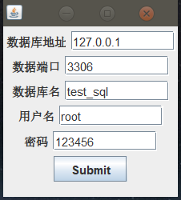
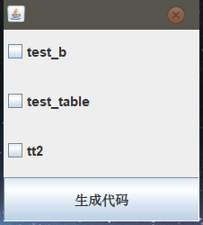
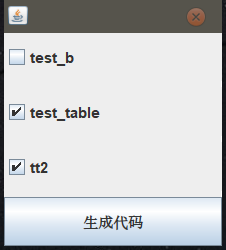

## mybatisPlus的代码生成器GUI

今天写了个mybatisPlus代码生成器的GUI

主要办法就是通过填入地址，端口号，数据库名，用户名，密码这些数据来扫描 输入数据库 内的所有表，并弹出窗口展示，选择对应表名之后，点击生成代码，就可以生成对应的代码。

### 界面展示

填入地址




表名查看



选择表名




弹出窗口


生成代码


### **runGUI**  swing界面

```java
package com.wonder.run;


import java.awt.*;
import java.awt.event.*;
import java.util.ArrayList;
import java.util.List;
import javax.swing.*;

public class runGui extends JFrame implements ActionListener
{

    JLabel labelData  = new JLabel("", JLabel.CENTER);
    JTextField textFieldData;
    JLabel labelUrl  = new JLabel("", JLabel.CENTER);
    JTextField textFieldUrl;
    JLabel labelPort  = new JLabel("", JLabel.CENTER);
    JTextField JTextFieldPort;
    JLabel labelUserName  = new JLabel("", JLabel.CENTER);
    JTextField JTextFieldPortUsername;
    JLabel labelPassword  = new JLabel("", JLabel.CENTER);
    JTextField JTextFieldPortPassword;
    JButton submitButton = new JButton("Submit");

    public runGui()
    {
        JPanel myPanel = new JPanel();
        add(myPanel);
        textFieldUrl  =new JTextField(10);
        JTextFieldPort=new JTextField(10);
        textFieldData = new JTextField(10);
        JTextFieldPortUsername = new JTextField(10);
        JTextFieldPortPassword = new JTextField(10);

        labelUrl.setText("数据库地址");
        myPanel.add(labelUrl);
        textFieldUrl.setText("127.0.0.1");
        myPanel.add(textFieldUrl);

        labelPort.setText("数据端口");
        myPanel.add(labelPort);
        JTextFieldPort.setText("3306");
        myPanel.add(JTextFieldPort);

        labelData.setText("数据库名");
        myPanel.add(labelData);
        textFieldData.setText("test_sql");
        myPanel.add(textFieldData);

        labelUserName.setText("用户名");
        myPanel.add(labelUserName);
        JTextFieldPortUsername.setText("root");
        myPanel.add(JTextFieldPortUsername);

        labelPassword.setText("密码");
        myPanel.add(labelPassword);
        JTextFieldPortPassword.setText("123456");
        myPanel.add(JTextFieldPortPassword);

        myPanel.add(submitButton);
        submitButton.addActionListener(this);


    }

    public void actionPerformed(ActionEvent actionEvent)
    {
        JDialog frame = new JDialog();//构造一个新的JFrame，作为新窗口。
        frame.setBounds(// 让新窗口与SwingTest窗口示例错开50像素。
                new Rectangle(
                        (int) this.getBounds().getX() + 50,
                        (int) this.getBounds().getY() + 50,
                        (int) this.getBounds().getWidth(),
                        (int) this.getBounds().getHeight()
                )
        );

        if (actionEvent.getSource() == submitButton) {
            String url = textFieldUrl.getText();
            String port = JTextFieldPort.getText();
            String data = textFieldData.getText();
            String username = JTextFieldPortUsername.getText();
            String password = JTextFieldPortPassword.getText();
            DatebaseTable datebaseTable = new DatebaseTable();
            try {
                List<String> resList = datebaseTable.tableName(data,url,port,username,password);
                //System.out.println(resList.size());
                if(resList.size() ==0){
                    System.out.println("没有这个数据库");
                    JOptionPane.showMessageDialog(null,"没有这个数据库！","没有这个数据库！",JOptionPane.WARNING_MESSAGE);	//消息对话框
                }else {
                    frame.setLayout(new BorderLayout());
                    frame.setLayout(new GridLayout(4,4,5,5));
                    JCheckBox[] boxs = new JCheckBox[resList.size()];// 创建控件数组
                      for (int i = 0; i < resList.size(); i++) {
                          //System.out.println(resList.get(i));
                          boxs[i] = new JCheckBox (resList.get(i));// 初始化数组中的复选框组件
                          frame.add(boxs[i]);
                      }
                    JButton submitButtonCode = new JButton("生成代码");
                    frame.add(submitButtonCode);
                    submitButtonCode.addActionListener(new ActionListener(){// 增加监听动作
                        public void actionPerformed(ActionEvent e){// 满足 动作 事件 的选择后触发以下事件
                            //System.out.println(e.getSource());
                            List<String> addList=new ArrayList<String>();
                            for (int i = 0; i <boxs.length ; i++) {
                                //System.out.println(boxs[i].getText() + " 是否选中: " + boxs[i].isSelected());
                                if(boxs[i].isSelected()){
                                    //System.out.println(boxs[i].getText());
                                    addList.add(boxs[i].getText());
                                }
                            }
                            System.out.println(addList);
                            if (addList.size()==0) {
                                System.out.println("没有这个数据库");
                                JOptionPane.showMessageDialog(null,"哥，你还没有选表。。。","你还没有选表！",JOptionPane.WARNING_MESSAGE);	//消息对话框
                            }else {
                                CodeGenerator.makeCoder(url+":"+port+"/"+data,username,password,addList);
                                JOptionPane.showMessageDialog(frame,"代码已经生成，关闭gui窗口查看");
                                frame.setVisible(false);
                            }

                        }
                    });
                    frame.setModalityType(Dialog.ModalityType.APPLICATION_MODAL);    // 设置模式类型。
                    frame.setVisible(true);
                }
            } catch (Exception e) {
                throw new RuntimeException(e);
            }

        }
    }


    public static void main(String args[])
    {
        runGui g = new runGui();
        g.setLocation(200, 250);
        g.setSize(181, 200);
        g.setVisible(true);
    }
}
```

### **DatebaseTable**  扫描某数据库的表类

```java
package com.wonder.run;

import java.sql.*;
import java.util.*;


public class DatebaseTable {
    public List<String> tableName(String datasourceName,String url,String port,String username ,String password) throws Exception {
        Class.forName("com.mysql.cj.jdbc.Driver");
        Connection conn = DriverManager.getConnection("jdbc:mysql://"+url+":"+port+"", username, password);
        DatabaseMetaData metadata = conn.getMetaData();
        //System.out.println("获取指定的数据库的所有表的类型");
        ResultSet rs1 = metadata.getTables(datasourceName, null, null, null);
        List<String> listTables = new ArrayList<>();
        //int count = 1;
        while (rs1.next()) {
            System.out.println();
            listTables.add(rs1.getString(3));
            //count++;
        }
//        System.out.println(count);
//        for(String value: setTables){
//            System.out.println(value);
//        }
        return  listTables;
    }
    public static void main(String[] args) throws ClassNotFoundException, SQLException {
        Class.forName("com.mysql.cj.jdbc.Driver");
        Connection conn = DriverManager.getConnection("jdbc:mysql://localhost:3306", "root", "123456");
        DatabaseMetaData metadata = conn.getMetaData();
        /**
         * 获取指定的数据库的所有表的类型,getTables()的第一个参数就是数据库名
         * 因为与MySQL连接时没有指定,这里加上,剩下的参数就可以为null了
         * 第二个参数是模式名称的模式,但是输出也是什么都没有。谁知道告诉我一声
         */
        //System.out.println("获取指定的数据库的所有表的类型");
        ResultSet rs1 = metadata.getTables("test_sql", null, null, null);
        //Map<String, String> map = new HashMap<String, String>();
        Set<String> setTables = new HashSet<String>();
        int count = 0;
        while (rs1.next()) {
            System.out.println();
            //map.put(rs1.getString(1)+"/"+count , rs1.getString(3));
            //System.out.println("数据库名:" + rs1.getString(1));
            //System.out.println("表名: " + rs1.getString(3));
            setTables.add(rs1.getString(3));
            count++;
        }
        System.out.println(count);
        for(String value: setTables){
            System.out.println(value);
        }
//        map.forEach((key, value) -> {
//            System.out.println(key + ":" + value);
//        });
        rs1.close();
        //showTables(conn);
    }

    private static void showTables(Connection conn) throws SQLException {
        ResultSet rs;// 获取数据库表
        System.out.println(">>>>>>>>>>>>>>>>>>>数据库表");
        DatabaseMetaData meta = conn.getMetaData();
        rs = meta.getTables(null, null, null,
                new String[]{"TABLE"});
        int count = rs.getMetaData().getColumnCount();
        ResultSetMetaData rsmd = rs.getMetaData();
        for (int i = 1; i <= count; i++) {
            System.out.print(String.format("%1$20s", rsmd.getColumnName(i)));
        }
        System.out.println();
        int j = 20 * count;
        while (j > 0) {
            System.out.print("-");
            j--;
        }
        System.out.println();
        while (rs.next()) {
            for (int i = 1; i <= count; i++) {
                System.out.print(String.format("%20s", rs.getString(i)));
            }
            System.out.println();
        }
    }
}
```


### **CodeGenerator** 代码生成器类

```java
package com.wonder.run;


import com.baomidou.mybatisplus.annotation.FieldFill;
import com.baomidou.mybatisplus.annotation.IdType;
import com.baomidou.mybatisplus.core.mapper.BaseMapper;
import com.baomidou.mybatisplus.generator.FastAutoGenerator;
import com.baomidou.mybatisplus.generator.config.OutputFile;
import com.baomidou.mybatisplus.generator.config.rules.DateType;
import com.baomidou.mybatisplus.generator.config.rules.NamingStrategy;
import com.baomidou.mybatisplus.generator.engine.FreemarkerTemplateEngine;
import com.baomidou.mybatisplus.generator.engine.VelocityTemplateEngine;
import com.baomidou.mybatisplus.generator.fill.Column;
import java.util.Arrays;
import java.util.Collections;
import java.util.List;

public class CodeGenerator {
    public static void makeCoder(String op, String name, String password, List<String> listTable) {
    //public static void main(String[] args) {

        //数据库地址，数据库用户 ，数据库密码
        //String op = "localhost:3306/test_sql";
        //String name="root";
        //String password="123456";
        //添加需要生成的数据表
        //List<String> listTable = Arrays.asList("test_table","tt2","test_b");  //设置需要自动代码生成的表名

        //基本信息
        String author = "DelLevin";    //作者
        String parent = "com";   //父包名
        String module = "wonder";   //模块包名


        String url="jdbc:mysql://"+ op +"?serverTimezone=UTC&useUnicode=true&characterEncoding=utf-8";
        //List<String> listTableSuffix = Arrays.asList("_b");    //设置 过滤 表的后缀
        //List<String> listTablePrefix = Arrays.asList("t_","c_"); //设置 过滤 表的前缀
        //已封装好，无需更改。可按照需求进行注释
        //1、配置数据源
        FastAutoGenerator.create(url, name, password)
                //2、全局配置
                .globalConfig(builder -> {
                    builder.author(author) // 设置作者名
                            .outputDir(System.getProperty("user.dir") + "/src/main/java")   //设置输出路径：项目的 java 目录下【System.getProperty("user.dir")意思是获取到项目所在的绝对路径】
                            .commentDate("yyyy-MM-dd hh:mm:ss")   //注释日期
                            .dateType(DateType.ONLY_DATE)   //定义生成的实体类中日期的类型 TIME_PACK=LocalDateTime;ONLY_DATE=Date;
                            .fileOverride()   //覆盖之前的文件
                            .enableSwagger()   //开启 swagger 模式
                            .disableOpenDir();   //禁止打开输出目录，默认打开
                })
                //3、包配置
                .packageConfig(builder -> {
                    builder.parent(parent) // 设置父包名
                            .moduleName(module)   //设置模块包名
                            .entity("entity")   //pojo 实体类包名
                            .service("service") //Service 包名
                            .serviceImpl("service.impl") // ***ServiceImpl 包名
                            .mapper("mapper")   //Mapper 包名
                            .xml("mapper.xml")  //Mapper XML 包名
                            .controller("controller") //Controller 包名
                            .other("config")    //自定义包名(一般不在这里生成，而是后面编写的时候自己建包）
                            .pathInfo(Collections.singletonMap(OutputFile.mapper.xml, System.getProperty("user.dir")+"/src/main/resources/mapper"));    //配置 mapper.xml 路径信息：项目的 resources 目录下
                })
                //4、策略配置
                .strategyConfig(builder -> {
                    builder
                            .enableCapitalMode()    //开启大写命名
                            .enableSkipView()   //创建实体类的时候跳过视图
                            .addInclude(listTable) // 设置需要生成的数据表名
                            //.addTableSuffix(listTableSuffix) //设置 过滤 表的后缀
                            //.addTablePrefix(listTablePrefix) // 设置 过滤 表的前缀

                            //4.1、实体类策略配置
                            .entityBuilder()
                            .enableChainModel() //开启链式模型
                            //.disableSerialVersionUID()  //默认是开启实体类序列化，可以手动disable使它不序列化。由于项目中需要使用序列化就按照默认开启了
                            .enableTableFieldAnnotation()       // 开启生成实体时生成字段注解
                            .enableLombok() //开启 Lombok
                            .versionColumnName("version")   //乐观锁字段名(数据库)
                            .versionPropertyName("version") //乐观锁属性名(实体)
                            .logicDeleteColumnName("deleted")   //逻辑删除字段名(数据库)
                            .logicDeletePropertyName("deleteFlag")  //逻辑删除属性名(实体)
                            .naming(NamingStrategy.underline_to_camel)  //数据库表映射到实体的命名策略：默认是下划线转驼峰命。这里可以不设置
                            .columnNaming(NamingStrategy.underline_to_camel)    //数据库表字段映射到实体的命名策略：下划线转驼峰命。（默认是和naming一致，所以也可以不设置）
                            .addTableFills(
                                    new Column("create_time", FieldFill.INSERT),
                                    new Column("modify_time", FieldFill.INSERT_UPDATE)
                            )   //添加表字段填充，"create_time"字段自动填充为插入时间，"modify_time"字段自动填充为插入修改时间
                            .idType(IdType.AUTO)    //设置主键自增

                            //4.2、Controller策略配置
                            .controllerBuilder()
                            .enableHyphenStyle()    //开启驼峰连转字符
                            .formatFileName("%sController") //格式化 Controller 类文件名称，%s进行匹配表名，如 UserController
                            .enableRestStyle()  //开启生成 @RestController 控制器

                            //4.3、service 策略配置
                            .serviceBuilder()
                            .formatServiceFileName("%sService") //格式化 service 接口文件名称，%s进行匹配表名，如 UserService
                            .formatServiceImplFileName("%sServiceImpl") //格式化 service 实现类文件名称，%s进行匹配表名，如 UserServiceImpl

                            //4.4、Mapper策略配置
                            .mapperBuilder()
                            .superClass(BaseMapper.class)   //设置父类
                            .enableBaseResultMap()  //启用 BaseResultMap 生成
                            .enableBaseColumnList() //启用 BaseColumnList
                            .formatMapperFileName("%sMapper")   //格式化 mapper 文件名称
                            .enableMapperAnnotation()       //开启 @Mapper 注解
                            .formatXmlFileName("%sXml") //格式化Xml文件名称
                            .formatMapperFileName("%sMapper");   //格式化Mapper文件名称

                })
                //5、模板
                .templateEngine(new VelocityTemplateEngine())
                /*
                    模板引擎配置，默认 Velocity 可选模板引擎 Beetl 或 Freemarker(以下两个引擎用哪个就保留哪个)
                   .templateEngine(new BeetlTemplateEngine())
                   .templateEngine(new FreemarkerTemplateEngine())
                 */
                .templateEngine(new FreemarkerTemplateEngine())	//本人选择了Freemarker
                //6、执行
                .execute();
    }

}
```


### 依赖

```java
   <dependencies>
        <!--spring-boot-->
        <dependency>
            <groupId>org.springframework.boot</groupId>
            <artifactId>spring-boot-starter-web</artifactId>
        </dependency>
        <!--SpringBootTest-->
        <dependency>
            <groupId>org.springframework.boot</groupId>
            <artifactId>spring-boot-starter-test</artifactId>
            <scope>test</scope>
        </dependency>
        <!--swagger-->
        <dependency>
            <groupId>io.swagger</groupId>
            <artifactId>swagger-annotations</artifactId>
            <version>1.6.3</version>
        </dependency>
        <!--lombok-->
        <dependency>
            <groupId>org.projectlombok</groupId>
            <artifactId>lombok</artifactId>
        </dependency>
        <!--mysql 驱动-->
        <dependency>
            <groupId>mysql</groupId>
            <artifactId>mysql-connector-java</artifactId>
            <version>8.0.26</version>
        </dependency>
        <!--mybatis-plus-->
        <dependency>
            <groupId>com.baomidou</groupId>
            <artifactId>mybatis-plus-boot-starter</artifactId>
            <version>3.5.2</version>
        </dependency>
        <!--mybatis-plus-generator 生成器-->
        <dependency>
            <groupId>com.baomidou</groupId>
            <artifactId>mybatis-plus-generator</artifactId>
            <version>3.5.2</version>
        </dependency>
        <!--velocity-->
        <dependency>
            <groupId>org.apache.velocity</groupId>
            <artifactId>velocity-engine-core</artifactId>
            <version>2.3</version>
        </dependency>
        <!--以下两个引擎模板保留一个即可，看个人爱好选择-->
        <!--freemarker引擎模板-->
        <dependency>
            <groupId>org.freemarker</groupId>
            <artifactId>freemarker</artifactId>
            <version>2.3.31</version>
        </dependency>
    </dependencies>
```

