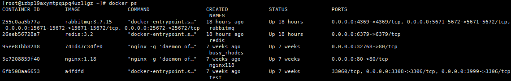
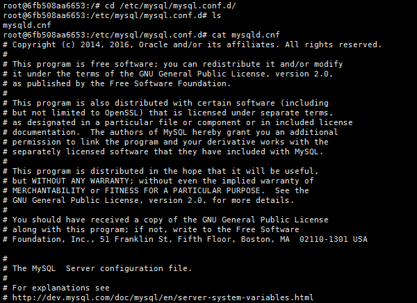
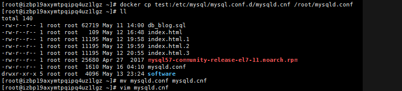

#docker  #idea 

在运行idea项目时，连接本地数据库运行成功。

改成服务器的docker容器内数据库时一直报这个错误，项目也进不去。

经过各种方法查试。

用了以下方法才解决。

**解决思路：**

之所以出现异常”The last packet sent successfully to the server was 0 milliseconds ago.“的大部分原因是由于数据库回收了连接，而系统的缓冲池不知道，继续使用被回收的连接所致的。

 方法就是将mysql回收空闲连接的时间变长，mysql默认回收时间是8小时，可以在mysql目录下的my.ini中增加下面配置，将时间改为1天。

单位是秒，最大好像是24天：
```linux

[mysqld]

wait_timeout=86400 //加上这一句

```


但是由于是docker容器里面的，可能这个my.ini不好找或以其它名称存在。

解决需要用到的命令

**查看运行的容器**

```
docker ps
```



**进入mysql容器**

```
docker exec -it test bash
```

**进入mysql.conf.d**

```
cd /etc/mysql/mysql.conf.d/
```



**由于是docker容器的mysql,不能直接用vi/vim打开，需要复制出来**

```
docker cp test:/etc/mysql/mysql.conf.d/mysqld.cnf /root/mysqld.conf
```



**打开mysqld.cnf后，在下面加上wait_timeout=86400即可。**

**复制回原来的目录。**

```
docker cp mysqld.cnf test:/etc/mysql/mysql.conf.d/mysqld.cnf
```

**重启docker容器**

```
systemctl restart docker
```

**重启mysql**

```
docker start test //test是我的mysql容器名称，一般可能为mysql
```

idea重新远程连接docker容器内的mysql.启动项目，运行成功。