### [docker英文官网](https://docs.docker.com/)

### [docker中文官网](https://dockerdocs.cn/index.html)

### [dockerHub仓库](https://hub.docker.com/)

[docker](https://so.csdn.net/so/search?q=docker&spm=1001.2101.3001.7020)分为镜像和容器
首先将镜像pull下来
然后用`docker run`生成一个容器，生成容器时指定镜像

我这里拿centos7.x举例，安装就不举例了，根据官网安装很简单

### 基本查看命令

使用`docker -v`查看是否安装成功
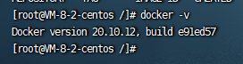
使用`docker images`查看镜像列表，可以看到目前是没有镜像的
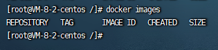
使用`docker ps`查看运行着的容器列表，可以看到目前是没有容器的
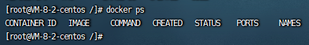
使用`docker ps -a`查看所有容器列表，`-a` 代表 `--all` 的意思，我这里举例所以搞了一个已停止的容器
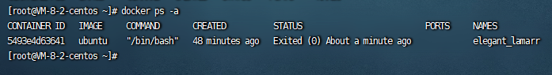
使用`docker ps -aq`仅查看所有容器的ID的列表，`-q`不知道啥意思，反正就是带上只返回ID
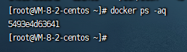

### 拉取镜像

拿[ubuntu](https://so.csdn.net/so/search?q=ubuntu&spm=1001.2101.3001.7020)的镜像举例
在docker Hub仓库的Explore找到ubuntu，点击去之后
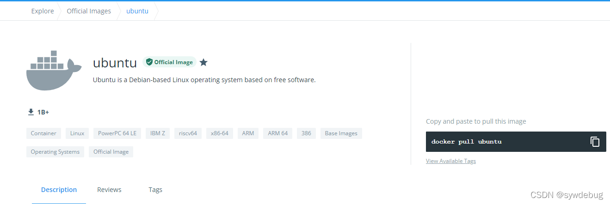
使用`docker pull ubuntu`将 ubuntu 镜像 pull 下来
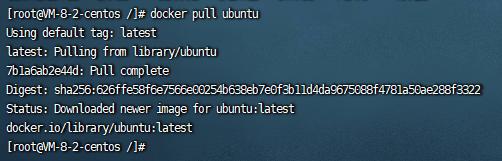
这时候再使用`docker images`查看镜像列表就可以看到有 ubuntu 这个镜像了，这个容器之所以这么小，是因为只含有ubuntu，不存在另外的任何例如vim这种东西
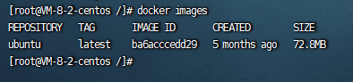

### 运行容器

#### ubuntu

然后使用`docker run -it ubuntu /bin/bash`运行一个容器，容器使用 ubuntu 镜像
–name 自定义容器名称
-d 启动后在后台运行
-i 以交互模式运行容器，通常与-t一起使用
-t 运行后返回一个伪终端，通常与-i一起使用
-P 随机映射端口
-p 指定映射端口，可以有多个，例如`-p 80:80 -p 443:443`，也可以范围映射，例如`-p 8000-9000:9000-10000`
/bin/bash shell交互命令的接口，一般就只用bash或者/bin/bash即可
还有一些其他的，目前我只用到这些，以后了解了再补充
不使用`-d`的话会直接进入到ubuntu容器内部

使用-d的话会返回一串id，并将启动的容器在后台运行
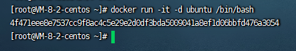
然后在这个容器内部就可以当做一个ubuntu系统使用了

#### nginx

再说一个nginx，示例端口映射，先拉nginx的镜像
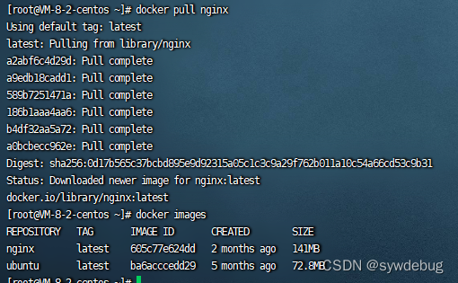
然后使用`docker run -it -d -p 80:80 nginx /bin/bash`运行一个容器，镜像使用nginx镜像
这个`-d`就是指创建后在后台跑，`-p 80:80`就是指将容器内部的80端口映射到本机的80端口，在访问本机80端口时就会访问到nginx容器里的80端口的信息，可以写多个`-p`，例如`-p 80:80 -p 81:81`就是映射多个端口
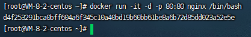
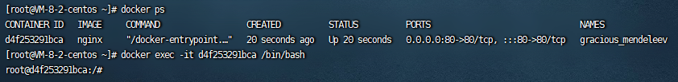
使用`nginx`启动nginx服务
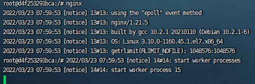
然后访问服务器ip就可以看到了
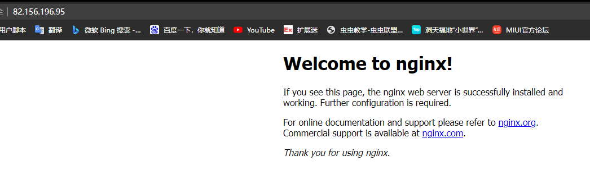
nginx配置的话就不在这说了。。。

### 操作容器

1. 退出容器
   进入容器内部后可以使用`ctrl+d`或输入`exit`或输入`ctrl+p+q`退出容器
   如果进入容器的时候使用`exec`进入的，退出时容器不会停止
   如果直接`run`进入的容器，使用`ctrl+d`或`exit`退出容器时，容器会停止，使用`ctrl+p+q`不会停止
   我这里举例刚才使用了一次`-d`，所以使用`exec`进入的，退出时容器不会停止
   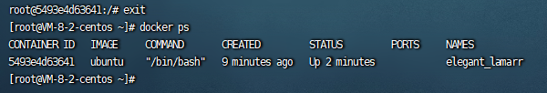
2. 进入已退出但还在后台运行的容器
   使用`docker attach 容器ID`或者使用`docker exec -it 容器ID /bin/bash`进入已退出的容器
   区别：使用`attach`进入容器，退出容器时容器会停止，使用`exec`进入容器，退出时容器不会停止
   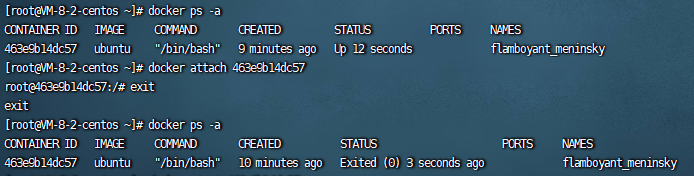
   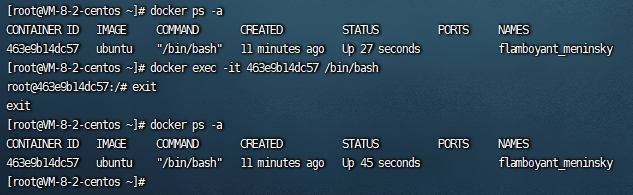
3. 停止已退出但是还在后台运行的容器
   使用`docker stop 容器ID`停止已经退出但是还在运行的容器
   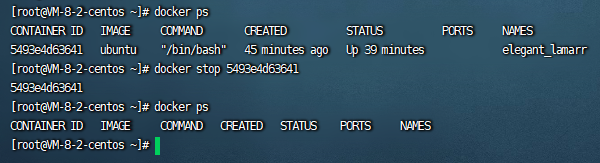
   另外还有一个命令是`docker kill 容器ID`也是停止运行的容器
   区别：使用`stop`是让容器自行停止，`kill`是强制停止，就像电脑的关机和拔电源一样（应该吧）
4. 删除已停止的容器
   使用`docker rm 容器ID`
   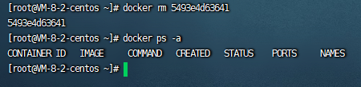
5. 删除还在运行的容器
   这个时候还用上面的方法删除会报错，提示容器还在运行，如果想要直接删除的话要带上`-f`
   使用`docker rm -f 容器ID`
   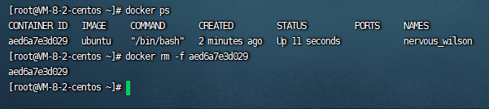
6. 启动已停止的容器
   使用`docker start 容器ID`启动已停止的容器
   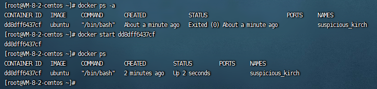
7. 删除所有已停止的容器
   使用`docker rm $(docker ps -aq)`删除所有已停止的容器，使用`rm -f`的话是删除所有容器
   使用`docker rm`是删除，使用`docker ps -aq`是获取所有容器的ID
   `$()`在其他地方也可以用，例如停止所有，启动所有
   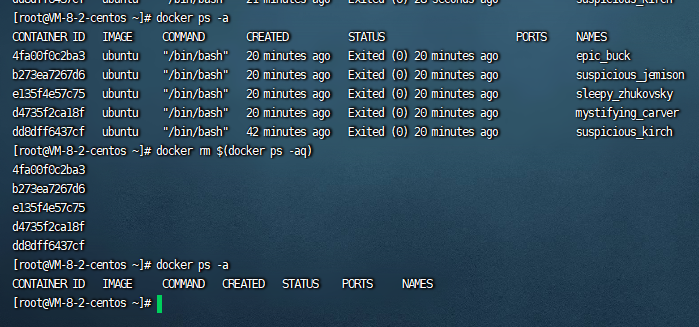

### 操作镜像

1. 删除镜像
   使用`docker rmi 镜像ID`删除镜像，`i`应该是`image`的意思吧，所以是删除镜像
   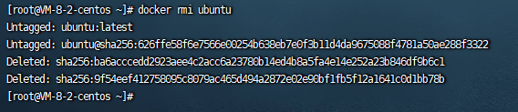
   加上`-f`删除正在使用的镜像，例如被容器使用，不管容器有没有停止都是使用中
   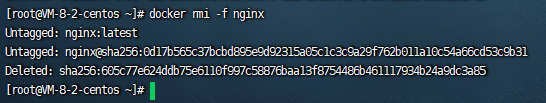
   使用`docker images -a`查看已经没有镜像了
   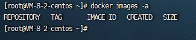
   但是使用`docker ps -a`查了一下那个使用了nginx镜像的容器还在，试了一下可以正常启动，还可以正常使用，这个应该是容器和镜像的使用关系，这个没搞懂不乱说了，一般删除时应该先删除容器，再删除镜像
   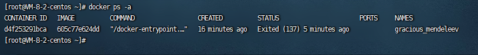

### 配置nginx

重新拉了一下nginx镜像，然后使用`docker run -it -d -p 80:80 -p 81:81 nginx /bin/bash`生成容器映射80和81端口
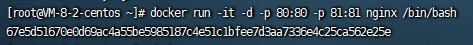
使用`docker exec -it 67e5d51670e0 /bin/bash`进入容器
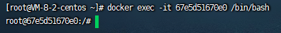
切换镜像源地址，不然`apt-get update`慢，下载东西也慢，切换可以参考[apt-get update 太慢,如何解决](https://yijiebuyi.com/blog/f03488dcc97ce9d0f0fdbcfce3d4a07b.html)，里面有写docker镜像里面如何更改镜像源
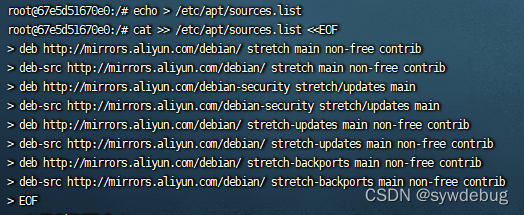
`apt-get update`更新镜像源
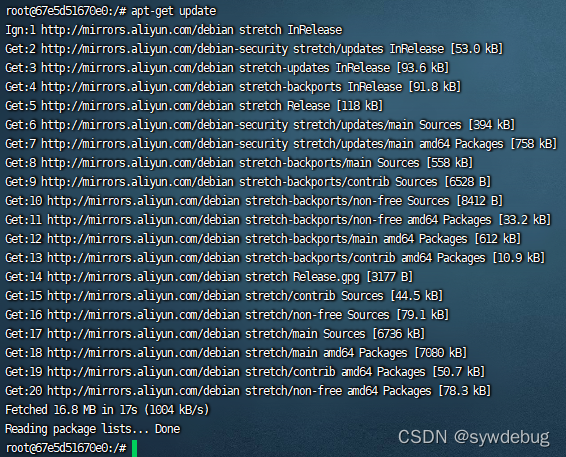
使用`apt-get install vim`下载vim编译器
过程报了个错

```
The following packages have unmet dependencies:
 ncurses-base : Breaks: libtinfo5 (< 6.1) but 6.0+20161126-1+deb9u2 is to be installed
E: Error, pkgProblemResolver::Resolve generated breaks, this may be caused by held packages.
123
```

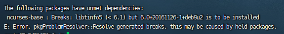
说什么没有满足的依赖项，这种缺啥装啥就行，这里看到少`libtinfo5`，就用`apt-get install libtinfo5`安装
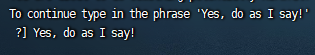
确认安装的时候一个字符都不能输错，包括英文逗号感叹号和空格
安装完成后安装vim，然后使用vim配了一下nginx，然后在相应文件下创建index.html写些东西测试
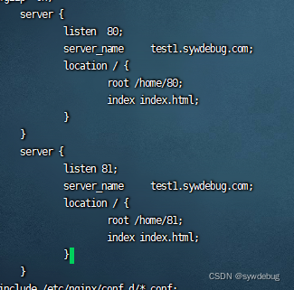
启动nginx


完事，这个就相当于自己做完的东西，想做成自己的镜像，方便交付转移或保存

### 生成自己的镜像

```
docker commit -m="注释" -a="作者" 容器ID 要创建的镜像的名字:[版本号]
1
```

使用docker ps 查看容器，这个容器就是刚才被操作的容器，装了vim，写了文件
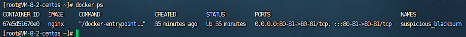
使用`docker commit -m="添加vim，配置80、81端口的nginx" -a="sywdebug" 67e5d51670e0 my_nginx`生成镜像
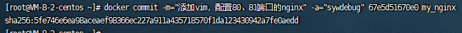
然后使用`docker images`查看就可以看到生成的my_nginx
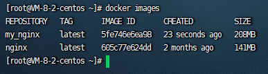
然后停止原来的容器，使用`docker run -it -d -p 80:80 -p 81:81 my_nginx /bin/bash`生成一个新的容器使用my_nginx镜像
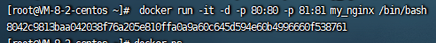
然后进入容器
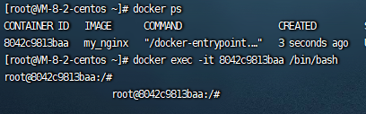
可以看到是有之前使用创建的文件夹的
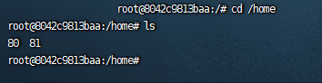
启动nginx

可以正常访问

### 推送镜像到私有云

此处我使用的是腾讯云的容器镜像服务
首先新建命名空间
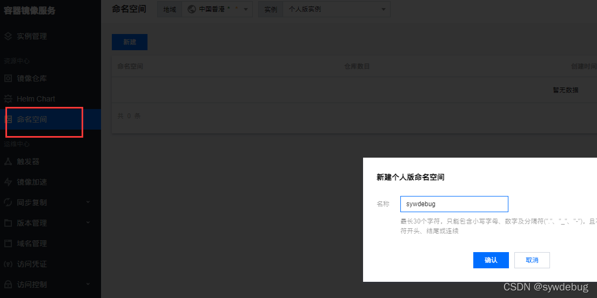
然后新建镜像仓库

创建完成后可以看到仓库右侧右快捷指令

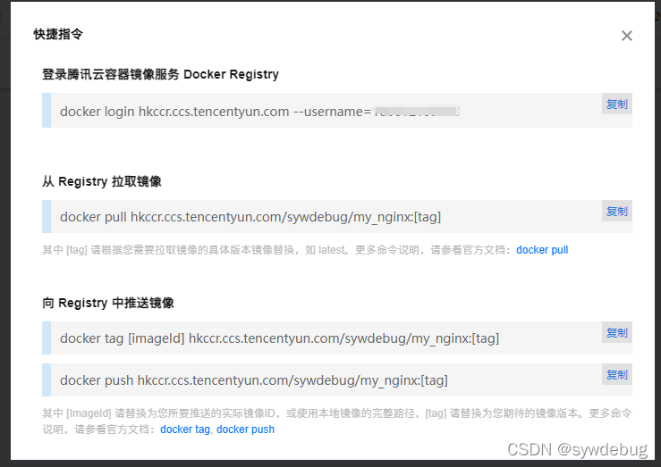
可以看到有登陆，拉取镜像，推送镜像，上面我已经生成了自己的镜像，现在将镜像推送到仓库里

首先使用登陆指令登录腾讯云容器镜像服务 Docker Registry，登录时要输入密码，密码好像是启动容器镜像服务时设置的，因为我这个之前弄过忘记是不是了，如果不记得登陆密码可以在腾讯云控制台的容器镜像服务的实例管理重置登陆密码
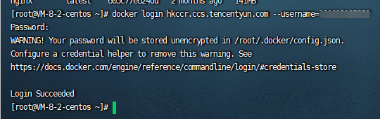
查看一下镜像的ID
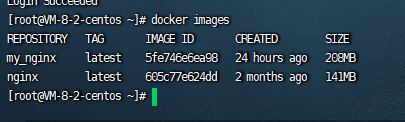
使用向Registry推送指令的第一条`docker tag 5fe746e6ea98 hkccr.ccs.tencentyun.com/sywdebug/my_nginx`创建一个标签标记
然后再次查看，可以看到多出一个镜像
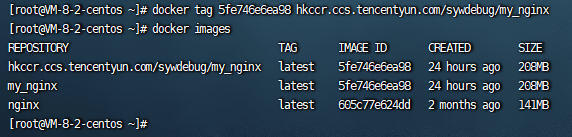
然后使用推送的第二条指令`docker push hkccr.ccs.tencentyun.com/sywdebug/my_nginx`推送到仓库
我这里前面推送过一次，所以这里提示`layer already exists`，但是也已经推送上去了
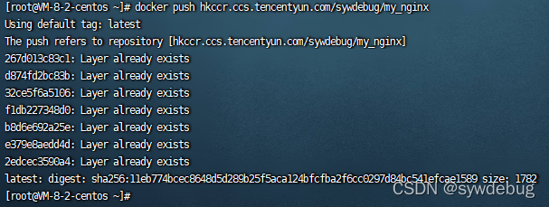
查看腾讯云容器镜像服务刚刚创建的仓库my_nginx，里面有一条记录
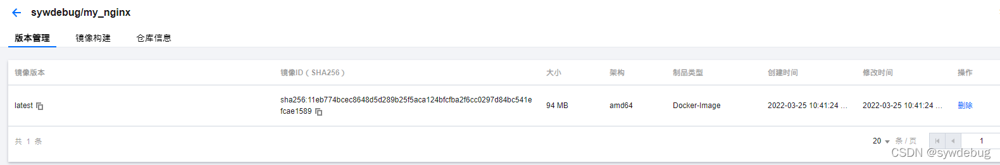
至此，推送完成

### 从仓库拉取镜像测试

因为我windows电脑上也是有装docker的，所以拉下来测试一下
先登录腾讯云容器镜像服务 Docker Registry
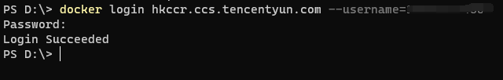
然后使用从 Registry 拉取镜像指令`docker pull hkccr.ccs.tencentyun.com/sywdebug/my_nginx`拉取镜像
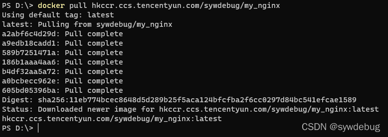
可以看到已经拉下来了
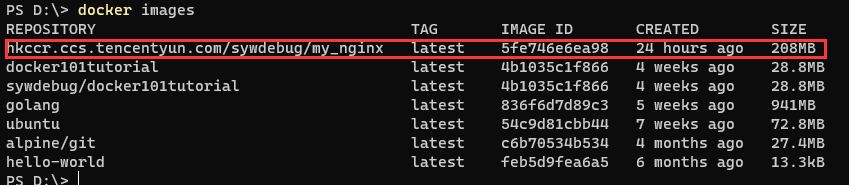
生成容器运行一下这个镜像
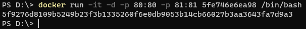
进入容器查看，可以看到没什么问题

用vim查看nginx.conf配置也是没问题

这里nginx就不启动了，因为上面配置了域名而不是使用127.0.0.1，而域名是解析到服务器，这里启动也是访问不到，整体来说docker镜像推拉仓库没什么问题

### 容器数据卷

#### 提示

Docker挂载主机目录访问如果出现`cannot open directory:Permission denied`，表示没有权限
解决：在挂载目录后加一个`--privileged=true`参数即可，开启这个容器内才拥有真正的root权限，否则容器内的root只是外部的一个普通用户权限

#### 使用

> 容器数据卷作用是将docker容器内的目录映射到宿主机的目录，众所周知，容器被删除后里面的数据都没有了，使用容器数据卷可以实现数据的持久化到本地主机目录，方便备份数据，容器卷更改实时生效
> 运行一个带有容器卷存储功能的容器实例

```
docker run -it --privileged=true -v /宿主机绝对路径目录:/容器内的目录 镜像名
1
```

-v也可以像上面的端口映射-p一样使用多个，也就是挂载多个目录

举例：
使用以下命令运行一个镜像为ubuntu并且带有数据卷的容器，容器将docker内部的/tmp/docker_data映射到宿主机的/tmp/host_data目录

```
docker run -it --privileged=true -v /tmp/host_data:/tmp/docker_data ubuntu
1
```

可以看到docker_data目前为空，宿主机的host_data也为空


然后在docker内部的docker_data创建一个文件

然后查看宿主机的host_data目录的文件，可以看到docker内部创建的这个文件

在宿主机的host_data创建一个文件

然后查看docker内部的docker_data目录的文件，可以看到宿主机创建的这个文件

就像是vue的双向绑定一样
docker修改，主机同步获得
主机修改，docker同步获得
docker容器stop，主机修改，docker依然获得

#### 查看是否挂载

使用`docker inspect 容器ID`可以查看是否挂载成功


#### 权限

```
docker run -it --privileged=true -v /宿主机绝对路径目录:/容器内的目录 镜像名
1
```

上面默认创建命令是docker容器对于映射目录可读可写rw(read write)，相当于

```
docker run -it --privileged=true -v /宿主机绝对路径目录:/容器内的目录:rw 镜像名
1
```

如果要让docker容器对于映射目录只可读，可以将权限改为ro(read only)

```
docker run -it --privileged=true -v /宿主机绝对路径目录:/容器内的目录:ro 镜像名
1
```

修改为仅可读，再进行写操作就会提示`Read-only file system`

#### 继承

```
docker run -it --privileged=true --volumes-from 容器ID 镜像名
1
```

`--volumes-from`是父类的意思，也就是继承于哪个容器，按上面命令运行容器，父类容器什么样，这个新创建的就什么样，容器卷等等也是相同的
