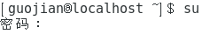
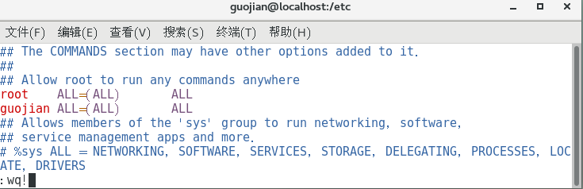
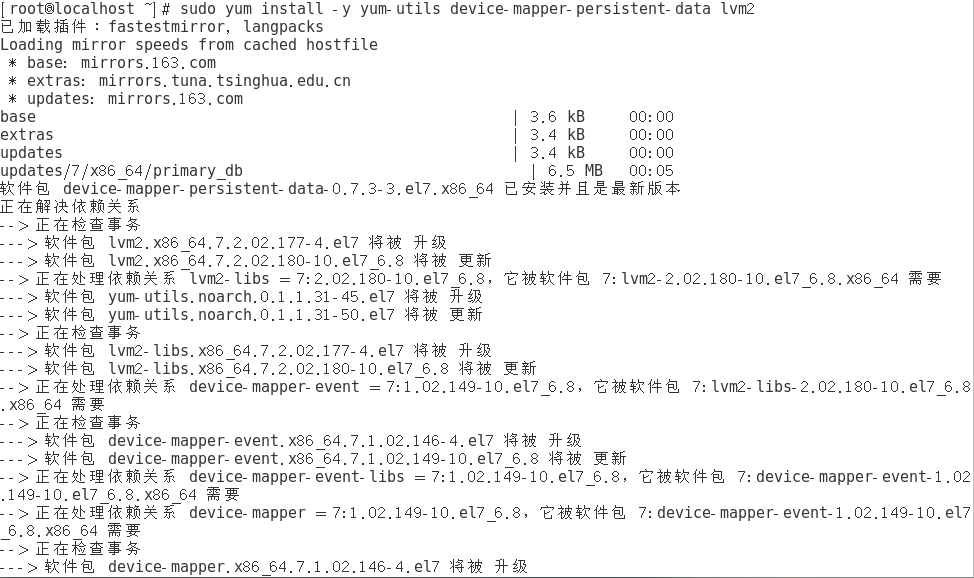

**通用解释**：sudo命令可以让你以root身份执行命令，来完成一些我们这个账号完成不了的任务。但是并非所有用户都能够执行sudo，因为有权限的用户都在/etc/sudoers中。

解决方案：

**（1）进入root模式，su，再输入正确密码，**

**（2）通过cd /etc 进入etc文件中，**

**（3）通过vim打开sudoers并编辑，**

找到root  ALL=(ALL)  ALL文件，在下方添加自己的账户并:wq!进行强制保存退出，

**（4）接下来就可以继续安装一些必要的系统工具了：sudo yum install -y yum-utils device-mapper-persistent-data lvm2**

