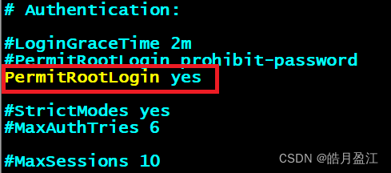
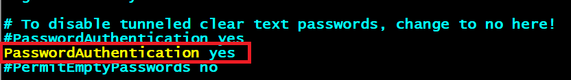

全新安装系统后，默认情况下将禁用Debian Linux上的root登录。当您尝试以root用户身份登录Debian11 Linux服务器时，访问将被拒绝。要在Debian Linux系统上为root用户启用SSH登录，您需要首先配置SSH服务器。

**0.首先安装SSH**
注意：如果使用的是WSL安装的ubuntu/debian，那么你需要先卸载：`apt remove openssh-server`

```bash
sudo apt install openssh-server
```

安装完成后[SSH](https://so.csdn.net/so/search?q=SSH&spm=1001.2101.3001.7020) 服务默认开启
手动启动：

```bash
systemctl start ssh.service
```

**1.安装vim**
首先由普通用户登录Debian服务器，su root切换到root用户，输入下面命令安装即可：

```bash
apt-get install vim
```

**2.利用vim打开并修改/etc/ssh/sshd_config文件**
将PermitRootLogin 设置为yes,PasswordAuthentication设置为yes即可，:wq保存退出即可。

```bash
vim /etc/ssh/sshd_config
```




**3.输入下面命令，重新启动SSH服务器：**

```bash
/etc/init.d/ssh restart
```