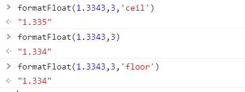
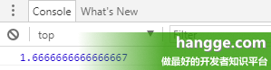

今天计算PUE的时候遇到了一个问题，对方要求取小数点后一位，不能进行四舍五入。这样的话`toFixed`方法就用不了了。同时`Math.round`也不能使用，他的本事就是四舍五入的计算方式。

**toFixed() 方法**

- toFixed() 方法可以将数字转换为字符串，并指定小数点后保留几位。如果小数实际位数不够指定的位数，不足的部分会补 0。所有主要浏览器都支持 toFixed() 方法。
- toFixed() 使用的是银行家舍入规则：四舍六入五取偶（又称四舍六入五留双）。

在网上找了一个自建的方法。

```javascript
/**
 *
 * @param {number|string} num 需要处理的数字
 * @param {number} n 保留位数,默认1
 * @param {string} flag = 'ceil' || 'floor' 向上或向下保留，默认四舍五入
 * @returns {string}
 */
function formatFloat(num, n = 1, flag) {
    var f = parseFloat(num);
    if (isNaN(f)) {
        return false;
    }
    if (flag === 'ceil') {
        f = Math.ceil(num * Math.pow(10, n)) / Math.pow(10, n); // n 幂
    } else if (flag === 'floor') {
        f = Math.floor(num * Math.pow(10, n)) / Math.pow(10, n); // n 幂
    } else {
        f = Math.round(num * Math.pow(10, n)) / Math.pow(10, n); // n 幂
    }
    var s = f.toString();
    var rs = s.indexOf('.');
    //判定如果是整数，增加小数点再补0
    if (rs < 0) {
        rs = s.length;
        s += '.';
    }
    while (s.length <= rs + n) {
        s += '0';
    }
    return s;
}
```

测试结果：




项目引用案例：

```html
<!DOCTYPE html>
<html style="height: 100%">

<head>
  <meta charset="utf-8">
</head>

<body style="height: 100%; margin: 0; background-color: transparent">
  <div id="container" style="height: 100%; background-color: transparent"></div>
  <script type="text/javascript" src="echarts.min.js"></script>
  <script type="text/javascript">
    var dom = document.getElementById("container");
    var myChart = echarts.init(dom);
    var app = {};

    var option;

    option = {
      backgroundColor: 'transparent',

      series: [
        {
          type: 'gauge',
          axisLine: {
            lineStyle: {
              width: 15,
              color: [
                [0.3, '#67e0e3'],
                [0.7, '#37a2da'],
                [1, '#fd666d']
              ]
            }
          },
          min: 0,
      max: 3,
          pointer: {
            itemStyle: {
              color: 'auto'
            }
          },
          axisTick: {//轴刻度
            distance: -15,
            length: 8,
            lineStyle: {
              color: '#fff',
              width: 2
            }
          },
          splitLine: {
            distance: -15,
            length: 15,
            lineStyle: {
              color: '#fff',
              width: 2
            }
          },
          axisLabel: {
            color: 'auto',
            distance: 20,
            fontSize: 12
          },
          detail: {//pue显示
            valueAnimation: true,
            formatter: 'PUE={value}  ',
            color: 'green',
            fontSize: 20
          },
          data: [
            {
              value: 99.999,
              min: 0,
              max: 3
            }
          ]
        }
      ]
    };


    

    oaJsApi.dpConnect('System1:PueReceive.PUEreceive:_original.._value', true,
      {
        success: function (data) {
          var newF = data.value[0];
          var test = formatFloat(newF, n = 1,'floor');
          console.log("自建方法",test);
          console.log("print",newF);
          
          myChart.setOption({
            series: [
              {
                data: [
                  {
                    value:test,
                  }
                ]
              }
            ]
          });

        }
      });


    if (option && typeof option === 'object') {
      myChart.setOption(option);
    }

    function formatFloat(num, n = 1, flag) {
    var f = parseFloat(num);
    if (isNaN(f)) {
        return false;
    }
    if (flag === 'ceil') {
        f = Math.ceil(num * Math.pow(10, n)) / Math.pow(10, n); // n 幂
    } else if (flag === 'floor') {
        f = Math.floor(num * Math.pow(10, n)) / Math.pow(10, n); // n 幂
    } else {
        f = Math.round(num * Math.pow(10, n)) / Math.pow(10, n); // n 幂
    }
    var s = f.toString();
    var rs = s.indexOf('.');
    //判定如果是整数，增加小数点再补0
    if (rs < 0) {
        rs = s.length;
        s += '.';
    }
    while (s.length <= rs + n) {
        s += '0';
    }
    return s;
    }

  </script>
  <script>

  </script>

</body>

</html>
```

在网上找到一个针对小数点后取值解释比较好的帖子


[JS - 控制小数位数的方法（保留小数点后N位、以及小数取整）](https://www.cnblogs.com/NazLee/p/11646023.html)


开发中有时我们需要对小数进行取整，或者只保留 N 位小数进行显示。下面分别对这两种情况进行说明。这里假设我们有如下数字进行处理：

```html
var num = 5/3;
console.log(num);
```

 

输出如下：

[](https://www.hangge.com/blog/cache/detail_1791.html#)

 

## 一、取整

### 1，直接取整（丢弃小数部分）

```javascript
var num = parseInt(5/3);  // 1
```

 

### 2，四舍五入取整

```javascript
var num = Math.round(5/3); ``// 2
```

 

### 3，向上取整

```javascript
var num = Math.ceil(5/3);   // 2
```

 

### 4，向下取整

```javascript
var num = Math.floor(5/3);  // 1
```

 

## 二、保留小数点后N位

### 1，使用 toFixed() 方法

（1）方法介绍

- toFixed() 方法可以将数字转换为字符串，并指定小数点后保留几位。如果小数实际位数不够指定的位数，不足的部分会补 0。所有主要浏览器都支持 toFixed() 方法。
- toFixed() 使用的是银行家舍入规则：四舍六入五取偶（又称四舍六入五留双）。

银行家舍入法：
四舍六入五考虑，五后非零就进一，五后为零看奇偶，五前为偶应舍去，五前为奇要进一。

 

（2）使用样例

```javascript
var  num1 = (5/3).toFixed(2);  // 1.67 
var num2 = (4).toFixed(2); // 4.00
var num3 = (0.015).toFixed(2); // 0.01 
var num4 = (0.025).toFixed(2); // 0.03
```

 

### 2，自定义转换方法

（1）如果嫌 toFixed 这种四舍六入五取偶规则太奇葩。可以考虑自己实现个四舍五入的方法，下面方法转换后仍为数字类型。

- 第一个参数为待转换的数字
- 第二个参数为保留的小数个数

```javascript
//保留n位小数 
function roundFun(value, n) 
{ 
return Math.round(value*Math.pow(10,n))/Math.pow(10,n); 
}
```


（2）使用样例

```javascript
var num1 = roundFun(5/3, 2);  // 1.67
var num2 = roundFun(4, 2); // 4 
var num3 = roundFun(0.015, 2);  // 0.02  
var num4 = roundFun(0.025, 2);  // 0.03
```


### 3，自定义格式化输出方法

（1）下面方法同样是指定小数位数进行四舍五入，不过返回的不再是数字而是格式化后的字符串，小数点后面不足的位数会自动补 0。比如数字为 4，会在 4 后面补上 00，变成 4.00 返回。

```javascript
//保留n位小数并格式化输出（不足的部分补0） 
var fomatFloat =  function (value, n) {
var f = Math.round(value*Math.pow(10,n))/Math.pow(10,n);
var s = f.toString();
var rs = s.indexOf( '.' );  
    if (rs < 0)  {   
      s += '.' ; 
    }
    for ( var i = s.length - s.indexOf( '.' ) ; i <= n ; i++){ 
        s +=  "0" ; 
    } 
	return s;
}
```

 

（2）使用样例

```javascript
var num1 = fomatFloat(5/3, 2);  // 1.67
var num2 = fomatFloat(4, 2); // 4.00
var num3 = fomatFloat(0.015, 2); // 0.02
var num4 = fomatFloat(0.025, 2); // 0.03
```

