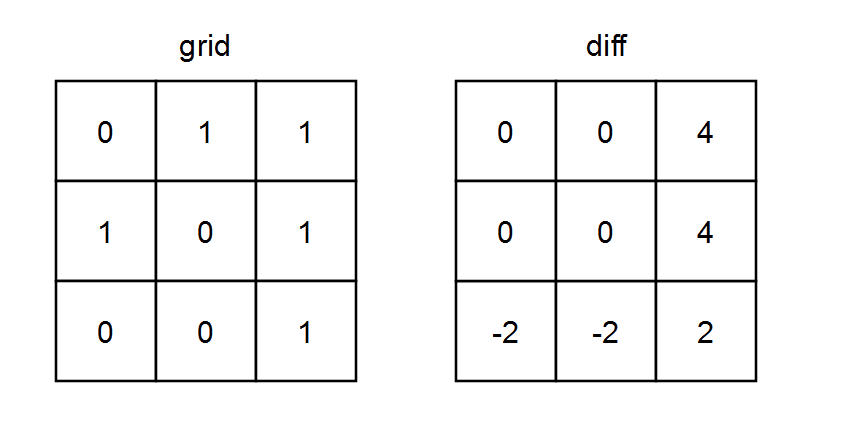

给你一个下标从 **0** 开始的 `m x n` 二进制矩阵 `grid` 。

我们按照如下过程，定义一个下标从 **0** 开始的 `m x n` 差值矩阵 `diff` ：

- 令第 `i` 行一的数目为 `onesRowi` 。
- 令第 `j` 列一的数目为 `onesColj` 。
- 令第 `i` 行零的数目为 `zerosRowi` 。
- 令第 `j` 列零的数目为 `zerosColj` 。
- `diff[i][j] = onesRowi + onesColj - zerosRowi - zerosColj`

请你返回差值矩阵 `diff` 。

 

**示例 1：**



```bash
输入：grid = [[0,1,1],[1,0,1],[0,0,1]]
输出：[[0,0,4],[0,0,4],[-2,-2,2]]
解释：
- diff[0][0] = onesRow0 + onesCol0 - zerosRow0 - zerosCol0 = 2 + 1 - 1 - 2 = 0 
- diff[0][1] = onesRow0 + onesCol1 - zerosRow0 - zerosCol1 = 2 + 1 - 1 - 2 = 0 
- diff[0][2] = onesRow0 + onesCol2 - zerosRow0 - zerosCol2 = 2 + 3 - 1 - 0 = 4 
- diff[1][0] = onesRow1 + onesCol0 - zerosRow1 - zerosCol0 = 2 + 1 - 1 - 2 = 0 
- diff[1][1] = onesRow1 + onesCol1 - zerosRow1 - zerosCol1 = 2 + 1 - 1 - 2 = 0 
- diff[1][2] = onesRow1 + onesCol2 - zerosRow1 - zerosCol2 = 2 + 3 - 1 - 0 = 4 
- diff[2][0] = onesRow2 + onesCol0 - zerosRow2 - zerosCol0 = 1 + 1 - 2 - 2 = -2
- diff[2][1] = onesRow2 + onesCol1 - zerosRow2 - zerosCol1 = 1 + 1 - 2 - 2 = -2
- diff[2][2] = onesRow2 + onesCol2 - zerosRow2 - zerosCol2 = 1 + 3 - 2 - 0 = 2
```

**示例 2：**


```bash
输入：grid = [[1,1,1],[1,1,1]]
输出：[[5,5,5],[5,5,5]]
解释：
- diff[0][0] = onesRow0 + onesCol0 - zerosRow0 - zerosCol0 = 3 + 2 - 0 - 0 = 5
- diff[0][1] = onesRow0 + onesCol1 - zerosRow0 - zerosCol1 = 3 + 2 - 0 - 0 = 5
- diff[0][2] = onesRow0 + onesCol2 - zerosRow0 - zerosCol2 = 3 + 2 - 0 - 0 = 5
- diff[1][0] = onesRow1 + onesCol0 - zerosRow1 - zerosCol0 = 3 + 2 - 0 - 0 = 5
- diff[1][1] = onesRow1 + onesCol1 - zerosRow1 - zerosCol1 = 3 + 2 - 0 - 0 = 5
- diff[1][2] = onesRow1 + onesCol2 - zerosRow1 - zerosCol2 = 3 + 2 - 0 - 0 = 5
```

 

**提示：**

- `m == grid.length`
- `n == grid[i].length`
- `1 <= m, n <= 105`
- `1 <= m * n <= 105`
- `grid[i][j]` 要么是 `0` ，要么是 `1` 。

**代码:**

```java
class Solution {
    public int[][] onesMinusZeros(int[][] grid) {
        int len1 =grid.length;
        int len2 =grid[0].length;
        int[] onesRowi = new int[len1];
        int[] onesColj = new int[len2];
        int[] zerosRowi = new int[len1];
        int[] zerosColj = new int[len2];
        int[][] diff = new int[len1][len2];

        for(int i =0;i<len1;i++){
            for(int j=0;j<len2;j++){
                if(grid[i][j]==1){
                    onesRowi[i]++;
                    onesColj[j]++;
                }else{
                    zerosRowi[i]++;
                    zerosColj[j]++;
                }
            }
        }
        for(int i=0; i<len1;i++){
            for(int j=0;j<len2;j++){
                diff[i][j]=onesRowi[i]+onesColj[j]-zerosRowi[i]-zerosColj[j];
            }
        }
        return diff;
    }
}
```

**思路:**

这题看着难,其实简单,首先grid是一个二维数组,并且不是0就是1。所以关于diff的赋值就只需要做一个判断就可以了。初始化数组的时候默认都是0。计算的都是行列中0和1的个数只需要判断在自己原来的数值上进行+1就可以了。

最后在进行遍历相加减赋值，就出来了。
