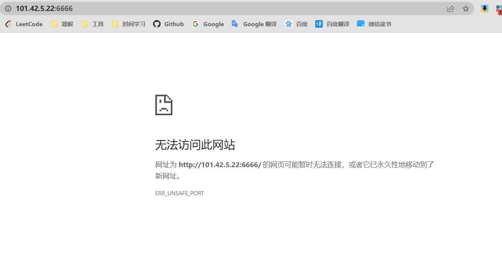
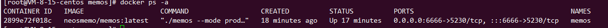

起因是，今天看到一个有趣的项目（https://github.com/usememos/memos）想拉下来跑跑体验一下。结果在docker之后，指定好了端口，打开时却出现如下的情况



再次确认后台程序在跑的时候，已经基本确定就是某些操作的问题，或许是被拦截了。



在看到前端报错的时候发现他在告诉我这个情况

```bash
ERR_UNSAFE_PORT
```

仔细查询（https://zhuanlan.zhihu.com/p/383077079）了之后才发现这是浏览器的安全问题导致无法打开。虽说可以是强制打开，但是还是换个端口比较稳妥。

```bash
  1,    // tcpmux
  7,    // echo
  9,    // discard
  11,   // systat
  13,   // daytime
  15,   // netstat
  17,   // qotd
  19,   // chargen
  20,   // ftp data
  21,   // ftp access
  22,   // ssh
  23,   // telnet
  25,   // smtp
  37,   // time
  42,   // name
  43,   // nicname
  53,   // domain
  77,   // priv-rjs
  79,   // finger
  87,   // ttylink
  95,   // supdup
  101,  // hostriame
  102,  // iso-tsap
  103,  // gppitnp
  104,  // acr-nema
  109,  // pop2
  110,  // pop3
  111,  // sunrpc
  113,  // auth
  115,  // sftp
  117,  // uucp-path
  119,  // nntp
  123,  // NTP
  135,  // loc-srv /epmap
  139,  // netbios
  143,  // imap2
  179,  // BGP
  389,  // ldap
  465,  // smtp+ssl
  512,  // print / exec
  513,  // login
  514,  // shell
  515,  // printer
  526,  // tempo
  530,  // courier
  531,  // chat
  532,  // netnews
  540,  // uucp
  556,  // remotefs
  563,  // nntp+ssl
  587,  // stmp?
  601,  // ??
  636,  // ldap+ssl
  993,  // ldap+ssl
  995,  // pop3+ssl
  2049, // nfs
  3659, // apple-sasl / PasswordServer
  4045, // lockd
  6000, // X11
  6665, // Alternate IRC
  6666, // Alternate IRC
  6667, // Standard IRC
  6668, // Alternate IRC
  6669, // Alternate IRC
```


