**编者荐语：**

每年都有人怀旧，今年额外多。

怀旧除了因为亲历过的上个年代充斥着回忆滤镜，大概还有现不如今的遗憾。

反差何处来 ，略长，请耐心看正文。

2022年的二分之一结束了。

如果要给它一个阶段性的关键词，“怀旧”二字，最为贴切。

王心凌的声音再一次在电视机响起，周杰伦九年前的演唱会如今有一亿人在手机里观看，甄学依然霸占着影视解说的高地，音乐综艺节目里站着年逾花甲的林子祥和叶倩文，《食神》里的珍宝海鲜舫沉没三天后，转身迎来了周星驰的60岁生日。

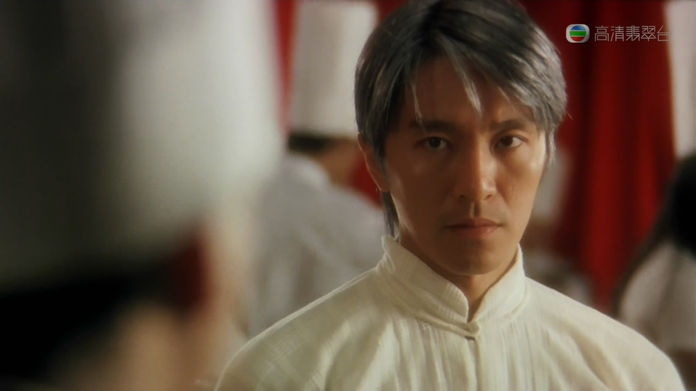

怀旧情绪并不罕有。正如直男追忆罗马硬汉，文青怀念民国骚人，这样的遥望怀古，都带着不切实际的滤镜。

而2022年的怀旧，“旧”怀得却过分“近”了。近到我都不用仔细回忆，那个时期的色彩、温度以及气味就能浮现在面前。

当怀旧周期被压缩得越来越短，几乎成为一个文化显学时，我开始好奇：

 

是什么，让怀旧愈发年轻化？

众神时代‍‍‍‍‍‍‍‍‍‍‍‍‍

你不会想念你从来没有拥有过的东西。

 

而80后与90后共同拥有的，构成了当下目之所及有关怀旧的所有内容——众神世代。

 

先说音乐。

 

线上演唱会就像一场资本的垂钓，每次都能钓上来一大批亟需怀旧的鱼。他们握着一方窄窄的屏幕，试图找回曾经站在现场或者戴着耳机时的悸动。

 

如果给线上演唱会划出时间线，你会发现这是一场事先张扬的怀旧计划。观众带来的每一次流量，都没有让资本失望。

 

> 2021年12月，西城男孩线上演唱会在视频号打响第一枪。
>
> 今年4月1日，张国荣线上演唱会在线观众900万；
>
> 4月15日，崔健线上音乐会收看人数4500万；
>
> 5月20日、21日，周杰伦演唱会总观看量破1亿；
>
> 5月27日，罗大佑和孙燕姿在两个平台打擂台，观看人数分别斩获4000万和2.4亿；
>
> 6月，后街男孩和西城男孩合体，观看人数4600万。

 

如果不是“线上”二字，甚至让人感觉翻开了20年前的报纸。

 

在华语乐坛一潭浑水的当下，唱片行业死亡，流量和算法捧出无数你不想听却又被逼洗脑的神曲。而那些远古的名字，就像是在一场混战中请出了阿瑞斯和雅典娜，古典、正确而威严。

 

他们的声音所具备的意义，就是“恒久不变”。这种确定性如同镇静剂一般，给慌张、焦虑、迷茫的一代人注射进体内。

 7月2日，B站与杰威尔达成版权合作

弹幕刷屏“终于等到周杰伦”

 

音乐同步影响着综艺。

 

当所有人都认为枯竭的《浪姐3》不会再有奇迹发生时，王心凌赌对了一次。

 

在这档综艺节目建构的语境里，所有女性都默认要改变、打破自己的刻板印象，就连Twins都没有选择赢面更大的《下一站天后》赚情怀。而王心凌却走上相反的方向：不变。

 

当扎着高马尾的女孩，唱着2004年发行的《爱你》出场时，她便兑现了一个长达20年的承诺。就像请出布兰妮站在舞台上穿着露脐装跳Baby One More Time一样，经历这种画面的人，恐怕都会产生不切实际的眩晕感——如果一切都可以保持不变，那我是否能找回20年前的快乐无虑？

 

至于业务水平，王心凌算是台湾音乐产业“四大三小一蛇团”中的一个“小”而已。

 

不管是个人风格还是歌曲质量，并不具备当年台湾流行音乐最大的能量。试想一下，如果来到《浪姐3》舞台上的是蔡依林或孙燕姿，效果会否比王心凌效应更恐怖？

 

但仅仅是王心凌重回舞台，就足以把众人掀个跟头了。

 

如果你把《浪姐3》的节目单拉到最后，会发现芒果TV推荐了自家的另一档综艺《声生不息》。

 

除了以“香港流行音乐”为主题之外，二者主打的怀旧思路如出一辙。

 

当节目拉出了林子祥、叶倩文、李克勤、杨千嬅等大众熟悉的粤语流行音乐符号时，就已经瞄准了它的目标观众。

 

甚至连选择的曲目，都精准避开了80-90后不熟悉的时期。它重现的正是那个曾经纵横四海、英雄本色的香港，而非近些年关注私人语境的香港。香港流行音乐变了，但大多数人并不关心，每个人只会关心自己心中的香港。

 

80-90后观众与香港之间的关系，停滞在“怀旧”二字面前。香港永远是莫文蔚唱着“分分钟都盼望跟他见面，默默地伫候也从来没怨”，是满头银发的周星驰站在珍宝海鲜舫面前。

 

所以观众想听的，仍然是1993年的《海阔天空》和2006年的《最佳损友》。整场节目透露出“抱残守缺的繁荣”，并没有打捞主流话语外的粤语残片。

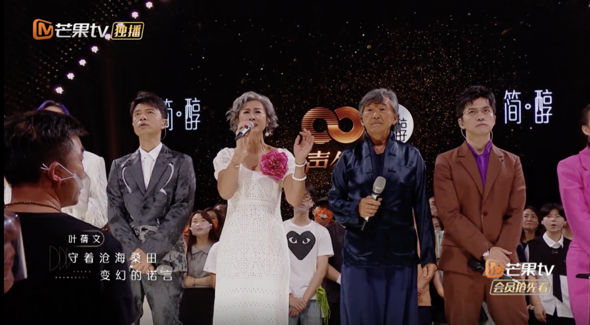

在这场不断加码的怀旧过程中，观众的宽容度也在悄悄增加。

 

如果你也经历过2007年的《快乐男声》，一定清楚当时的评论声音对这群男生并不友好。而如今一档综艺节目《欢迎来到蘑菇屋》凑齐了他们，却意外地收获了流量和口碑。这群平均年龄30+的不再偶像化的“前偶像”，一举一动都让观众感到亲切。

 

相比于当下这个时代的偶像，观众先入为主地认为10年前的偶像更有实力。

 

07届快男犹在，但同时期更多的人和事已经成为历史。

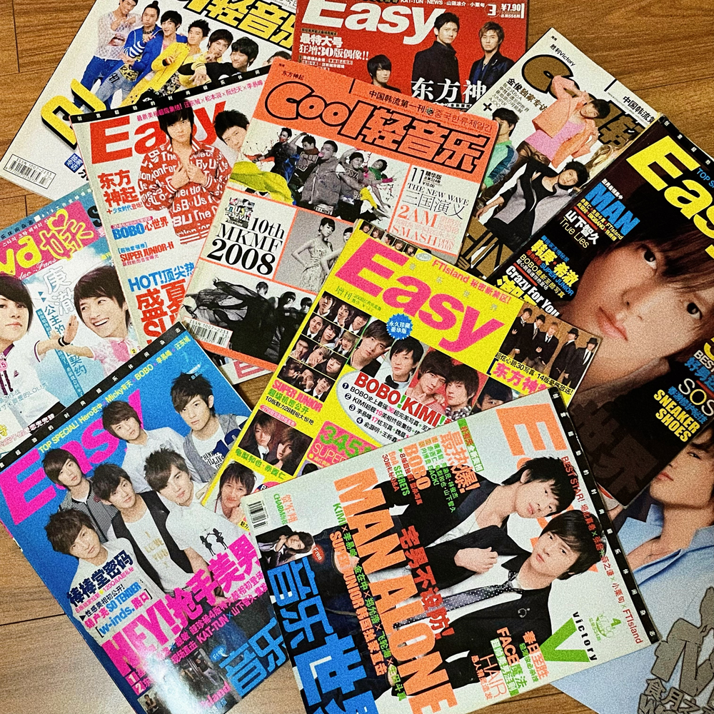十几年前，中日韩偶像产业的黄金时代

 

相比音乐与综艺，影视方面的繁荣显得更为虚空。

 

即便视频平台的电视剧播放量每一年都在刷新记录，即便文化从业者们绞尽脑汁从影视作品中提纯社会议题，我们都不得不承认，从创作内容到社会影响，电视剧都无法重现十年前的生命力。

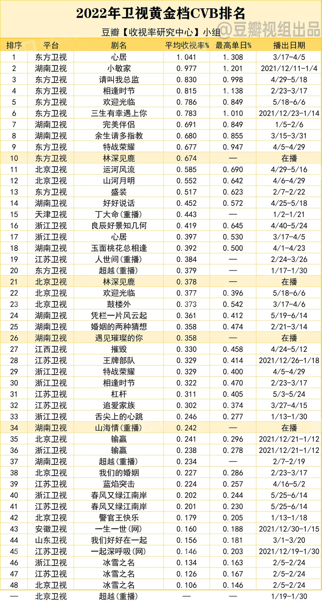图源：豆瓣小组@收视率研究中心

 

一部2011年开播的《甄嬛传》，花了十年时间凝结成一本厚厚的《甄学》，而《甄学》的文字就是互联网海量的二次创作信息。

 

有人以此为生，做出百万粉丝的账号，榨取76集的每一滴内容，贩售着关于这部电视剧的一切边角料。

 

更多参与其中的普通观众，在十年间从学生仔变成打工人，就着《甄嬛传》的背景音，咽下20多块钱的外卖。这或许是他们在焦虑时代下，为数不多内心平静的时刻。

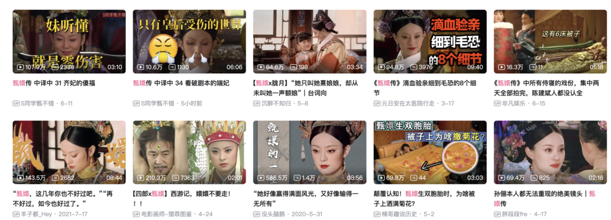

除此之外，2006年的《武林外传》、2005年的《亮剑》、2005年的《家有儿女》仍然在为内容创作者和内容消费者提供情怀语料。

 

多少人在B站敲下“山本大意失先人”的弹幕之后还是笑得前仰后合，似乎他们的笑点永远停留在旧故事里。

眼前路一片渺茫，便只能回头望。就这么挖下去，一路挖到《我爱我家》、《编辑部的故事》和《贫嘴张大民的生活》，我们还剩多少部库存可以用来考古？

 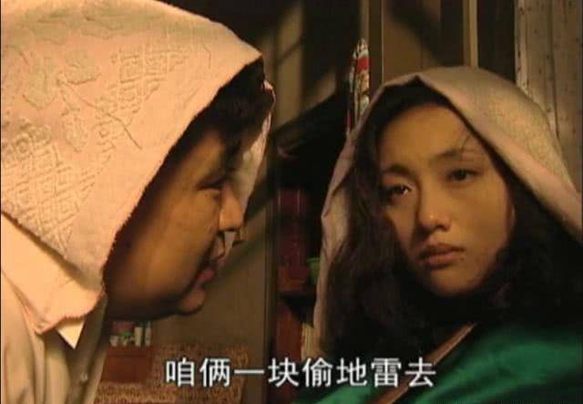《贫嘴张大民的幸福生活》 

而电影走向了比电视剧更悲哀的田地。

 

人们一边调侃着“有人说疫情让中国电影业倒退三十年，我心想还有这等好事”的段子，一边翻看着29年前戛纳海滩上的那张三人合影。人人都清楚，这恐怕就是顶点了。

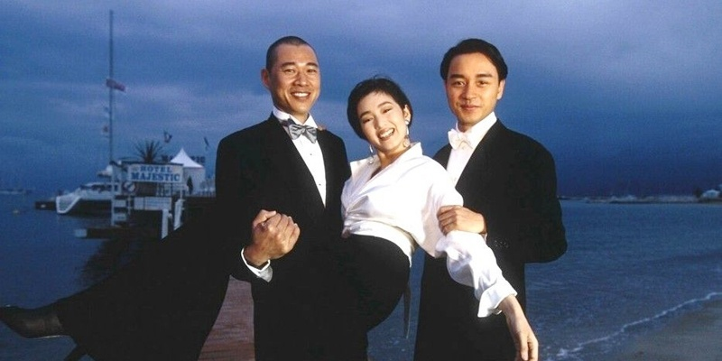

与甄学形成对照的是，2010年的《让子弹飞》，在B站衍生出了“让学”，源源不断地剪辑、拼贴、戏仿姜文的每一个台词和镜头。

 

如果此时此刻打开抖音你会发现，“我来某地只干三件事”以及姜文出场那段昂扬的配乐，正在成为新的热门模仿视频。很难想象，一句台词的生命力能蔓延十年。

 

人们说起中国电影，停在了一部《让子弹飞》，甚至连姜文自己都无法改变这个事实，因为他也没能拿出更好的新故事。

 

影音之外，被誉为第九艺术的游戏也在不断推出重制版。这些被历史证明成功的作品，正在成为游戏厂商的新理财产品。

 

不管是备受好评的《生化危机2》、还是被喷烂的《魔兽争霸3》、或是马上到来的《最后生还者》和手游版《暗黑破坏神》。

《魔兽争霸3》重制版，先知成蠢知

 

我们无意从道德角度指责各大厂商的商业考量，但当一个游戏小子目睹新游戏不断跳票，旧东西却不断翻新出局的状况时，难免会感到失望。

 

一切现象都在不断提醒你：

 

旧的就是最好的。观众不必为新的故事冒险，资本也不必。

 

永远有年轻人

人们永远相信，十六七岁到二十多岁的那段时间是黄金时代。

 

而黄金时代的产物永远是正确的。

 

那么，那些正在经历自己的黄金时代的人呢？

 

作为互联网原住民，00后是这波怀旧浪潮的局外人。他们成长在抖音与B站的天下，兴趣圈层更加闭合，吸取的信息养料来自一套更复杂的分发机制。

 

千禧年初，音乐产业在环境和时代的双重利好下，经历了迅速的膨胀增长，制造了90后所说的众神，紧接着一个踉跄，进入漫长的枯萎期。而今的华语乐坛并不是完全没有好音乐，只是好音乐不再那么容易和最多数听众碰面了。

 

如今说起音乐，不是一首歌的时间，而是15秒短视频里的一个BGM。刷到了好听的bgm，然后返回音乐软件找到这首歌，用户的操作习惯已经悄悄被算法改变。

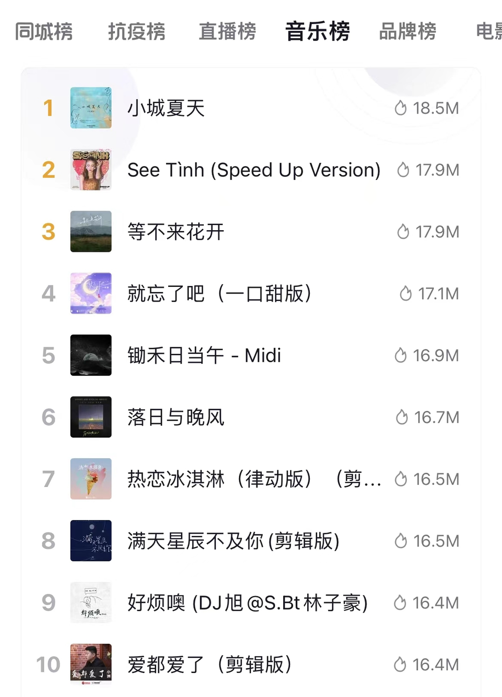抖音实时热门音乐榜

 

为了窥探00后的审美趣味，我找到了3个年纪相仿、经历不同、爱好不同的00后。诚然，他们不能代表全体00后，但我们依旧可以从个体身上找到一些暗线。

 

一个私人化的粗糙观察是，90后的青春期，或多或少会有摇滚元素的参与；而00后的成长离不开说唱。二者虽然都是舶来品，但折射的态度却是不同的：前者愤怒彷徨，后者随心所欲。

 

而在周杰伦身上，两代人的价值观令人意外的一致。

 

00后女孩姜一告诉我，她现在已经没有固定喜欢的歌手了，但如果要说起青春期的播放量第一，那会是张杰、汪苏泷和周杰伦。虽然张杰很土，汪苏泷很“青春疼痛”，但依然不影响那些歌出现在她的十七岁歌单里。

 

而她最喜欢的电影，有长大后才被各种影视解说反向安利的《霸王别姬》，也有和闺蜜聚会必看的《小时代》，即便二者差别很大。

 

她猜想，自己长大后或许也会变成一个“怀旧派”，因为她也认同“20年前的音乐和电影更用心”。“如果十年后也能看到我们喜欢的明星复出，我也会很激动。就像是和当年的朋友一起和青春来一个重逢，有一种惺惺相惜的感觉”。

 

02年出生的男孩周全，最喜欢的歌手分别是Drake、J Cole和周杰伦。

 

他对王心凌引发的大型怀旧现象并不能共情：“只是因为当年有一定的粉丝基础，再通过短视频平台引流一传十十传百。也许有真正的粉丝在支持吧，但更多的是一些没有听过王心凌的跟风网友而已”。

 

那些80-90后刷屏的线上演唱会，对于周全来说有些无聊：“终究还是缺少线下演唱会的感觉，看一会儿就疲劳了。”

 

相比于姜一的怀旧，周全更喜欢向前看。“相比于20年前的，我觉得现在的电影电视剧更好。特效更丰富，有未来感。”

 

01年出生的男孩Harry说起最欣赏的歌手，抛出的全是Rapper，包括王以太、The Weekend和Kendrick Lamar。

 

那些80-90后缅怀的旧事物，他虽然很欣赏，但也承认并不是很感冒：“我觉得2000年左右的歌曲非常好听，但是那个时代的电影我很少看。我更喜欢现在的电影，因为我喜欢与时俱进的感觉”。

 

对于Harry来说，只要Netflix还在播出新剧，那怀旧二字就是无病呻吟。

 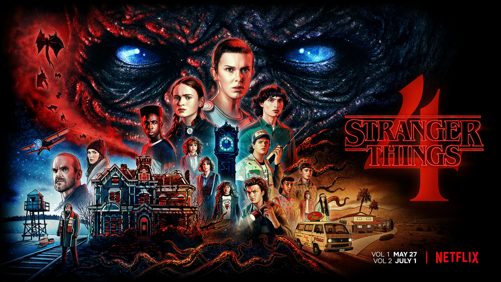《怪奇物语4》

 

当我问起这三个00后，如何看待10后小学生疯狂迷恋《孤勇者》的现象，他们都笑了。

 

周全不理解这种现象，他认为这是一群小孩盲目从众的行为。

 

反而是姜一和Harry觉得很有趣：“就像我们当时唱张杰的《逆战》和徐良的《坏女孩》一样，如果哪天徐良又站在舞台上唱《坏女孩》，我也会情不自禁地回忆杀吧”。

 

当我问到，00后是否有自己这代人的“周杰伦”时，三个00后几乎都在第一时间坚决地否定了：“没有人能取代周杰伦，这是肯定的”。

 

这个问题确实有拉踩的嫌疑，没人敢坐上这个烫屁股的位置。

 

无法告别

怀旧是人类不可避免的一场时代病。

它可以是精英话语，也可以是大众情绪。

 

茨维格在二战动荡时，身在异乡回首旧世界欧洲故土的人、事、物，感慨昨日的世界和镀金的时代在炮火中湮灭。这些文字当然是怀旧。

 

一个刚下班的90后，在公交车上打开QQ音乐听了一首周杰伦的《七里香》，闭上眼睛回到了六年级暑假的午后。这种感触当然也是怀旧。

 

怀旧是人类创造出的独特情感，甚至连“怀旧”这个词都是人造杜撰的。1688年，一位瑞士医生在一篇医学论文中提出：“nostalgia这个词的表现力可以说明源于返回故土的欲望的那种愁思”。

 

怀旧/nostalgia，来自两个希腊词语：nostos（返乡）和algia（怀想），是对于某个不再存在或者从来就没有过的家园的向往。“怀旧是一种丧失和位移，但也是个人与自己的想象的浪漫纠葛。”

 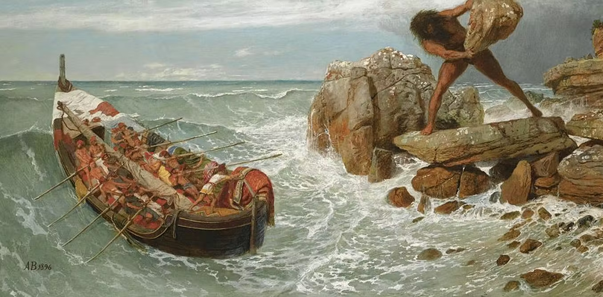《荷马史诗：奥德赛》

 

只要世界的车轮向前滚动，永远都会有人回头看。我们正在经历的这场复古浪潮，就像一场大迁徙中的休息。明知新世界即将到来，却迟迟不肯开门。

 

无论世界如何变化，总有一群人正在怀旧。而今天怀旧的主角变成了在争议声中长大的80后和90后。曾经的小孩们成为夺取话语权力的壮年，合谋策划出一场漫长的告别。

 

新世界不再有吸引力。于是我们频频回头张望，寻找曾经跟世界那个熟悉的连接点。

 

而沉浸在怀旧之中的人们，未来或将面临一个尴尬的问题——数十年后，人们该拿什么怀旧我们当下？又有什么能够证明我们驻足过、创造过的世界？

 

一场带货直播，一档寡淡无味的综艺节目，还是抖音15秒就切歌的神曲。

 

没有新故事出现，就是如今怀旧火热、无法告别的症结所在。

 

未来失焦模糊，不再充满诱惑。而回忆不断被浪漫化，套上一层层光环，最后被塑造为一场集体神话。我们只能不断地考古、再考古、掘地三尺背朝天，去寻找那根和大地紧紧绑定的绳索。

 

怀旧其实是在寻找一种群体性情绪，在飘荡中握住确定性、安全感和归属感。个体被雨打风吹，变成孤单的原子，渴望重新抱在一起。而引导我们抱团的，就是怀旧——解决当下焦虑的唯一手段。

 

> “眼下全球都在流行这种怀旧病，越来越多的人渴望总有一种集体利益的共同体情感，渴望在一个碎片化的世界中获得一种连续性。这种流行病是身处生活与历史加速剧变的时代中的人们的一种防御机制。而这种防御机制的实质在于承诺重建今天诸多有影响的意识形态一味主张的理想家园，引诱我们放弃批判思考，而代之以情感团结。”（齐格蒙特·鲍曼《怀旧的乌托邦》）

 

人类总是在安稳与冒险、保守与自由、怀旧与展望这两个方向摇摆，而摇摆的过程，构成了我们大多数人的人生。

 

还记得在《午夜巴黎》最后，大梦初醒的男主人公独白道：

 

“人们总是以为自己生活的时代糟糕透顶，总以为如果能够回到过去，自己会更快乐。但在我们如今认为是身处黄金年代的那些人看来，他们当时所处的世界同样是苍白无力的。”

 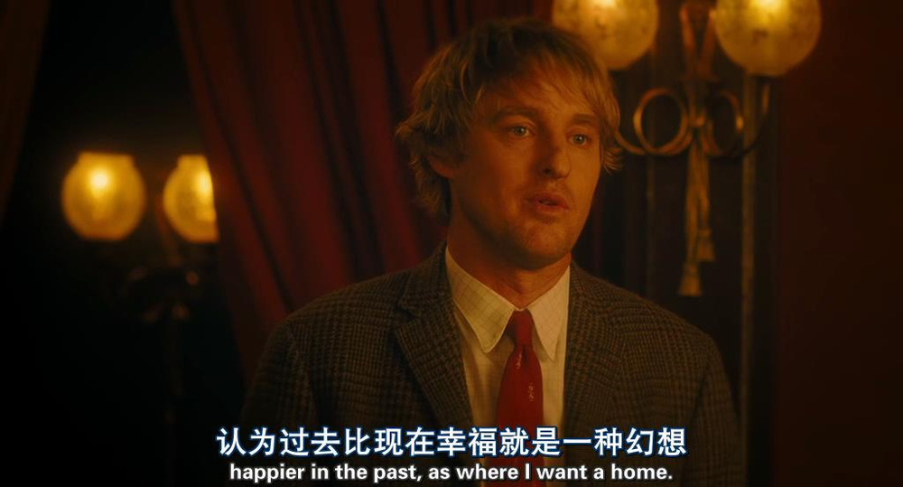

我们依赖过去美好的经验，希望能从旧日的吉光片羽中，借几分面对未来的勇气。

 

正因为我们经历过最好的，所以才看清了当下的不如意。

 

而当下的每分每秒，或许也是他人未来怀旧的主题曲。