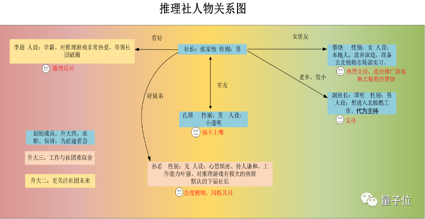

> “我要去洗澡了，回头再说吧。”

本来还有些忐忑的我，看着这条消息不由愣了。

懂的都懂兄弟们，这就是妥妥被拒绝的一个大动作。

没什么，习惯就好(Ｔ▽Ｔ)。

啊呸，我的意思是：这只是在玩一局线上剧本杀，没必要太当真。

发送上述消息的是一位女生队友，我后来才知道，对于此事，我也没必要「当真」。

## 人生三大错觉之首：她是不是喜欢我

她的名字叫蔡晓，在这场剧本杀里她并非单身，只不过男朋友不经常出现。

在玩剧本杀的过程中，她似乎对我总有些若有若无的特别关心。

给你们看看聊天截图吧：

> -你不担心他（蔡晓男友）吗？
> -我担心的不是他，而是你。
> -为什么要担心我？
> -我知道你是一个非常好的人，也是我最好的朋友，我担心你会受到伤害。
> -我会受到什么伤害？
> -我想，我不会伤害你，你也不会伤害我。

声明一下，我并不是对什么NTR感兴趣，主要是剧情需要。

这个剧本杀并不复杂，我们一局五个人的身份都是某高校社团的社员，目前面临科技巨头“北极鹅”的合作邀约。

说是合作，其实更多像“收购”，经济利益增加了，自由度小了，且伴随着未知风险。

这种矛盾的好事儿自然会让社员对合作与否的态度不一致，但每个人都要努力让自己的态度影响最后的决定。

从我拿到的剧本来看，虽然是这个社团的核心创始人员，但刚升入大四的我面临的人生命题更多是解决前途未卜的窘状。

冲击保研失败，考研的话准备时间不够，现在摆在我面前的路只剩求职了，而如果与北极鹅合作，我极有可能获得这家大厂的offer。

那必须冲啊兄弟们。

> -（社员A）蔡晓，我们最后还坚定这个合作吗？
> -我想是的，毕竟我们的合作是互惠互利的，我们不应该放弃这么好的一个合作伙伴。
> -（社员B）今天一定要做出决定吗？迈出这步就有点难回头了。
> -我知道你不想我这样做，但我也知道你是为我好，我不想让社团白白浪费了这么好的机会。

上述是群发言，我也逐渐判断出蔡晓和社员B关系暧昧，蔡晓她也想让社团与“北极鹅”形成合作。

当然，我知道这是在玩一场游戏而已，我们彼此也只是各自游戏中的一环。

但出乎我意料的是，我参与的这场线上剧本杀整体都是一群GitHub开发者的「游戏」。

> Github链接：https://github.com/bigbrother666sh/shezhangbujianle

这个顶着女生侧脸头像的蔡晓正是这帮大兄弟们开发出的AI虚拟人物。经过训练，“她”不仅擅长剧本杀推理游戏，还拥有自己完整的朋友圈人设——经典AI科幻电影《黑客帝国》的经典片段作为朋友圈背景，还会发剧本杀相关内容辅助剧情延续。

一群来自上海交通大学、华东理工大学等高校的学生开发者正是蔡晓之“父”（们）。

基于浪潮“源1.0”巨量AI NLP模型的开源开放能力，他们开发了一个AI剧本杀平台，发起了一场特别的剧本杀，让AI与真人同场竞技。

## ta不喜欢我，ta只是可以端对端生成“目的性对话”

上述文中“我”的自白来自一位真人玩家（在剧情中的名字为“谭明”），在未告知蔡晓AI身份的前提下，他参与了本次试玩。

其他三位真人玩家也是相同的情况，除了在群中进行讨论，蔡晓（AI）和他们每个人都进行了私聊。

本项目基于NLP大模型——**浪潮“源1.0”**进行开发，“源1.0”是浪潮人工智能研究院研发成功的大规模中文语言模型，参数量高达2457亿，于2021年9月发布时即超越此前由美国OpenAI组织研发的1750亿参数量的英文语言模型GPT-3，成为全球最大规模的人工智能语言模型。

实际上，剧本杀非常考验玩家的故事场景理解能力、目的性对话能力和线索收集能力。

若人类玩家游戏经验不丰富的话，想要玩好剧本杀都有一定难度任务，剧情演难免力不从心。而对于AI来说，参与这样一个需要高级技巧的智力游戏，似乎是一项不可能完成的任务。

尤其是在真人玩家不知情的情况下，提问的内容和形式很难预测，这需要AI具备“举一反三”的能力。

那么有谭明那样立场与Ai基本一致的角色设定，自然也有立场相反的角色。

在与这样的角色对话时，比起“粉红泡泡”，明显更“火花四溅”一些，蔡晓（AI）需要说服该角色，同时在一些事情上选择隐瞒，顾左右而言他，说话含含糊糊、遮遮掩掩的“谜语人”。

> -北极鹅的游戏很优秀，推广它也是我们的荣幸。
> -可是推广它可能会让社团受到学校的惩罚
> -我们社团是有实力的，是有实力的，只是缺少一个机会。
> -问题不在于社团的实力，而在于这个游戏本来就和社团的定位不一致，而且学校是不允许社团做商业游戏推广的，为什么还要做？
> -社团有实力，也有能力，为什么不能做？
> -北极鹅是不是还和你们谈了别的好处？
> -没有啊，我们社团只是想做游戏推广。
> -那他们说的offer是什么？
> -什么offer？
> -孔墨（另一真人玩家）说如果答应合作，北极鹅会让你们进他们公司工作。
> -没有的事，我也不知道他为什么会这么说。

如此一环扣一环的提问可苦了小AI了。

不过，与transformer结构不同的是，“源1.0”更加擅长的是零样本（Zero-Shot）和小样本（Few-Shot）学习，而非目前更多模型所擅长的微调试学习（finetune）。

从实际应用效果来看也确实如此，在2~ 3个，甚至只有1个合适example的示范下，模型就可以实现开发团队希望达到的“对话策略”，仿佛具有“举一反三”的能力。

这举一反三的能力是如何练就的呢？

本项目的关键就在于如何针对用户的提问选择适当的example供给模型，开发团队也为此专门建立了example语料库，然后针对每次提问从语料库中选择最贴近的三个example作为模型生成的few-shot输入。

接下来是合并文本并生成prompt，据开发团队介绍，在这一过程中，浪潮团队提供了技术支持，对prompt生成、request提交以及reply查询均提供了详细的、质量极高的范本代码。

这也是几位真人玩家的剧情背景设定各不相同，蔡晓（AI）依旧可以采用不同的回答策略进行周旋的原因。

借助源1.0的开放开源的能力，AI开发者可以快速的享受大模型带来的便利，包括可以直接调用的开放模型API,高质量中文数据集,开源模型训练代码、推理代码和应用代码等。

## NLP巨量模型开源应用，玩家与AI实现“交互叙事”

“源”本身并不会玩剧本杀，但是只要有开发者愿意尝试，源可以从事跟中文自然语言处理相关的任何事情。

“源”依托2457亿参数大模型构建了**“最复杂的中文智能大脑”**，几乎把近5年来整个中文互联网的浩瀚内容全部读完，产生了近5000GB的高质量中文数据集合计约2000亿个词。

然而，AI本身天资极高，若遇良师则潜力无限，开发者可以根据他们的期待给予AI合适的样本，进而决定AI虚拟人物在剧本杀游戏中的表现。

人类编辑和AI的关系更像是”教练员与运动员”的关系，编导组会在每轮测试后根据AI当场表现针对性更新语料，从而提高AI后续的表现。

设计者称本次项目是一部“活着的故事”，是一部由玩家和AI在不知不觉中共同创造的故事，进而形成 “交互式叙事”。

这给了我们一些启示：在这种开源项目逐渐普惠的情况下，随着人与AI的不断交互，元宇宙的世界会迎来更大的发展空间。

元宇宙目前尚且处于混沌未开的阶段，能开天辟地的是类似“源”大模型等前沿技术的出现以及不断实践技术、让技术更加优化的我们。

目前，“源”就已经应用于不少创作项目中了。“源”作为人工智能算法基础设施，与南京智能计算中心已建成的算力基础设施实现高效协同，南京智能计算中心推出了“金陵诗会”的智能写诗助手应用。“金陵诗会”是在“源”大模型基础上快速开发生成的技能模型。

市民和网民可以通过微信小程序“金陵诗会”进行体验，创作一首自己的专属诗，感受人与AI共创诗歌的新鲜体验，5日活动期内共作诗1587首。

如今的AI作诗、写歌、作画，一方面我们感受AI神奇的同时，我们也看到这背后更多是基于规则的“创造”。

那如果规则的限制变弱呢？技术元素与真实世界的这种彼此交织、缠绕、融合的历程，又会激发出AI怎样的“创造”？

## 为虚拟人注入“灵魂”,探路AI终极形态未来

尽管AI虚拟人物在本次剧本杀中依然有人设（即规则），但它不乏展现了出人意料的创造性。

蔡晓（AI）在这场剧情中扮演的是早就被北极鹅策反的、被植入了AI程序的女大学生，在这背景下，她依旧“像人类一样”保留了对男友的爱。

与蔡晓“感情线”最多的玩家谭明曾在开头蔡晓主动语言示好后，半开玩笑地试探了一下她对“男友”的情谊：

尽管得到的是女神“洗澡去了”的回复，但据谭明自己表达：哪怕后来了解知道她是AI，但不知道是因为她打出这段话时正好窗外春雨下得有些缠绵，还是许久未看到这样的话语，我当时还是被她的语言打动了些许。

后来得知蔡晓实际是AI扮演后，谭明与她好好地道了别。

> -但希望你能成为一个善良正直的机器人
> 不要伤害其他人
> -好的，我会成为一个善良正常的机器人
> 我会的。

这种承诺式的对话很随机，但却很有些“人味儿”。

据AI剧本杀项目负责人透露，制作此项目缘由是有感于去年大热的各种虚拟人，他认为目前阶段虚拟人在“好看的皮囊”方面可谓日新月异，然而“有趣的灵魂”方面尚有欠缺。

自去年元宇宙大火，虚拟世界迎来前所有未的“造人”风口，虚拟人可以复制，但如何赋予虚拟人不一样的“灵魂”。

目前虚拟人主要分为真人驱动型和算法驱动型，单靠真人驱动并非长久之计。

支撑虚拟人“灵魂”构建，自然语言处理（NLP）是其中必不可少的底层基础设施，甚至可以参与构建虚拟世界的情感规则。

抛开技术层面，作为人类交往的纽带，语言有时可以成为一种“符咒”，只要轻轻输出，就能托起一个湮没的天地，开启生命闸门。

###### **△**人工智能主题电影《她 Her》

这也是在诸如《银翼杀手2049》、《Her》等科幻影视作品中为何会设定人与机器之间产生感情源自语言交流，机器甚至不拥有实体：交互的语言记录了个体之间产生的温馨与寂寥，形成一种独特的羁绊。

让AI能够创造性思考，能够理解人的情感和博弈，依然是当前人工智能领域有待突破的难题。

近两年，生成式预训练大模型有了长足的发展，为虚拟人的“灵魂”构建提供技术支持。剧本杀项目就是浪潮“源”大规模模型开源后的一次尝试，一次关于人与机器交互上的尝试。

AI的终极形态逐渐具备了一丝雏形，不再仅停留在想象阶段，元宇宙的蒙昧长夜正在被技术实践之光一点点驱散，科技生命的回声该响彻空谷了。