最近我在网上冲浪的时候，发现已经去世两年半的篮球巨星科比·布莱恩特在视频网站“秽土转生”了。

 

种种怪相，堪称一场新世纪的百鬼夜行。

 

 

科比转生者，也就是科比的模仿者，近期井喷式增长，在全国各地落地生根。

 

这群科比转生者对科比的模仿，不止于长得像，连行为也无限趋同，堪称科比上身。

 

能叫得出名字的模仿者有贵州六盘水大姐夫、广西南宁科比、甘肃天水乡村峰曼巴、四川凉山曲比黑曼巴。

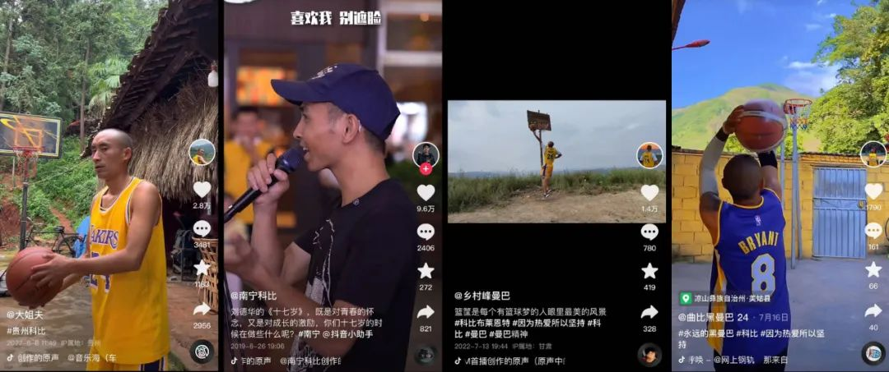

 

叫不上名字的就更多了。

 

***网友把这次科比模仿者井喷事件，称为科比复活赛。***

这场复活赛，各路选手都有绝活。

 

目前复活赛的头号种子选手，是来自贵州的大姐夫，他早期走的是传统形象模仿路线，靠一个回头动作狂吸三百万粉丝。

 

 

网友们一致认为这哥们长得太像科比了，一回头泪目了。

 

 

也有网友评论，天天就这么个回头动作，早看烦了。

 

而就在大家都以为大姐夫没活儿，只会凭借一张脸模仿科比的时候，不知道受哪位高人指点，他开始钻研球技，并有了质的飞跃。

 

最开始，他的三步上篮是这样的，走步、双手运球、翻腕，十分不规范。

 

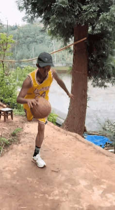

 

为此，他下定决心，剃了光头，辛苦练习后，虽然姿势还是不对味，但不走步了，背篓也换成了正规的球框。

 

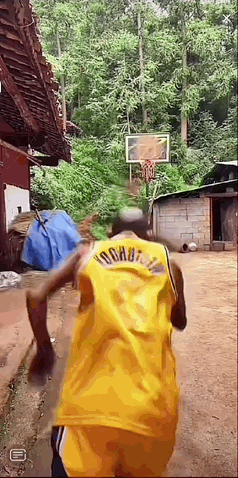

 

而最恐怖的，是他投篮的进步，大姐夫从一个从来没正式接触过篮球的中年人，进步到现在已经可以不看球框远距离投篮了。

 

 

网友纷纷高呼，那个男人回来了，复活赛打赢了，科比快适应身体了。

 

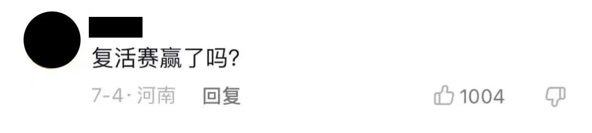

 

更具戏剧性的是，大姐夫不仅骗过了网友，甚至骗过了AI算法。

 

打开大姐夫的视频，推荐搜索是“科比”，可以说，他已经跟科比绑定了。

 

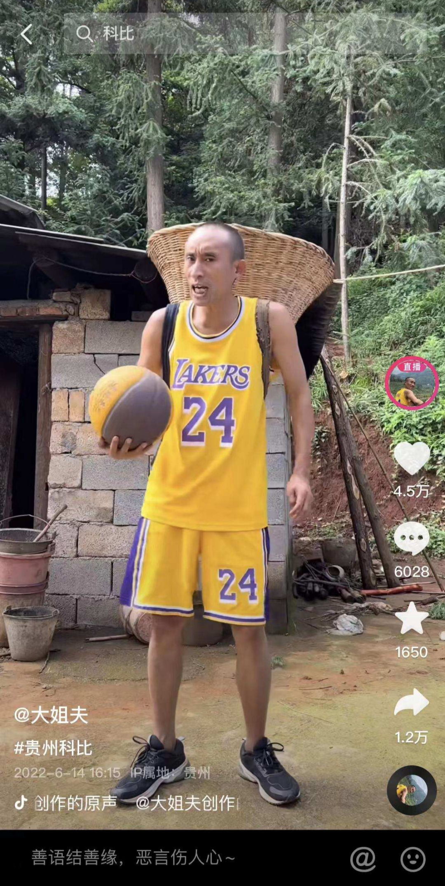

 

用大姐夫的图片识图，算法会告诉你，这个人或许就是科比·布莱恩特。

 

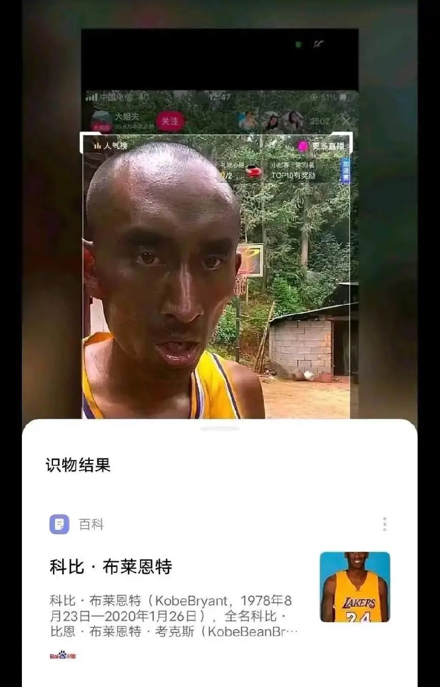

 

在推特上搜索科比，你看到的，可能是这个贵州科比。

 

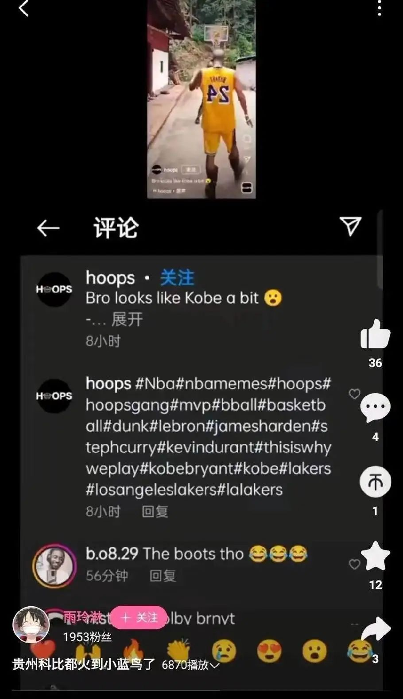

 

大姐夫除了长得像、进步快之外，在复活赛遥遥领先的另一手操作是，他明白，一个IP，要想发展，就得整矩阵。

 

他联手贵州奥泥耳组成“OK”组合，让两人的账号粉丝互通，进一步扩大自己的影响力。

 

这一手操作的专业程度完全媲美缔造了勇士王朝的NBA首席经理人杰里·韦斯特。

 

 

大姐夫还联手贵州“奥尼尔”“詹姆斯”“巴克利”“杜兰特”，办起了贵州山寨全明星赛。

 

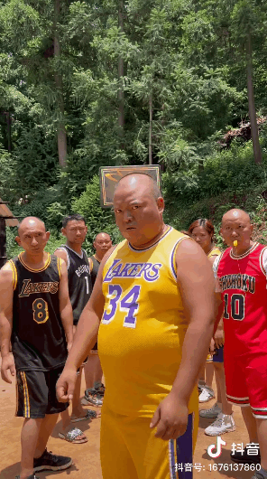

 

来自甘肃天水的乡村峰曼巴，是纯粹的技术型选手，靠模仿科比“三威胁”（突破、投篮和传球）姿势和标志性的后仰翻身跳投安身立命。

 

 

在模仿技术之余，他更多模仿的是科比“凌晨四点洛杉矶”的格言，不过不同的是，一个是在斯台普斯湖人主场练习投篮，另一个是在甘肃的烈阳下做俯卧撑。

 

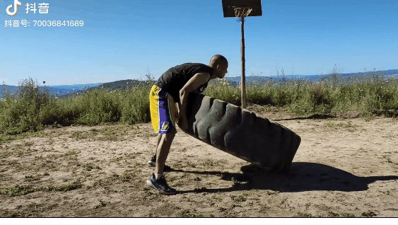

 

来自四川凉山的曲比黑曼巴，因为除了投篮，没什么独一无二的活儿，所以粉丝量一直上不去，目前处于科比复活赛的队尾。

 

 

科比模仿者的批量出现，实际上是大家对科比去世的情绪发生了变化。从最开始的震惊，缅怀，到现在的戏谑。

 

***现在太多人想看科比复活的地狱笑话了。***

 

人们在科比复活赛的评论区不断玩着关于科比复活的梗。

 

比如铁肘梗，科比在职业生涯中，肘击过巴蒂尔、姚明，还因为救球肘击过一位观众。

 

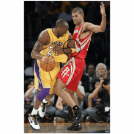

 

网友十分害怕被科比的铁肘给来上一下。

 

 

还有留言闪电旋风劈的。

 

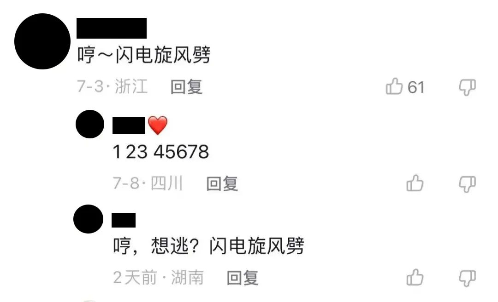

 

闪电旋风劈的梗，来自动画片《洛洛历险记》，里边的角色龙卷风，本体是直升机，必杀技是闪电旋风劈，因科比是坐直升机坠亡的，所以二者在视频网站上被缝合成嘲讽科比的梗。

 

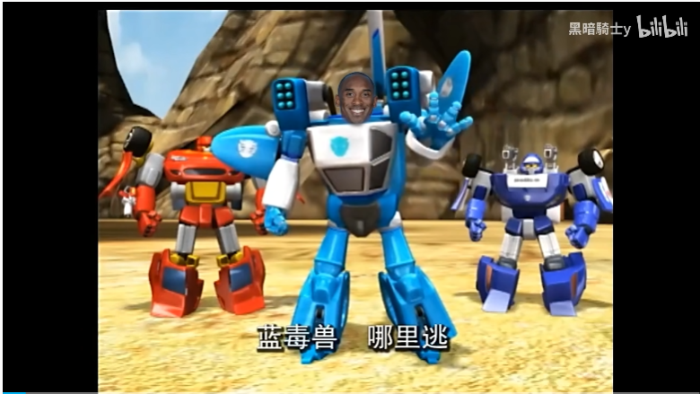

 

如果说前两个梗比较好理解，这条评论说的“我选小布丁”则让我摸不着头脑。

 

 

***科比复活，为啥跟一块钱一根的小布丁扯上关系了？***

 

这是因为，科比复活事件，最著名的战役是“小布丁之战”，发生在2020年科比去世后。

 

当时的NBA吧，有个帖子发起了投票，两个选项分别是“一只美味的小布丁”和“复活科比”。

 

 

结果当时90%的人都投了想要一只美味的小布丁。

 

 

自此，扣“1”复活科比，成了一个新的地狱笑话梗，并且还诞生了“科比<小布丁”的新贴吧定律。

 

在玩梗之外的另一面，确实有一些人太想念科比了，他们真的想复活科比，甚至不惜献出自己的生命。

 

 

如果你在视频平台上以“科比复活”为关键词搜索，能看见科比虔诚的信徒们，正试图用各种方式复活科比。

 

在B站上，有人挑选出逝去的巨星们，询问大家想复活谁。

 

 

有人在下面评论，愿意把父母的生命献出复活科比。

 

还有人拿科比给腾讯篮球手游《最强NBA》的宣传片配上字幕，说科比已经复活成功了。

 

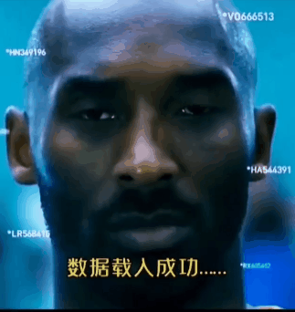

 

怪谈上也找上了“复活科比”的词条，还有假新闻报道，科学家发现了科比在洛杉矶豪宅留下的细胞核，正在探索用克隆技术复活科比的可能性。

 

一些人想的复活科比的方式也十分现实与刁钻。

 

在沈阳铁西区，就有这么一家科比主题烧烤店，座椅都是8和24号，墙上写着“凌晨4点的洛杉矶”，连菜单的配色都是紫色和金色。

 

 

怀着对科比的敬意，UP主转生成为毛毛狂吃了10串羊鞭。

 

而随着各方的加入，复活科比的范围，也逐渐变得宽泛模糊，蒙上了各种神秘色彩。

 

比如有个叫奈杰尔·盖西的巫毒教巫师声称能复活科比和他女儿。

 

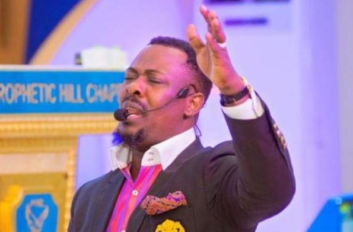

 

具体的操作是选择两个人作为容器，把科比和他女儿的灵魂招过来，进行复活。

 

奈杰尔·盖西说：“科比和他女儿在坠机中死亡并没有得到上帝的认可，因此，以合适的价格，我可以复活他们，上帝刚刚带我进入灵界，已指示过我。”

 

而他给出的价格是，5000万美元。

 

面对这个结果，大家一致认为这位加纳的哥们应该被关进精神病院。

 

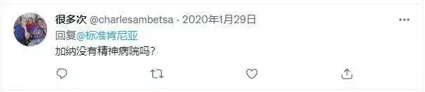

 

有的视频更是上升到了全人类命运共同体的高度。

 

比如有这么一条视频，问你愿不愿意加入复活科比的行列，只需要你献出一秒的生命给科比，全球70亿人，只要人人都献出一秒，科比就能复活32年。

 

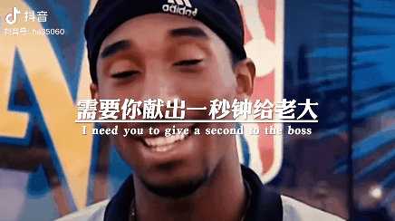

 

喜欢科比的粉丝被感动得痛哭流涕，说1秒钟哪够啊，我要献出我自己的生命换他回来！

 

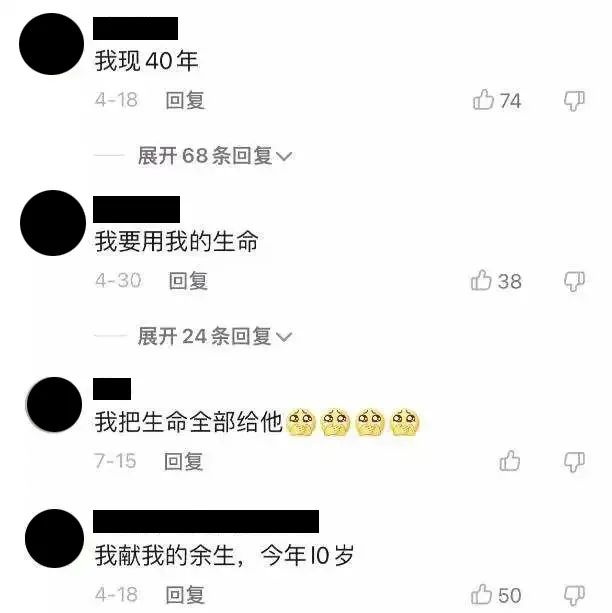

 

或许你以为能说出这种话的，不是资深的虎扑老哥，就是10年科密或者NBA学达人。

 

但点开他们的个人主页你会发现，她们有的是发视频记录两个孩子成长的宝妈。

 

 

有的是喜欢发自己特效滤镜视频和干农活的乡村女性。

 

 

你在街上看到这样一个人，绝对不会想到她想献出自己的生命复活科比， 也难以想象，是什么时候，她们跟科比结下了缘分。

 

现在距2020年1月26日科比去世已经过去了两年半，但有关科比的各种假新闻依旧满天飞。

 

前几天，还有不少新闻拿着“科比黑匣子破译了，科比给世界留下了6句话”做噱头赚流量。

 

 

这6句话分别是：

 

> 1，天呐，这是发生了什么吗？我感受到了剧烈的颠簸；

> 2，机长，发生了什么？有没有人告诉我，我们的飞机发生了什么？ 

> 3，上帝，我们正在经历什么？我们会没事的，对吗？

> 4，吉安娜，你还好吗？到我的怀里来，让我抱着你，一切都会好的。 

> 5，吉安娜，如果你是唯一的幸存者，答应我，一定要勇敢的生活下去，告诉妈妈，我爱她！

> 6，如果有人能生存下来，请帮我告诉这个世界，我依然爱她。

 

但直升机根本就没有黑匣子，外媒也没有这方面的报道。

 

在科比复活的巨大利益盘口里，有靠着模仿他走红的，有在评论区留言地狱笑话玩梗的，有真心想复活科比的，有捏造假新闻造谣的。

 

复活科比，已经成为一个新的互联网黑色幽默，一场全民的狂欢。

 

而当任何一种事物向狂欢演变，那么讨论的核心便有可能失焦。

 

没人关心科比复活是否在任何理论层面可行，甚至连这些复活赛的选手们也不关心。

 

模仿科比的大姐夫，晚上主要的直播内容是打麻将。

 

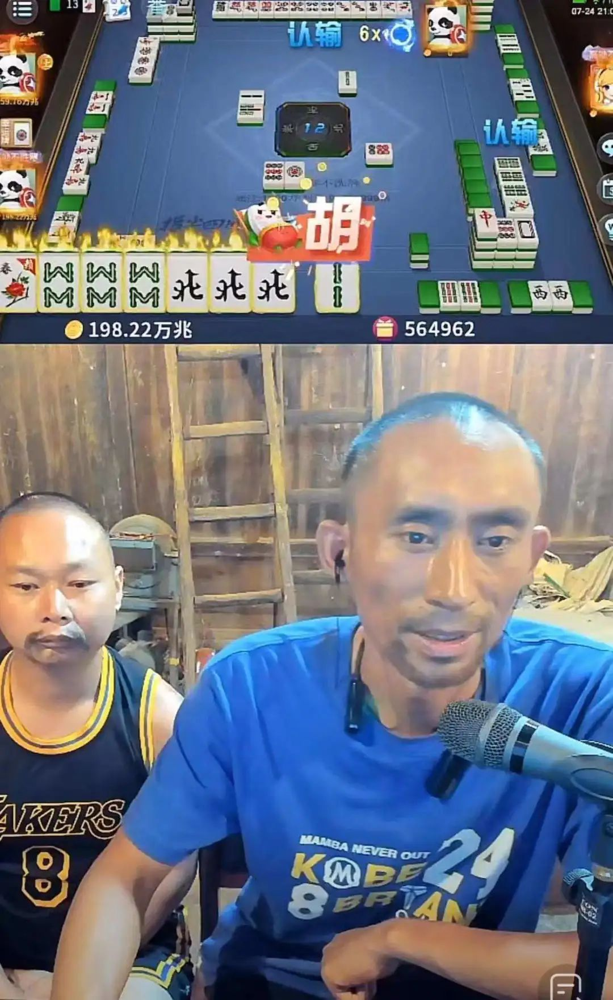

 

虽然科比复活是假的，但从全民狂欢中折射出的寓言却是真实的。

**人们在科比的尸骸上挖掘矿藏，并撷取自己需要的那一部分。**

**而下一场狂欢什么时候到来，谁又将成为新狂欢的主角、黑色幽默的载体、地狱笑话的宿主。**

**就交给不断造神和灭神的互联网了。**