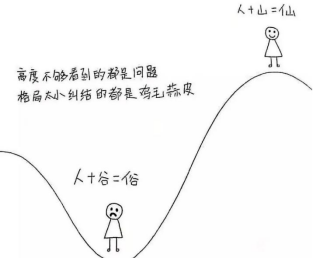

文/北木南

来源/夜听（ID：yetingfm）

《了凡四训》中说道：

“从前种种，譬如昨日死；从后种种，譬如今日生。”

过去的事，过去了就与现在无关了；往后的事，都可以从今天开始重新来过。

成事不说，遂事不谏，既往不咎。

人生下半场，我们最好的活法就是——

**别和自己过不去。**

**接受不完美，你就释怀了**

读过一封听友来信。

听友池池说，失恋后才知道想一个人有多痛，忘记一个人有多难，放弃一个人有多煎熬。

她有过一段6年的感情，最后因为种种原因两个人没有走到一起。

分手的时候，双方都不体面，彼此都说了最难听的话。

“真后悔跟你在一起。”

“我忍你够久了。”

“早就不想跟你过了。”

池池说，我们连分手都没有好好地告个别。

几多悔恨，几多悲凉。情深缘浅，造化弄人。

世间情感，无法善终，是再寻常不过的事情，有太多的意难平，也只能去接受这无疾而终的结局。

看过一段戳心的话：

**“你终会相信，生命中会出现这样一个人。就算不顾一切，就算倾尽所有，就算万死不辞，你也无法和他走到最后。”**

求而不得是人生的常态，很多东西都无法十全十美。

看过一个故事。

一位大师临终前想从两位徒弟里选一个继承人，于是就给两个人派了一个任务：去森林里找回一片最完美的树叶。

大徒弟带回来了一片叶子，说：“我没有在森林里找到最完美的叶子，但我带回来的这片叶子还算完整。”

小徒弟一心想要找到最完美的叶子，累得筋疲力尽，最后空手回去了，对师父说：“我找了很久，就是找不到最完美的叶子。”

最后，大师选了大徒弟。

图片来源：全景视觉

这世界上本就没有完美的叶子，与其凡事都求完美，不如图个问心无愧。人生中的许多痛苦，其实都是你在和自己较劲。

网上有一个话题：“你觉得真正完美的爱情，应该是怎样的？”

高赞的回答是：

**“可以有不完美。”**

蒋勋说：**“生命怎么活都会有遗憾，关键在于你怎么去领悟，给这个遗憾的部分更崇高的向往，然后尊重、包容它，反而会把这个遗憾的部分变成一种生命力的圆满。”**

所以，面对无法改变的结局，你要坦然接受缺憾，与自己和解，只需记住这12个字：

面对它、接受它、处理它、放下它。

**抛弃芝麻小事，你就快乐了**

你有没有过这样的时刻？

白天会被一堆事情困扰，心烦意乱。

晚上躺在床上胡思乱想，无法入睡。

你或许会想：

ta为什么不理我了，不喜欢我了？

领导说话是不是在针对我？

为什么朋友圈没人给我点赞？

我的为人是不是有问题？

ta是不是对我有意见？

有的人，总为一些无关紧要的事情劳力伤神，越想就越焦虑，越想越心烦。

在你遇到烦心的事情时，你可以先问自己几个问题：

你心烦的事情，值得让你如此痛苦吗？

你忧愁的事情，要怎么做才能变好呢？

你痛苦的事情，能够影响你多久的生活？

看过一张图：

 

如图所示：

一个有高度的人，目之所及都是风景。一个只看到眼前事物的人，眼里只装得下一地鸡毛。

“六尺巷”的故事你或许听过。

> 清朝康熙年间，大学士张英在桐城的家人，因宅基地与邻居发生纠纷。
>
> 
>
> 张英的家人给他写信，试图倚仗他的权势压倒对方。
>
> 
>
> 不料张英却从朝廷寄回一首诗：千里修书只为墙，让他三尺又何妨。长城万里今犹在，谁见当年秦始皇？
>
> 
>
> 家人读罢，深感惭愧，立马让出三尺地界。
>
> 
>
> 邻居被张家的举动感动，也让出了三尺。
>
> 
>
> 就这样，“六尺巷”成为千古佳话。

世间万物，终究抵不过时间，与其把精力浪费在锱铢必较，不如学会释怀。

烦恼天天有，不捡自然无，正如《菜根谭》里说的那般：

“石火光中争长竞短，几何光阴？蜗牛角上较雌论雄，许大世界？”

把目光放长远点，不囿于当下，用更大的格局去衡量对待一件事情，那些所谓的烦心事会变得不足挂齿。

诗人歌德说过：**“重要之事，不可受芝麻绿豆小事所累。”**

余生，别为芝麻小事耗力气，别去钻入牛角尖。

生活中多数的烦恼，都源于内心的计较。

抛弃烦心的事情，你会快乐许多。

**看淡得失，你就轻松了**

微博有这样一个话题：

“你做过最幼稚的一件事情是什么？”

高赞的回答是这样写的：

“执念太深，紧抓着失去的东西不放，明知道无法再得到了，却还是不肯放手，不断地消耗自己，让自己变得筋疲力尽。”

作家萧伯纳说：**“人生有两大痛苦，一是得不到，二是已失去。”**

人生之苦，苦在执着；人生之难，难在放下。

分享一个故事。

> 有一个财迷，背着一袋金子去乘船。
>
> 
>
> 没想到船行驶到河中央的时候，突然刮起了大风，眼看船只就要被风浪打翻，船夫拼命喊道：“快把你怀里的金子扔掉。”
>
> 
>
> 如果扔掉金子，船的重量会变轻，可能还有一线生机，但是无论船夫怎么喊，那个人都舍不得放下怀里的金子。
>
> 
>
> 最后，船沉了，财迷因为一袋金子，失去了自己的性命。

其实，想一想我们有时候也活成了财迷的样子。

我们追求名利，牺牲身体，成为物质的奴隶。

我们追求感情，委曲求全，最后被爱情所伤。

有句话说：“幸福永远不取决于你拥有多少，而取决于你看淡多少。”

还看过一个故事。

有一个人，背着一个大包袱，准备出去游玩。

他一路跋山涉水，却丝毫没有体会到旅途的快乐。

背着沉重的包袱累得直不起腰，他遇见了一个农夫。

他向农夫抱怨说：“我一路游山玩水，为什么还是找不到快乐？”

图片来源：全景视觉

农夫笑而不语，只是弯腰放下了肩膀上的稻草，说：

“快乐还需要刻意去找吗？放下就是快乐啊！”

人生之苦，苦在权衡取舍，就像那句话说的：“人生海海，正是有权衡过后的舍弃，有反思过后的放下，才会有悠然见南山的闲适，和千金散尽还复来的畅快。”

**生命是需要及时减负的，背负越多失去越多。**

得之我幸，失之我命。看淡得失，一切随缘。

很喜欢一句话：

“假如你是一棵树，别人对你的态度就是一阵又一阵的风，如果你总是很在意，随便一阵风都会把你剧烈摇动，甚至将你吹倒。”

所以，有时候不是忧愁选择了人，而是人主动选择了忧愁。

心理学家詹姆斯说：**“人们可以通过心态来改变生活，这可以说是我们这一代人最伟大的发现。”**

你什么心态，就什么命。一个心态好的人，人生肯定不会太差。

从今天开始，不如放下对完美爱情的执念，把心中的烦心事及时清理一遍，把得失看淡一点。

以一个美好的心态去面对世事，恰到好处地活着，你的幸福感会提升许多。

白岩松说：“学会归零，让坏的不影响未来，让好的不迷惑现在。”

**万物都在更新，我们的思想也该如此，需要打破一些惯性思维，迎接一个全新的自己。**