来源/女子无才便留德（ID: wucai6de）

**两份抑郁症报道**

前不久看到一篇关于一位高中女生患上抑郁症的深度报道。

主人公的姓名在文中没有提及，为方便叙述，我们暂且叫她M。

**M是个非常优秀的女孩，就读于全省排名第一的重点高中，距离梦寐以求的重点大学仅一步之遥。**

然而就在这个节骨眼上，出事了。

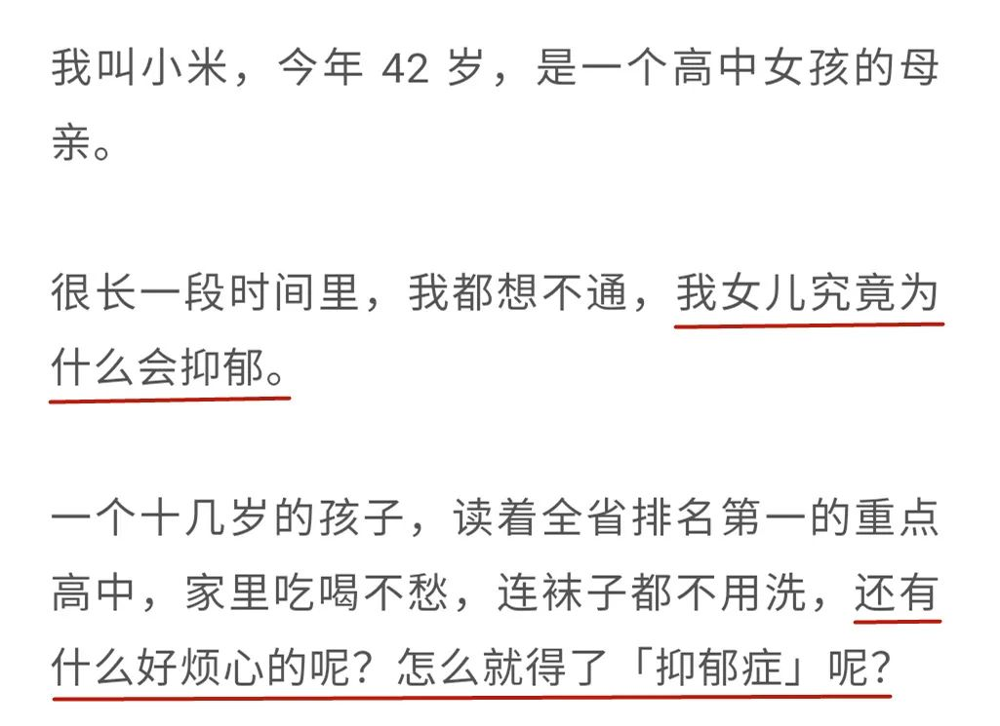

来源：丁香医生

标题：《错把抑郁当成叛逆，我差点失去了女儿》

自从高中住校后，M从小处理不好人际关系的问题开始凸显出来，常常和同学发生争执，闹得宿舍鸡犬不宁。

**M在电话中频频向妈妈求助，诉说自己被孤立、被欺负，而每一次妈妈都让她自己反省，因为“跟每个同学都搞不好关系，那就是你自己的问题”。**

而每一次接到班主任电话投诉后的访校，都以妈妈对M的责骂和对班主任的道歉而终结。

此后M的状态变得越来越歇斯底里，M的父母被迫在学校附近租房陪读。

陪读之后，妈妈惊恐地发现，女儿像变了个人一样。

**无心学习、谈起恋爱、嗜睡畏光、深夜哭泣、拒绝沟通，还常常无意识地抠自己的手指，抠得指尖遍布伤口……**

直到有一天M哭着回家，说自己在学校好可怜，站在教学楼上就想往下跳时，妈妈才慌了神，决定带她去看医生。

**诊断结果为中度抑郁，轻度焦虑。**

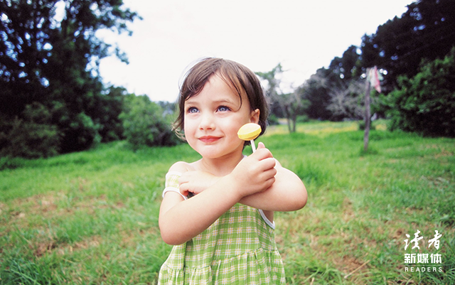

图片来源：全景视觉

而此时M的妈妈最关心的是，既然有药可吃，那么M什么时候病能好，什么时候可以恢复正常？

即使M苦苦央求休学，妈妈也不甘心就此中断学业，只是给她请了几天假。

**抑郁症、药物副作用，加上繁重的课业，这个女孩再也支撑不下去了。**

**
**

**一天下午，她把自己反锁在房间，吞下了所有的药片……**

在医院洗胃时，M的妈妈听到别的病房传来的家属的嚎哭，彻底崩溃了，也彻底清醒了。

**此后，是长达两年的休学、治疗、陪伴和反思，直到现在。**

无独有偶，几乎在同一时间，公众号“全现在”报道了另一位14岁少女罹患重度抑郁的经过。

主人公彭可欣（化名）不像M那样成绩优异，只是个非常普通的中学生。

甚至连她的患病经过也没有清晰的因果可循。

她记不清自己是从什么时候发生变化的，没有突发事件，也没有明显征兆。

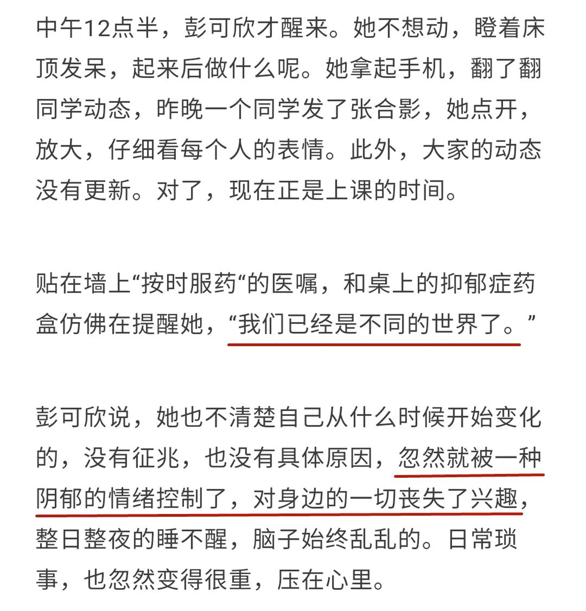

来源：全现在

标题：《特别关注 | 一个14岁重度抑郁症女孩的困与退》

唯一相关的猜测，是初一那个暑假妈妈把她的手机没收了，只许晚饭后玩一个小时。

这一个小时根本不够她和同学联系，说不到三五句话时间就到了。

**与朋友失去联系的不安笼罩着她，她开始怀疑自己被大家排挤。**

她跟妈妈吼：“别的同学暑假都有手机，不信你去问！”

而妈妈的回答是：“期末考试你排名降了13名，别的同学呢？”

这是诱因吗？只能说也许。

**好像就是突然之间，这个小姑娘对身边的一切丧失了兴趣，整日整夜睡不醒，对一些不起眼的小事又特别容易暴躁，不受控制。**

初二开学时换了新同桌，彭可欣开始接连几天上课打瞌睡，被老师叫起回答不出问题。

青春期的自尊、敏感、孤独……各种小情绪混杂在一起，压在她心头。

**她开始尝试自残，用刀尖划开皮肤，血流出来的时候“觉得舒服很多”。**

女儿的情绪异常，妈妈注意到了，曾经试图开点中药给她“去去火”。

女儿手臂上的伤口，妈妈也注意到了，但觉得那是女儿“威胁我，跟我要手机”。

**直到有一天，可欣情绪完全崩溃，大喊大叫，用脚踢门，最后瘫坐在地上抽泣着央求妈妈带她去看医生。**

**
**

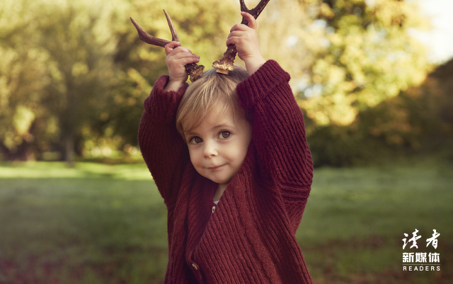

图片来源：全景视觉

她想被确诊为抑郁症。

**诊断结果为重度抑郁症伴有双相情感障碍，这个14岁女孩拿着诊断书泪如雨下。**

之后是休学、反复尝试回校、多次住院，以及在这个过程中，妈妈面对女儿一次次自残和自杀冲动，拼尽全力挽救。

**“能救这次，未必能救下一次。”**

两篇报道看得人非常揪心。

平心而论，两位妈妈都是好妈妈，她们都在努力接受孩子的病情，都对治疗付出了极大的精力和耐心，并且后来都对自己作出了反思和改变。

M的妈妈最终放下了对学业的执念，可欣的妈妈也终于学会夸奖孩子，两个女孩的病情都开始出现一些好转的迹象。

可是，悲剧的发生总是让人忍不住要问一句：**“何以至此\**？\**”**

**冰冻三尺非一日之寒，“积郁成疾”最要命的是这个“积”字。**

两个女孩都曾经一次次地向父母发出过求助的信号，却都一次次被父母无情地忽略了。

于是，累积的情绪像雪球一样越滚越大，最终压垮了她们，也压垮了两个家庭。

值得注意的是，在女儿被确诊的那一刻，两位妈妈的表现出奇一致：

**不敢相信，不能理解。**

M的妈妈感到无比困惑：我们付出了这么多，把她培养进了这么好的学校，她为什么那么不让人省心？

可欣的妈妈百思不得其解：**我自己不也是这样长大的吗？**

**
**

一声叹息。

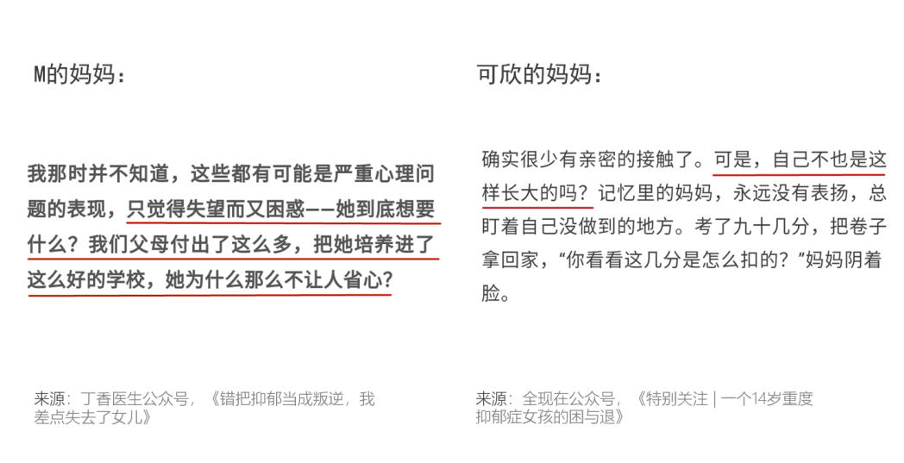两位妈妈谈曾经的“失望和困惑”

请记住这两个问题，这是我们这个时代最困扰中国父母的问题。

如果解不开它们，也就解不开孩子的情绪，更解不开亲子关系的死结。

读者

，赞799

**一切都变了**

M的妈妈和可欣的妈妈，是两个非常典型的中国妈妈，她们身上带着上一代父母的烙印。

**M从小在妈妈的否定、要求、拒绝和指挥下长大，耳边永远是“别人家孩子怎样怎样”，身上背负着父母沉重的期许。**

学习如此出色的她，甚至从来没有被妈妈夸过一句“聪明”。

M小时候就不太合群，成长过程中时常被排挤和孤立，而妈妈从来没有真正了解过到底发生了什么，只是大声训斥她，甚至当众给她难堪。

M的妈妈提出的那个问题，可以说代表了一类中国父母的通病，那就是：

**把孩子的成绩归结于父母的培养，而把孩子的问题推给孩子自己。**

孩子好，都是父母的功劳，孩子不好，那都是孩子的错。

他们剥夺了孩子的自我价值感，同时又回避了父母的责任，不给孩子提供应有的援助。

**他们的孩子迷茫、自责，形如困兽。**

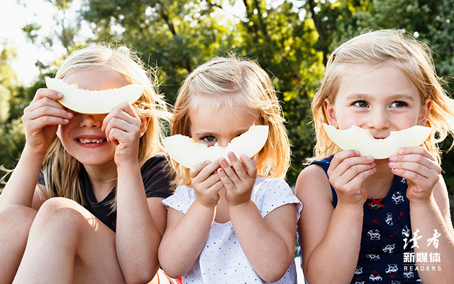

图片来源：全景视觉

彭可欣虽然和M生在不同的家庭，成长氛围却十分相似。

可欣的妈妈反复回忆也记不起女儿和自己发生过矛盾，因为女儿从小顺从乖巧，很少会拒绝她的要求。

**和M的妈妈一样，她也从不夸奖女儿。**

她想起在确诊抑郁症之前，女儿想要“抱一下，亲一下”，她本能地抗拒。

这种奇怪的“本能”，来自于对自己母亲（可欣的外婆）的记忆。

**记忆里的母亲对她永远没有表扬，永远盯着自己没有做好的地方。**

考了九十几分，母亲的第一反应是阴着脸说：“你看看这几分是怎么扣的。”

曾经，她也在日记里写过“我恨妈妈”，一心想读大学是为了“快点长大，就能逃出去”。

工作后在广州买了房，她骄傲地带父母去看楼盘，母亲却只说了一句“你看看你，要还房贷了”。

**
**

**母亲的严厉管教令她变得“强大”，也在不知不觉中，令她变成了自己最讨厌的样子。**

她怎么都想不通的那个问题，也正是如今的中国父母们普遍想不通的问题：

我们不都是这样过来的吗？现在的孩子怎么就过不去了呢？

的确，我国抑郁症低龄化趋势已经触目惊心，中小学生自杀事件近年来层出不穷。

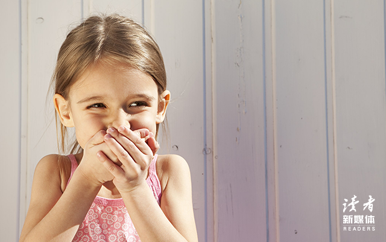

图片来源：全景视觉

**是现在的孩子集体基因突变，变脆弱了吗？**

显然不是。

**恰恰相反，只有孩子还是孩子，而他们周遭的一切都已经完全改变了。**

就连有意无意地秉承着上一代教育理念的我们，可能都没意识到，我们自己也早就不是上一代父母了。

**最焦虑的父母**

以我为例，我成长在一座经济繁荣的十八线小城市，我们的上一代大多经历过十年浩劫，错过了受教育的最佳时机。

在我读小学到高中的这段时间里，班里同学的家长以小学和初中文化程度最为普遍，高中学历已属少见，本科学历基本没有。

当我就读省重点高中时，班里以农村上来的寄宿生为主，父母很多都是土生土长的农民。

而我所在的班级，几乎所有人都考上了本科，一半人上了985、211大学。

这些同学后来绝大多数都定居在一、二线城市，买了学区房，让孩子上最好的学校。

**我们和上一代父母一样吗？**

**学历不一样，学历引起的心态差别更是巨大。
**

在我读书的时候，父母可以接受孩子在学习上的任何状态，也可以接受任何出路。

别说考不上大学，考不上高中都没关系，能养活自己就好。

图片来源：全景视觉

父母辅导不了孩子功课，也就放任自流，心态一个比一个坦然。

**而当我们这一代人成为父母的时候，谁还能接受自己的孩子考不上大学？**

如今在我的家乡，那座十八线小城市依然民风淳朴，小学可以零基础入学，而我的同学们所在的大城市呢？

上海的朋友告诉我，孩子所在的小学不仅要通过重重考试，还施行末位淘汰制，最差的学生会被劝退。

北京的朋友告诉我，孩子所在的班级，家长最低学历是硕士，她一个名校硕士在一群常青藤归国博士面前都不好意思打招呼。

而最可怕的是，每个班级永远都有最后一名，管你父母是硕是博，是龙是凤。

所以比起我们的父母，我们这一代人对教育有一种无法掩饰的焦虑感，捂住嘴巴也会从眼睛里跑出来。

**这焦虑藏在我们陪写作业的怒气中，藏在我们拿到试卷的失望中，藏在我们看****待孩子时挑剔的眼神中，最终变成无形的压力，压在孩子稚嫩的肩膀上。**

当我们抱怨孩子变脆弱的时候，有没有审视过自己，给孩子传递了怎样的情绪？

**最单一的价值观**

春节期间我和大麦、小米一起看一个国内的视频讲座，里面的老师问学生：

我们怎样才能让妈妈开心呢？

下面一年级的小学生争先恐后地举手回答：

**
**

**考一百分！考双百分！考全班第一！**

**
**

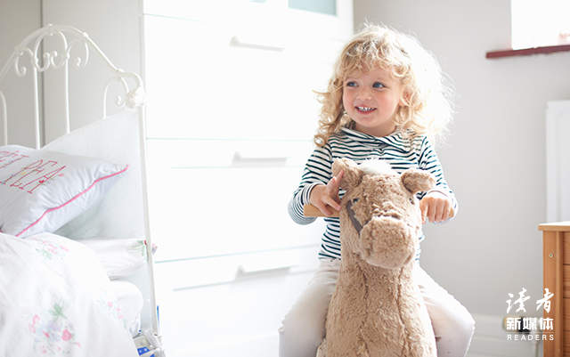

图片来源：全景视觉

大麦和小米面面相觑，看看我说：

**这还不简单？我们亲亲妈妈她不就高兴了吗？**

说完就一起把我扑倒，亲得我满脸口水。

我挣扎着爬起来，故意逗她们：你们能不能做点有意义的事，让我更开心？

她俩争着回答：帮你做家务！给你做好吃的！给你按摩！陪你聊天！反正你都会开心！

**我想起自己小时候也是这样，父母非常好哄，叠个被子刷个鞋，他们就眉开眼笑了。**

那时候父母们凑到一起谈论孩子，总爱聊孩子成长中的趣闻，学习最多一带而过。

**而现在，可以明显感受到，只要孩子上了学，父母的喜怒哀乐仿佛就自动和成绩挂钩了。**

孩子考得好，父母扬眉吐气，孩子考不好，父母唉声叹气。

M的妈妈就曾多次提到，M考上全省排名第一的高中时，自己有多骄傲，面对M的病情时就有多困惑。

她对M感到失望的一个原因是：“家里不愁吃喝，连袜子都不用洗，有什么好烦心的呢？”

**可这个连袜子都不用洗的小孩，却令我感到无比心疼。**

因为她无法通过洗袜子这件小事获得小小的成就感，也无法通过洗袜子这件小事，来让妈妈开心。

**她唯一证明自己价值的方式，只有学习，考出让妈妈满意的成绩。**

如今有很多父母以包揽了所有的家务引以为傲，觉得自己尽职尽责，孩子只需要安心学习就好。

殊不知，他们剥夺了孩子作为家庭成员的价值感，令孩子沦为一台功能单一的学习机器。

**学好了，是报答，学不好，是辜负。**

孩子作为独立的生命个体，自己存在的意义在哪里？

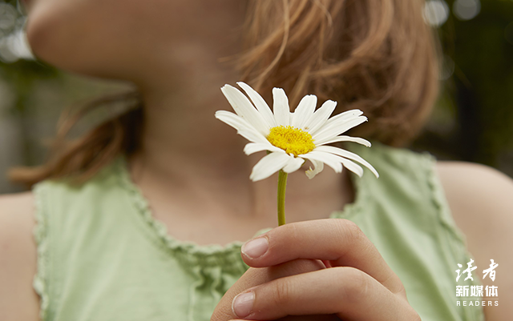

图片来源：全景视觉

**最孤独的孩子
**

我们小时候课业也很繁重，周末有补课，每天有晚自习，高中三年更是拼得骨瘦如柴，面如菜色。

**但我仍然觉得自己要比现在的孩子幸福得多。**

学习之外的时间尽管很少，但全部都可以自由支配。

写完作业就可以在家门口呼朋引伴、疯跑疯玩；闺蜜二三，聚到一起就有着说不完的八卦和秘密。

哪怕是高考前最紧张的阶段，我房间的电视每周末都可以想看多晚看多晚。

**如今那个十八线小城市已经高楼林立、车水马龙，城市化把每个人的空间都压缩得极小。**

不再有孩子结伴走着上学，也不再有孩子骑车去逛遍城市。

孩子们的课余时间被各种兴趣班和网课填满，小伙伴渐渐变成手机里的短信、视频和玩游戏时的队友或对手。

而手机和电脑，又常常是家长的眼中钉。

**大城市的孩子就更不用说了，他们似乎永远都在路上奔波。**

就连在小区楼下玩一会儿，也有可能被业主们自发组织的纠察队抓到，赶回家写作业，因为升学率会影响小区房价。

总有人说现在的孩子身在福中不知福，条件这么好还不知足。

**可我常常觉得，物质丰富了，快乐却变得稀缺了。**

现在的孩子不再有我们小时候吃一次巧克力的狂喜，也不再有我们小时候穿一次新衣服的望眼欲穿。

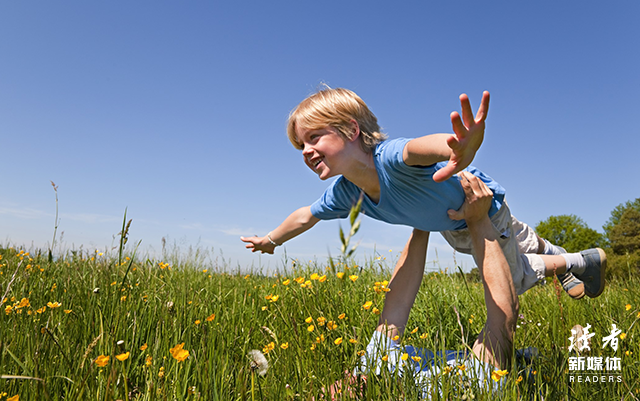

图片来源：全景视觉

当最基本的物质需求被满足时，人自然而然地会对精神产生更高的要求。

**这就是为什么抑郁症在发达国家出现得更早、更普遍的原因。**

而我们国家和发达国家相比，还有着更大的竞争压力。

我们国家的孩子，手足朋友更少，竞争对手更多，学习压力更大，离大自然也更远。

**这一代的孩子，心理空间最小，也最孤独。**

**最疯狂的时代**

我们这代人的成长中没有互联网，没有朋友圈，也没有家长群。

闭目塞听的父母们很容易满足。

即使有“别人家孩子”，那也是看得见摸得着，几分钟就能走得到的人家的孩子，能神奇到哪里去？

**而互联网奔涌而来时，几乎在一夜之间，把全世界的孩子都拉到了一个赛道上。**

某个老母亲一时兴起晒了个娃，就可能点燃了一群老母亲熊熊的斗志，哪怕她们实际距离十万八千里，哪怕这个晒娃只是自娱自乐，水分很大。

我们小时候，最多和同班、同年级学生比，而现在的孩子，动不动要和全国乃至全世界孩子比。

**时代的疯狂令成年人都措手不及。**

 “你的同龄人正在抛弃你”令我们寝食难安，“成年人的崩溃要不要藏起来”令我们纠结不已。

**这样的我们，又怎么忍心去指责孩子，你为什么这么脆弱？**

又怎么好意思抱着上一代人古老的教育观念，继续打压、否定和控制孩子，然后问他们：

**我就是这样长大的，你为什么不可以？**

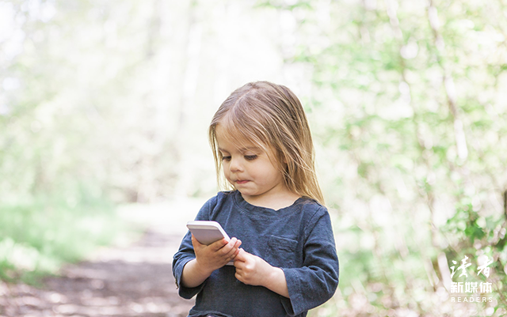

图片来源：全景视觉

**防患于未然**

因为气候寒冷、日照少等多方面原因，德国是一个抑郁症多发的国家，抑郁症甚至有“国民疾病”之称。

也正因为如此，德国对抑郁症的研究和治疗都更为成熟先进。

德国人对抑郁症的预防，是从婴儿时期开始的。

在托儿所和幼儿园每年对孩子的成长评估中，有一部分就是对社交行为和心理状态的评估，如果孩子出现过于孤僻或者攻击性行为，老师会建议家长求助于心理治疗。

从孩子6岁以后的U10体检开始，每年儿科医生都要求家长填写一份表格，以便于对孩子的心理异常及时发现及时干预。

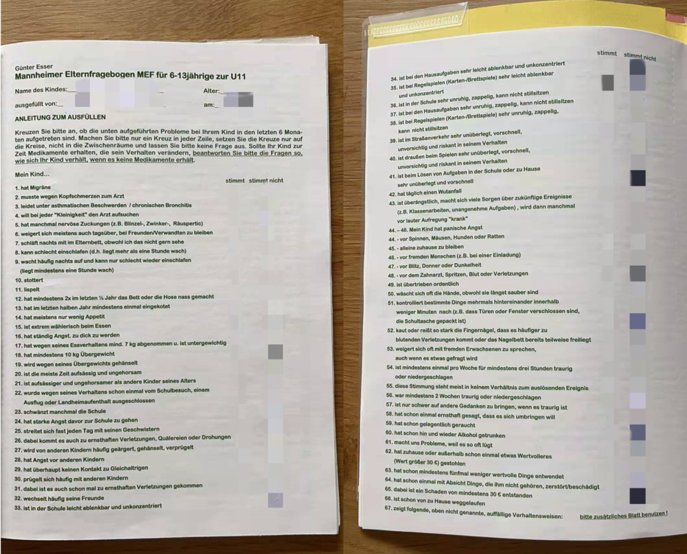

大麦在U11体检中的心理问卷

我觉得这份表格很有价值，对于大多数对心理疾病没有经验的普通家长来说，是非常实用的参考。

建议大家收藏，在孩子6到13岁期间每年拿出来自测一次。

您的孩子在最近6个月中有无出现以下情况（如正在服药，请排除药物影响）：

| 1     | 有偏头痛                                                     |
| ----- | ------------------------------------------------------------ |
| 2     | 曾因头痛必须就医                                             |
| 3     | 受到哮喘症状/慢性支气管炎的困扰                              |
| 4     | 一旦有任何“小毛病”就要求去看医生                             |
| 5     | 不时有神经性抽搐（比如频繁眯眼、眨眼、清嗓子）               |
| 6     | 通常情况下白天也拒绝和朋友/亲戚待在一起                      |
| 7     | 晚上都睡在父母床上，尽管父母并不愿意                         |
| 8     | 很难入睡（上床后清醒状态超过1小时）                          |
| 9     | 晚上经常醒来且难以再次入睡（清醒状态超过1小时）              |
| 10    | 口吃、结巴                                                   |
| 11    | 大舌头、口齿不清                                             |
| 12    | 在最近半年里至少有过两次尿床或尿裤子                         |
| 13    | 在最近半年里至少有过一次大便在裤子里                         |
| 14    | 大多数情况下胃口不好                                         |
| 15    | 极其挑食                                                     |
| 16    | 对长胖有持续的恐惧                                           |
| 17    | 因为个人饮食问题至少减重7公斤且体重过轻                      |
| 18    | 至少超重10公斤                                               |
| 19    | 因为体重超重而被讥笑                                         |
| 20    | 大多数时间表现叛逆、不听话                                   |
| 21    | 比同龄孩子表现得更叛逆、更不听话                             |
| 22    | 曾经因为行为表现（不佳）被禁止上学、（和班级一起）郊游。     |
| 23    | 时而逃学                                                     |
| 24    | 对上学有强烈的恐惧                                           |
| 25    | 几乎每天都和兄弟姐妹发生争执                                 |
| 26    | 争执时还出现了严重的伤害、折磨或威胁                         |
| 27    | 经常被其他孩子激怒、嘲笑、殴打                               |
| 28    | 害怕其他孩子                                                 |
| 29    | 和同龄人基本没有接触                                         |
| 30    | 经常和其他孩子打架                                           |
| 31    | 打架时曾出现严重伤害                                         |
| 32    | 频繁更换朋友                                                 |
| 33    | 在学校很容易分心、注意力不集中                               |
| 34    | 做作业时很容易分心、注意力不集中                             |
| 35    | 在玩规则性游戏（棋牌游戏）时很容易分心、注意力不集中         |
| 36    | 在学校非常不安、好动、坐不住                                 |
| 37    | 做作业时非常不安、好动、坐不住                               |
| 38    | 在玩规则性游戏（棋牌游戏）时非常不安、好动、坐不住           |
| 39    | 在道路交通中表现得非常轻率、冒失、不小心、爱冒险             |
| 40    | 在户外玩耍时表现得非常轻率、冒失、不小心、爱冒险             |
| 41    | 在学校或者在家完成作业时非常匆忙仓促、不加思考               |
| 42    | 每天都会暴怒                                                 |
| 43    | 过分害怕，非常担心将来发生的事情（比如随堂测验、厌恶的考试） |
| 44-48 | 我的孩子对此过度恐惧：44. 对蜘蛛、老鼠、狗45. 独自待在家中46. 对陌生人（比如被邀请时）47. 对闪电、雷鸣或黑暗48. 对牙医、打针、血或伤口 |
| 49    | 整洁到夸张的地步                                             |
| 50    | 经常洗手，哪怕手早就很干净了                                 |
| 51    | 在短时间内不停地检查某些特定的东西是否收好                   |
| 52    | 撕咬指甲严重到经常出现流血的伤口或者甲床部分裸露             |
| 53    | 经常拒绝和不熟悉的大人说话，哪怕对方已经在问他一些问题的时候 |
| 54    | 每周至少有一次，每次至少有3小时以上感到悲伤或者沮丧          |
| 55    | 这种情绪往往和突发事件没有关系                               |
| 56    | 曾经有过连续两周以上的悲伤或沮丧情绪                         |
| 57    | 当他悲伤的时候，很难对其进行开导                             |
| 58    | 曾经认真地说过一次，他想自杀                                 |
| 59    | 偶尔抽烟                                                     |
| 60    | 时不时地喝酒                                                 |
| 61    | 经常撒谎，已经给父母造成困扰                                 |
| 62    | 在家或在外已经偷过高价值物品                                 |
| 63    | 已经偷过5次以上低价值物品                                    |
| 64    | 曾经故意损毁不属于自己的物品                                 |
| 65    | 损毁的价值超过30欧元                                         |
| 66    | 有过离家出走                                                 |

**如果孩子出现表格中的某些行为表现，并不意味着就一定患上了抑郁症或者某种心理疾病。**

其中有些是婴儿期的行为滞后，有些是青春期的行为超前，不排除随着年龄增长自然消失的可能性。

**但我们可以把这66条看作孩子的66种求助信号，当信号出现时，我们的第一反应不该是对孩子进行训斥或责骂。**

而是要意识到，孩子正在承受着某种精神压力，他们需要我们更多的关怀和帮助，以及更多的心理空间。

比如啃手和尿床，是很多孩子都经历过的问题，只要大人不过度反应，适当帮助孩子转移注意力，问题自然就会解决。

但也有听说过因为大人的打骂和强制性措施，导致孩子啃手啃到见骨、尿床尿到成年的极端现象。

M和彭可欣的患病经历如果回过头再去看，有很多的细节都可以修补，如果不是积重难返，也许悲剧可以避免，实在令人惋惜。

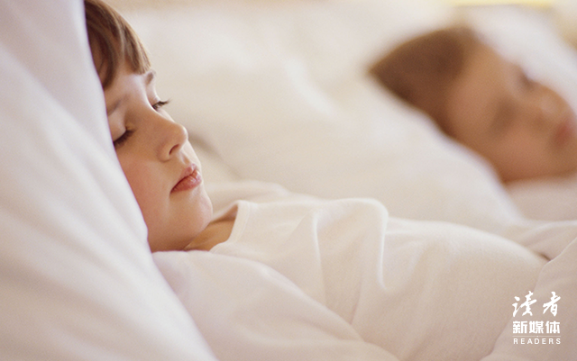

图片来源：全景视觉

**她们的妈妈都习惯于用发泄愤怒的方式来面对孩子成长中出现的问题，寄希望于孩子自动觉悟、自动改正。**

她们不明白，孩子并没有这个能力。

**愤怒只会令孩子产生更大的精神压力，令问题更加严重化和复杂化。**

理解他们的无助，才是解决问题的第一步。

**孩子们得救，往往就在得到父母理解的那一刻。**