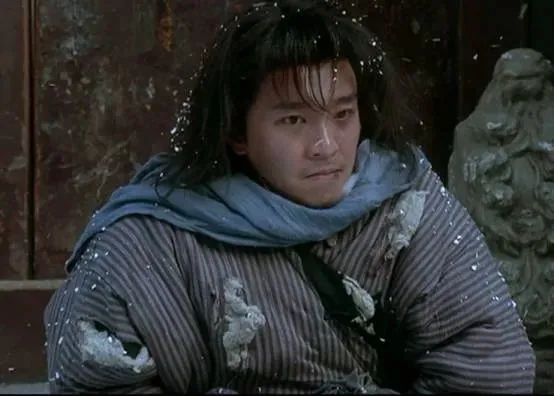
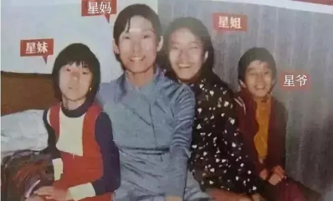
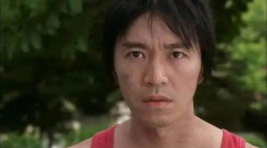
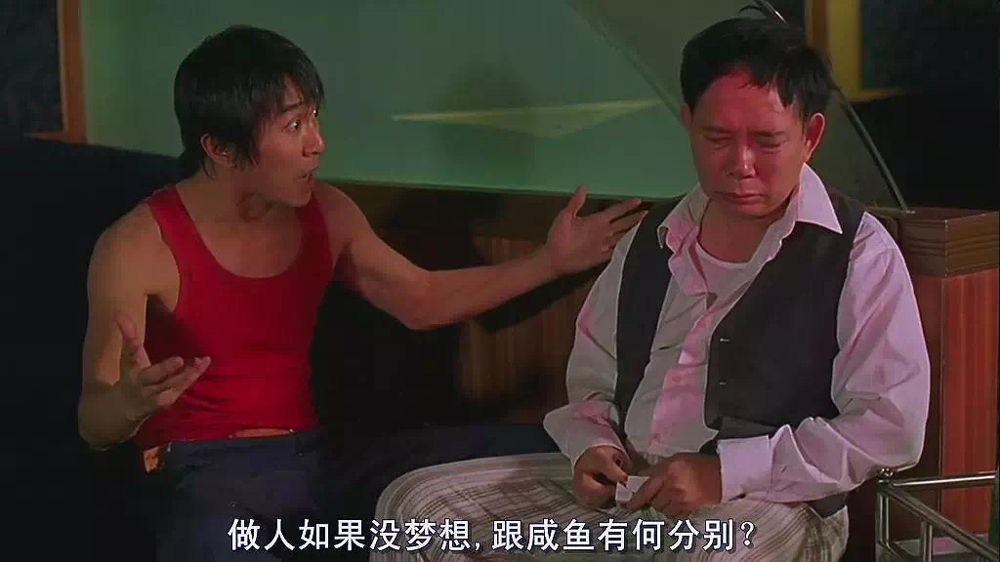
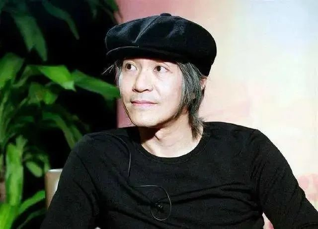

文/瑾山月 

今天，是周星驰的60岁生日。

有人说，小时候看周星驰的电影，觉得是喜剧片，长大后再看，才发现是纪录片。

喜剧的内核是悲剧，正如“星爷”后来的人生，退居幕后，每次大家提到这个名字，总是跟孤独、寂寞、心酸挂钩。

但他带给我们的快乐，一直深深留在一代人的心底。

**“如果说中国有查理·卓别林的话，那就是周星驰。”**

一路走来，周星驰从“星仔”到“星哥”，再到众人心中的“星爷”，他用一部部“无厘头”喜剧，为草根人物代言。

图片来源：电影《武状元苏乞儿》

如今他已经60岁了，但在不少人心里，他仍是那个无厘头少年，怀揣梦想却很难成功。

几乎所有的电影里，周星驰的角色都只是一个“loser”，让我们轻易窥见那种在社会底层摸爬滚打后，留在身上的标记、气味以及伤痕。

他不遗余力地将生活糅进电影，不管是邻居中的“绝世高手”，还是低声下气的“店小二”；不管是自作聪明的“小混混”，还是亦正亦邪的“大英雄”，你总能从某个人的某个瞬间，看见自己的影子。

豆瓣上有人问：为什么越长大，看星爷的电影越难过？

或许就是因为，在这些嬉笑怒骂背后，隐藏着一个真实而又残酷的现实世界。

我们跟着周星驰一起哭、一起笑，到头来才发现，自己才是他镜头下的主角，戏里戏外，是一样的天地。

**真正驱动成长的，是痛苦**

50多年前的一个傍晚，香港九龙贫民窟的一间木板房里，传来了一阵打骂声。

这天，凌宝儿好不容易从娘家要来一根鸡腿，精心烹饪，没想到儿子刚咬了一口，就把整个鸡腿扔在了地上。

她顿时暴跳如雷，狠狠打了儿子几巴掌，捡起脏了的鸡腿自己吃掉。

这个看似不懂事的孩子，就是周星驰。

图片来源：网络

很多年后，在凤凰卫视的访谈里，凌宝儿旧事重提，才知道儿子的一番好意。

因为穷，凌宝儿舍不得吃肉，只会偷偷捡孩子们剩下的、弄脏的吃。

为了让妈妈多吃点，小小年纪的周星驰自导自演了这么一出戏。

周星驰的童年，笼罩在贫穷的巨大阴影之下。

他的爸妈是广州来的逃港客，一家五口挤在巴掌大的“棺材房”里，像很多底层老百姓一样，活成了香港这件华服褶皱里的虱子。

俗话说，穷人的孩子早当家。

为了生计，周星驰很早就开始打工，尤其是父母离异后，他甚至不分昼夜地连轴转：在酒楼卖虾饺、在尖沙咀卖报纸、和外婆摆地摊、替人跑腿、给人打杂……

糟糕的家境，让周星驰不止一次提醒自己：**别想了，你不会有未来。**

然而，当他被妈妈第一次带去电影院，当他第一次看见银幕上的李小龙时，周星驰似乎看见了自己朦朦胧胧的未来——**做一名电影明星。**

图片来源：电影《少林足球》

关于这个梦想，朋友笑他不自量力，母亲劝他脚踏实地，女友希望他尽早放弃。

面对全世界的反对，周星驰迷茫、无助、孤独，但“拍电影”的种子已在心里生根发芽，他只能逆流而上，走向命中注定的那条路。

周星驰穷困的成长经历限制了他，也成就了他。

没有这段经历，他便少了对大众生活的洞察；他似乎生来孤独，可没有感受过孤立无援，就无法破釜沉舟，逼自己向前。

恰如哲学家尼采所言：**“一切决定性的东西，都从逆境中来。”**

真正驱动我们成长的，是一次次挫折与磨砺；真正激发我们斗志的，是一次次打击与失望。

都说人生实苦，殊不知苦也有苦的价值。

**没有谁的日子，不委屈**

如今看来，周星驰当属潮流的塑造者，中国电影史无法绕开的人物。

但在入行之初，他身上毫无“走红”的迹象。

为了梦想，执拗的周星驰连考了3年，才进入TVB艺员班。

他清晰地记得，当年为了不让身高成为障碍，他花不少钱买了双增高鞋，结果面试时考官只看了他一眼，就不屑地说“回家去吧”。

但周星驰没有离开，他一边展示才艺，一边赔笑脸、说好话，总算求来入职的机会。

谁也没有想到，在之后整整6年的时间里，周星驰只能靠卑微地献殷勤、扮乖巧为自己讨一两个“跑龙套”的小角色。

《喜剧之王》里，有这样经典的一幕。

周星驰饰演的尹天仇，对女主柳飘飘说：“小姐，如果你非要叫我跑龙套的，可不可以不要加一个‘死’字在前面？”

贱贱的语气、自嘲式的微笑，让喜剧效果直接拉满，但对周星驰而言，那是他苦涩往事的缩影。

图片来源：电影《喜剧之王》

他的朋友宋子文曾说：“当时星仔混得很差，为多赚几十块钱任人差遣，他学着很油的样子，跟人磨嘴皮子，有时候为了演死尸，都得浪费一升口水。”

有一次，他忍不住在导演面前表达对电影的理解，没想到话音未落，就引来哄堂大笑。

周星驰不得不尴尬地冲“大哥”笑笑，以示歉意，然后开始拍马屁，说好话。

却不想这位“大哥”当众说：“这人怎么跟狗一样？”

这几个字，仿佛一记猛拳，击碎了周星驰的心，让他久久不能释怀。

很多年后，他将这句话写进了电影《大话西游》中，成为了影片结束时，最为经典的一句台词。

入行后的这几年，可谓周星驰的“炼狱时刻”。

时常事与愿违，总是被人瞧不起，受尽委屈与欺辱。

他让我想起了刘震云的一句话：“世上所有的东西都可以挑，就是日子不能挑。世上所有的事情都经不起推敲，一推敲，每一件都藏着委屈。”

星爷如此，你我亦然。

**在充满辛酸与压力的生活面前，谁不是一边受尽委屈，又一边咬牙前行。**

图片来源：电影《少林足球》

为了梦想，为了生存，为了争口气，我们总是逼自己说不喜欢的话，做不喜欢的事，因为我们心有不甘，不想放弃与世界的较量。

**你真的很难让所有人满意**

1988年，对周星驰来说太重要。

这一年，他终于守得云开见月明，摆脱了事业上困顿的局面。

在《霹雳先锋》崭露头角后，他先后参演了《盖世豪侠》《龙在天涯》等电影，迅速打开了知名度。

甚至在1992年，他连续上映7部影片，一举包揽了年度香港电影票房前五名。

而这一年，也被香港媒体称为“周星驰年”。

《赌圣》《逃学威龙》《武状元苏乞儿》《唐伯虎点秋香》《大话西游》……一部部经典影片先后问世，把周星驰抬到了前所未有的高度。

他与周润发、成龙并称为“双周一龙”，凭一己之力撑起了香港电影的半壁江山。

在VCD盛行的年代，几乎每个人都看过周星驰的盗版光碟，难怪有人说：“我们都欠周星驰一张电影票。”

连《时代》周刊都说：“周星驰的喜剧，似乎能够让人暂时摆脱忧虑和痛苦。”

**然而，作为“喜剧之星”，周星驰自己却很难快乐。**

因为伴随走红而来的，是演艺圈的纷争与名利场的争夺。

有人说他是“片场暴君”，待人苛刻，动辄骂人，是王晶口中“主宰一切”的人；

有人说他“人缘差”，不少合作过的导演、演员骂他耍大牌，脾气暴；

还有人说他“自私自利”，指责他太爱钱，给钱时小气，收钱时却“狮子大开口”；

向华强妻子陈岚炮轰过他，罗家英公开指责过他，就连黄金搭档吴孟达都与他渐行渐远。

而周星驰本性里的孤僻与沉默寡言，又让他难以为自己辩解。

图片来源：网络

渐渐地，周星驰成了人们眼中的“怪咖”，一方面登峰造极，另一方面又是众矢之的。

参加专访时，提到自身问题，周星驰解释说：“我是一个很认真的人，工作狂，认真起来就会让人不高兴。”

**除此之外，再无多言，毕竟他明白，做得再好，也有人不满意。**

正如作家刘同所言：

“世界上没有任何一种性格能避免得罪人，说话直会得罪小人，说话委婉会得罪急脾气的人，老好人会得罪有原则的人，圆滑的人会得罪聪明人。既然都会得罪人，那就做好你自己，做好了自己，就不怕得罪人，因为你可以承担后果。”

懂你的人自然会理解你，不懂你的人说再多也没有用，我们无需向别人证明自己，更不必讨得所有人欢心。

**孤独，才是生命的底色**

除了作品、人品，周星驰的感情生活，也一直让人津津乐道。

可焦点并非“才子佳人，花好月圆”，而是一次次的错过与遗憾。

初恋罗慧娟曾对他痴心一片，无奈周星驰无心结婚，结果分道扬镳；

而后来与朱茵、莫文蔚的恋情，也都没有撑过3年，便烟消云散。

问及缘由，她们的回答竟惊人地一致：“周星驰只爱电影和自己。”

**岁月匆匆，周星驰活成了孤家寡人。**

有人说，他的孤独，从1962年一出生就开始了。

小时候，他总是一个人看向香港的车水马龙，没有玩伴，亦没有朋友；长大后，现实赤裸而粗粝，他似一叶扁舟，颠簸于汹涌的生活中。

等到功成名就，扑面而来的名利与纷扰，又促使他总在躲避，总想着逃离人群。

周星驰很难被定义，他是天才、偶像，做过演员、导演，涉足过商业、政坛，但最终，他把自己塑造成了孤独的“王者”。

很喜欢梁实秋的一句话：“人生，不过是一段来了又走的旅程，有喜有悲才是人生，有苦有甜才是生活。”

其实，我们和周星驰一样，也曾凌云壮志，满腔抱负；也曾吃过苦，受过累，遭遇不公与踩踏；也曾深夜痛哭，却不得不继续奔跑。

**为什么周星驰是不少人心中“神”一样的存在？**

**或许就是因为他让我们这些普通人看到了“生活会变好”的一束光芒。**

恰如《喜剧之王》里的那段经典对话：

> “看，前面漆黑一片，什么也看不到。”
>
> 
>
> “也不是，天亮后便会很美的。”

周星驰说：

“20年前，观众没有和尹天仇一起看到‘天亮’，但20年后，大家可以看到了，天亮以后真的很美。”

**我们在人生旅途上穿梭，不必害怕一时走进暗影，只要坚持走，也会和星爷一样，看到自己生命的曙光。**