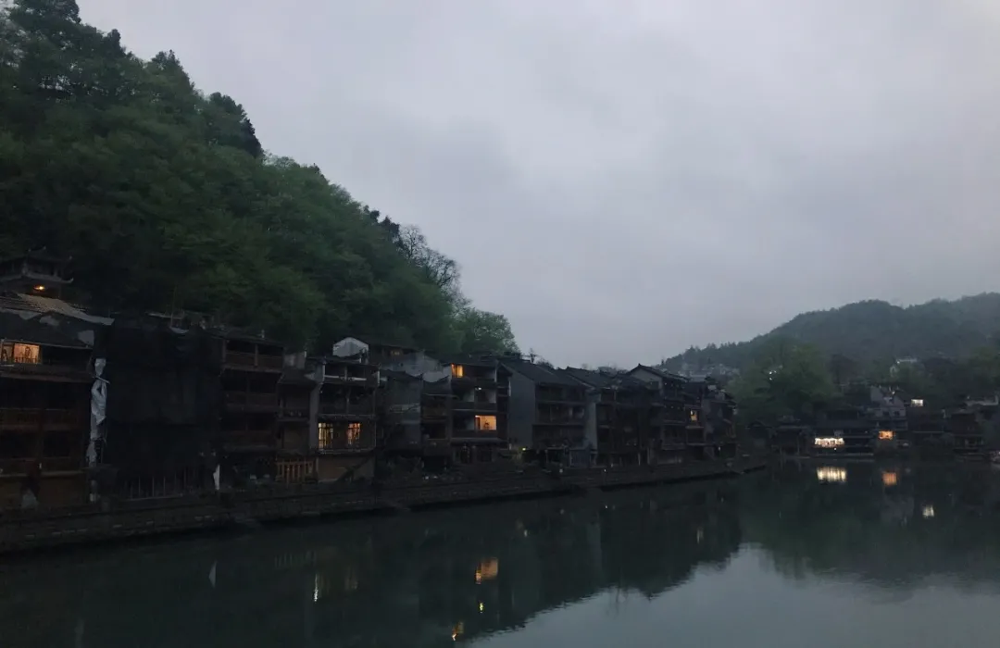
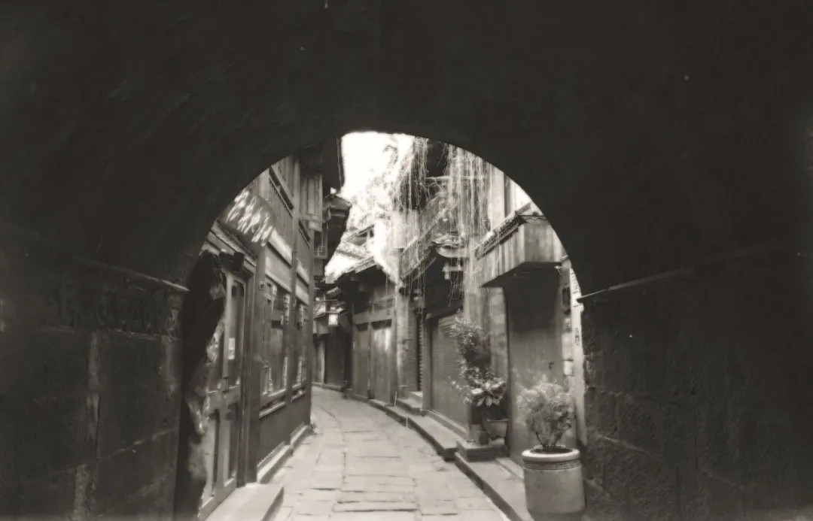
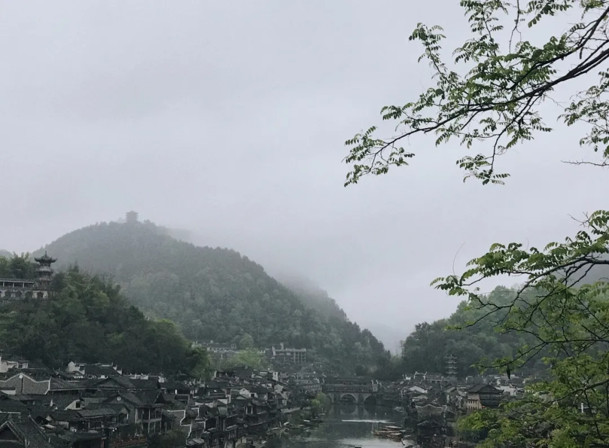
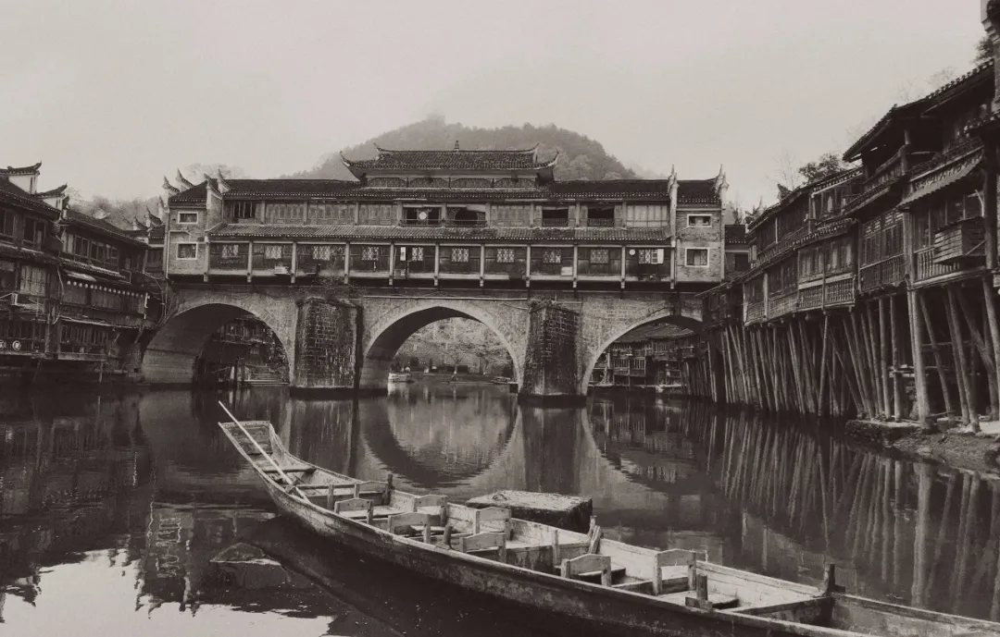
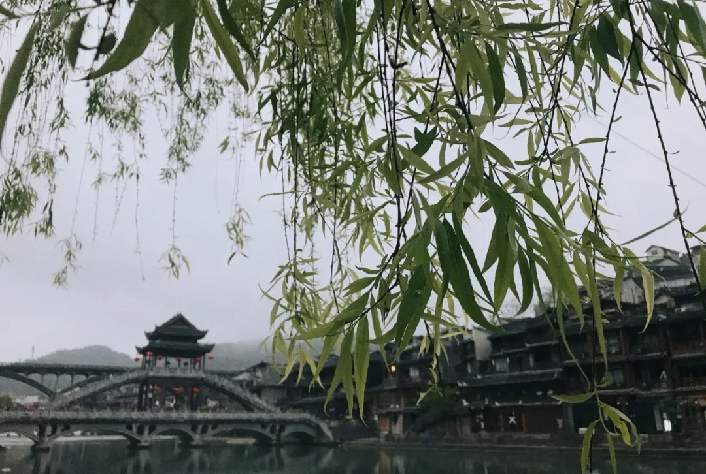
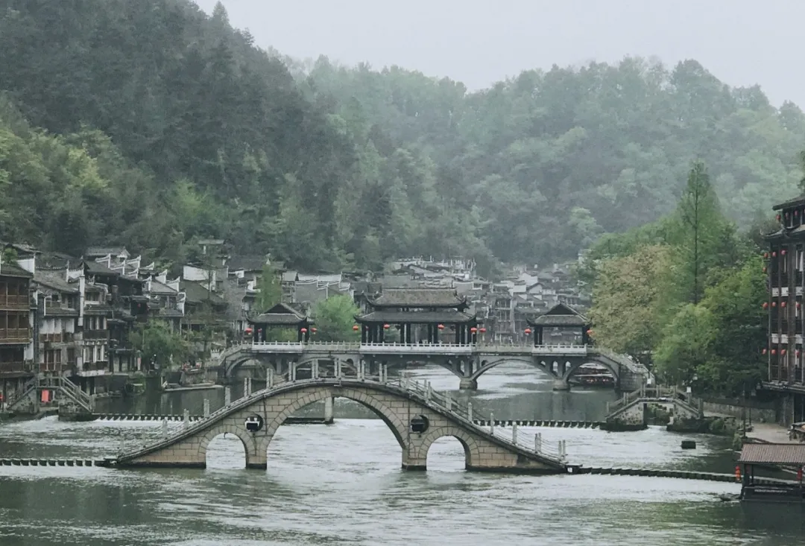

****

**文/稻田**

“你离我很远，却分明在我眼前，你在脂粉里招引，我却于浓妆间找寻你的素颜。”这是我从凤凰古城回来后，整理当时的感受时，在心里流出的几个语句，艰涩别扭，又执着情深。

到凤凰古城一睹风采的想法，至少已有二十年了，加上读了凤凰之子沈从文的一些描绘，期盼就更是强烈。成行时湘西的山水也做足了烘托和渲染，从桃源到古城，三百公里路程，均浓雾相伴，透过被雾水覆盖的车窗，苍翠欲滴的树木隐隐现现，一种仙气逼人的美已经在人心里将凤凰古城托到了高处，这还不够，接近古城区域时，一路不减的浓雾瞬间消去，随即便是连续的隧道来来往往，曲曲折折，像是一种拜见或迎接的仪式一般。

黑夜将古城和我们一起推到了金碧辉煌之中。古城的夜景工程极尽了渲染，建筑与桥梁皆“披金戴银”，在如墨屏的高山脚下着火一样地亮了起来，加上河畔窄街游龙般的红灯笼，以及明明暗暗的酒吧和歌屋里如雷的歌唱和音响，还有扑鼻而来的各样小吃气味，在摩肩的游人队伍里行走，竟有一种身处秦淮灯影闹市的感觉。我想，如果此时乘飞机经过，侧首俯视，一定会以为黑压压的群山之间有成堆的珠宝自天外投下，珠光宝气，熠熠生辉，恍如迷境。

但这不是我想要看的古城迷境，因为她既与“古”无关，也与这座湘西山城的清秀和宁静无关。我想要找寻古城原始的气韵，特别是沈从文当年孩童眼里的湘西古城。我需避开夜晚的喧闹，选择安静的清晨。

我在古城还在睡梦中的时候，静静地走过沱江的风雨桥，向静静的古城深处走去。古城卸下了前夜的浓妆，也停止了前夜的躁动，却将真相更多地展现出来。我在江边的步道上行走，薄雾中澄澈的江水缓流，偶有鱼跳，搅起带响的水花。想起了沈从文笔下主妇在江边浣洗衣衫的场景，也想起了顽皮的孩童在江水里嬉闹的情形，那年此时，逃学戏水的孩童沈从文，一定正在晨梦里吧？

我走在了青石板铺就的街道上，不知是雾水还是雨水，凹凸又圆滑的青石板湿漉漉地泛着明光，曲折地向一个拱形的门洞伸去，两侧砖木结构的房屋相夹，悄然无声，透着悠远和古朴。忽有一位背着竹篓的老妇从门洞摇摆着走来，青布的包头，青布的衣衫，横跨背篓端口的货物，身体微躬，面容沉静，在游人未至、空旷无声的深巷里，这样的画面已将边苗古城的历史复活于我了，我忍不住相会而过后，转过身来，久久地目送她向街巷的另一头走去，并在心里生出一种生命坚韧和沉静如水的感动。

我似乎有些感受到沈从文执着于湘西小人物描绘的情感了。穿过门洞才意识到这是古城的城门，连着城门楼还有一道红砂石垒筑的城墙横亘，我拾级而上，从垛口里向外望去，才知道我此前是从城外走入城内的。照沈从文在书里的描述，城外的江岸和坡地应是菜地和作坊的所在，但现在已经是屋宇错落、街道密集、游人如织，一江挑两岸，分不出城里城外了。好在还有城门和城墙提醒和示意，为时空的划分和找寻提供了线索。

最有湘西特色、也最有宣传噱头的风貌建筑是吊脚楼。如今才知道，今天名气很大的吊脚楼当年是被排在城墙保护以外的住家，房屋的承重一边靠着陆地，一边伸向江水，靠密集的木柱支撑，官宦和富裕人家的宅屋，用砖木为材料，在城墙的护卫下，建在牢实的陆地，而贫贱的百姓、船夫等则城下屈居、凌空求生，成了一道挡在古城最外层的特殊的城墙。古物的价值在不同的历史时空里是可以截然不同的，这也是历史的魅力，只是要知道历史的由来才能更深刻地感知。

从城门楼的护墙望去，见城下和对岸有石阶连岸，并有沙滩呈现，那是沈从文一伙顽皮的孩童下河游泳，堆放衣服的沙滩吧？眼下的护墙处是孩童沈从文经常与同伴比眼力，数对岸沙滩刀砍革命党人头的地方吧？当年的古城虽然安然有序，却是满清军事严管下的有序。想起来时路见的“天王庙”了，那是居民祈福求佑的圣地，却也曾当做过草菅人命的屠场，辛亥革命一刻，革命党人起义攻城失败，官军滥捕滥杀，竟然用丢竹板的办法判断无辜人犯的生死，这一幕同样进入了沈从文初看世界的眼睛和心灵里，从此形成了对滥用权力的厌恶。百年倏忽，天王庙依旧，而今闭门无语，却抹不去历史的尘埃。

向左望去，可见江中有横贯江面的石墩排列，那就是号称“沱江跳岩”的景观，以间隔的石墩为桥，一步一跨，一跨一进，终至对岸，这或就是“跳岩”之名的由来。但百年以前的“跳岩”或是有军事考虑的，城墙护卫、城门把守以外，“跳岩”是进出古城的必经之路，且无法快速行进，可以想见古城的紧张和凝重。用沈从文的话说，凤凰古城是一个“古怪的地方”，城里全民皆兵，城外驻军的人数超过城内的人数，城里高墙城楼，城外碉堡逶迤，营盘密布，号角联营，在这样一个实际为军营城堡的的边境山城里，竟然收获了“兵卒纯善如平民，农民勇敢而安分”的社会和谐，这真是古城费解的地方，也是她迷一样的所在。

游人的兴趣往往是多样的，即便在古城做与古城文化历史无关的举动，也无妨其兴致盎然。想起我在江边刻意拍下的一张照片，照片里的人是一位女性游客，只见其站在跳岩石墩的江心的位置，脚亲清流，背靠蓝天，侧身面对手机，美美自拍，是一幅极美的画面。这位游客的兴趣在风景画面之美，而我的兴趣却在深远的时空和意蕴里。于是在发现游人渐增，人语渐响的时候便结束了意犹未尽的游览，转而琢磨下一个连接古今、认识古城的游览内容。

午后时节，避开了人群和喧闹，我在沱江的下游码头坐上了一条翘首游船，意在江水上体验古城的韵味。一船夫，一乘客，我专享了沱江泛舟的待遇。江水清澈，随手即可掬起。从船上仰望两岸，发现古城的的房屋在陡立的青山下贴山而建，在水边和房屋间有窄道蜿蜒，问船夫那窄道是否为进出古城的官道，船夫谈兴很高，应声肯定，并告知江流另一侧的公路是上世纪六十年代初才开通的，以前都是走水路和山路。我猛地想起王之涣《凉州词》里“一片孤城万仞山”的诗句了。数百年以来，凤凰古城都是万山包围中的一座孤城，长期与世相隔的处境和历史，即便后来被清军筑成防御和镇压“蛮苗”的堡垒，也延传和积淀下了悍勇淳朴的民风，形成它独特的“边城性格”。又想到了江边狭窄的官道，当年和后来，沈从文离家参军和回家探母，也是走的这条官道吗？此时他正以五色石的形貌立在不远的听涛山，静静地注视着熟悉的沱江，以及陌生如我一样的游船上的游客；他或许也像我一样要刻意地拂去眼前的迷彩和喧闹，努力去寻找素颜古城儿时的样貌和声响气味吧？

离开古城的前一夜，忽然下起了大雨，至凌晨才停止。古城被大雨冲洗了一夜，在沉静里露出更多的底色来，细看可以辨出她面容的暗沉和年岁的长久。看着将清流换为黄水的沱江，我联想到曾经看到过的一张照片，这是已至暮年的沈从文与妻子张兆和坐在水边台阶的照片，应是他上世纪八十年代以凡界之身最后一次回乡的留影。照片里石阶蒙尘，杂草乱生，石阶前是已成淤泥的江滩，一副荒败之象。也难怪沈从文回湘西会产生故乡败落的怅惘。

历史之存，文化之藏，以及乡愁之寄，都是需要对其承载物进行修整保护的，否则以破败之貌相呈，必然会阻隔人心的追索和情怀的安放，至于扩散宣传，引更多的游人到来，并提升古迹的价值，就更是无从谈起。由此反观凤凰古城的建设开发，除了夜景装饰和酒吧歌厅过于张扬，对凤凰古城的风貌韵味有所折损以外，其他则是堪称精要之为，沈从文在五色石下有灵，必会怡然安宁的。

湘西重山，凤凰古城，水清树翠，拥护烟楼，是一个可以追怀和安顿尘心的地方。

**左岸记：** 蝉噪林逾静，鸟鸣山更幽。古城的热闹是人们的，古城的文化是热闹背后的安宁和平静，热闹点也不错，因为更显安静时候的包容和接纳。