原创        格子     X博士   *2022-10-31 14:36*      发表于北京

最近，有这样的一张图在互联网上广为流传。

 

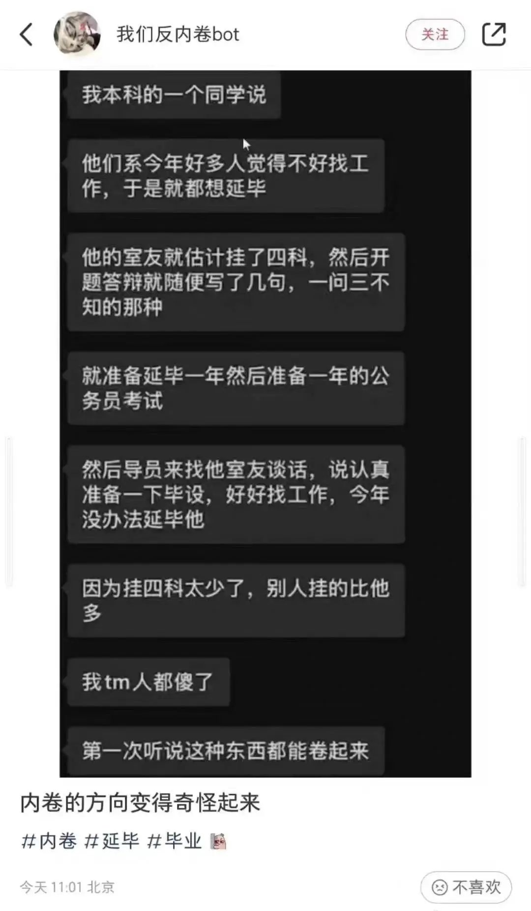

*·来自@我们反内卷bot*

 

说有应届生试图通过延期毕业来躲避今年的就业压力，为此甚至***形成了“挂科竞赛”，开始了“反向内卷”。***

 

我们知道，无论挂科还是延毕，往往会被视为大学履历中的负面加成，而现在，此举却被描述成了***应届生的自救路径。***

 

***这太荒谬******了。***

 

更荒谬的是，就在我以为这只是2022年秋招结束前一次无聊的焦虑杜撰时，***有些应届生已经开始实际操作了。***

 

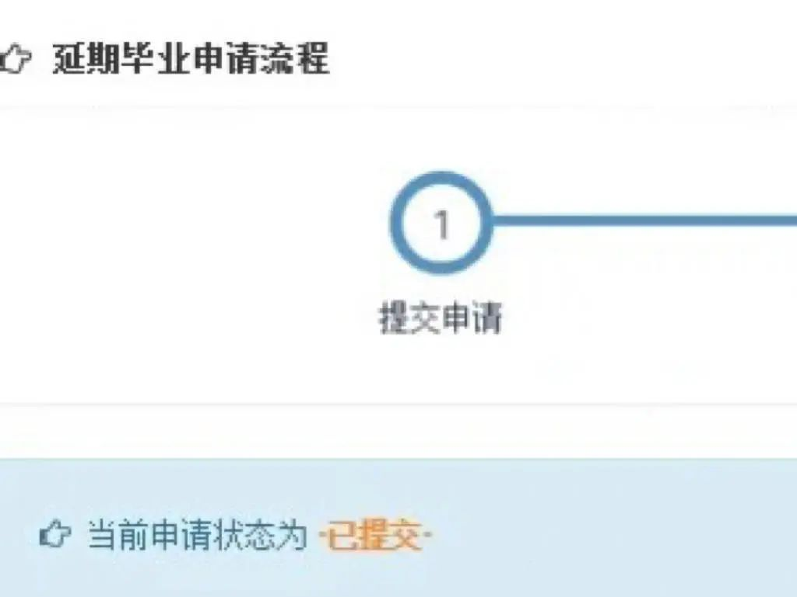

*·来自小红书网友*

 

有同样今年应届的网友评论道：***“这招学晚了。”***

 

 

# **延期毕业　无期内卷**

 

对于广大应届毕业生来说，延期毕业，在过去更多的是***一种被动的、不得不接受的结果。***

 

论文未通过，学分没有修够，挂了不该挂的科目，体测不合格，等等，都可能造成延毕。

 

不管是能力的问题，还是精力的问题，在公众考量里，***延毕难免经常与失败挂钩，代表你被同批次竞争者们甩在了身后。***

 

所以，一旦被延毕，应届生往往会陷入焦虑和自我怀疑中，甚至出现过部分极端案例。

 

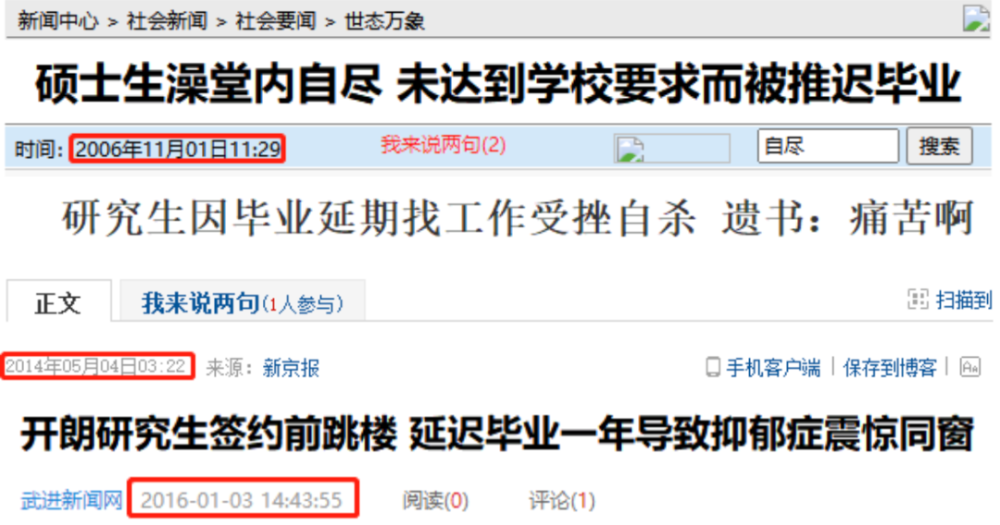

 

***然而，我发现眼下一些大学生对于延毕的看法，正发生颠覆性的改变。***

 

***延毕，已经开始从被动转为部分应届生出于利益考量下的主动选项。***

 

用故意挂科来延毕听起来确实过于虚幻，但有人在论文盲审前妥善规划延毕就显得较为体面。

 

像这位网友跟导师所说的，她选择延毕***不是论文压力，而是现实问题。***

 

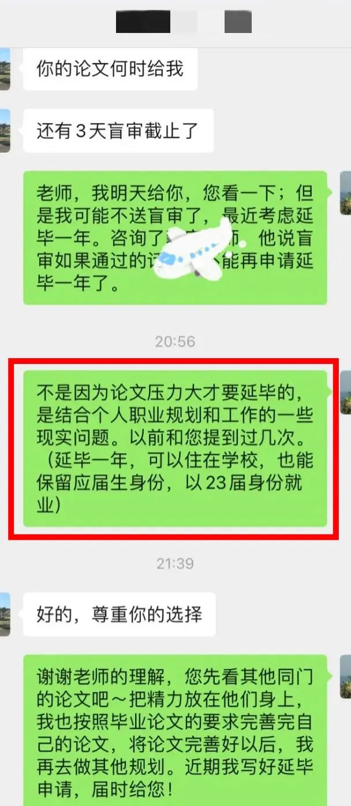

*·来自小红书网友*

 

相对于***没签到工作的窘境和仍不明朗的就业形势***，他们说延毕也就没那么难以让人接受了。

 

 

相同的权衡思路***在小范围内达成了共识***，一位知名高等院校的网友询问学妹今年是否有人申请了延毕，学妹回复：“是，我觉得延毕挺好的。”

 

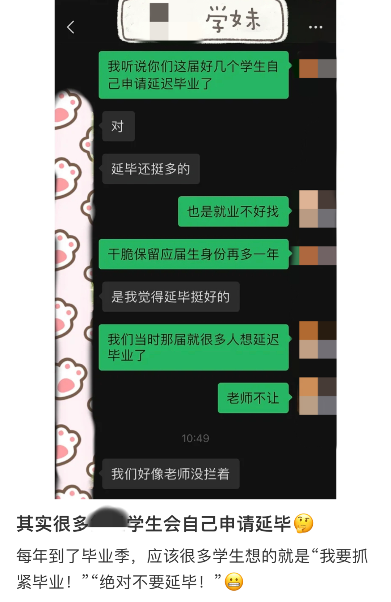

*·来自小红书网友*

 

有人说，延毕***缓解了自己的精神内耗***，能多参加一次秋招，能腾出手解决大学几年的遗留问题，还能提前适应独立生活。

 

*·来自小红书网友*

 

甚至，有人今年已经拿到了算得上不错的offer，但为了***保证其职业规划不被打乱***，思前想后，还是决定延毕一年。

 

*·来自小红书网友*

 

***以至于，在当下一些应届生看来，延毕几乎可以说是一个低成本、高收益的毕业解决方案。***

 

延出来的时间，他们既能考公，又能考研，氛围天然、食宿低廉，一次不行，还能二战，好比是多拿了一枚大学教育的“复活币”。

 

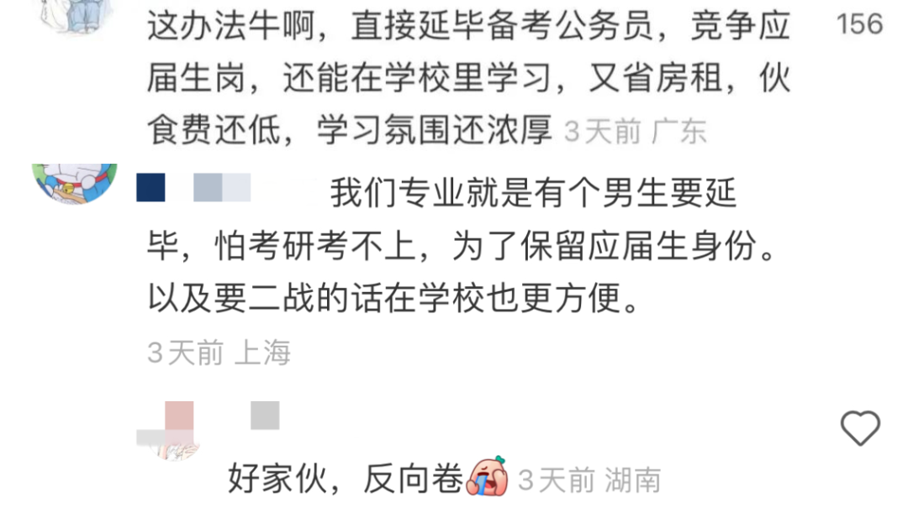

或者就算是用这段时间去刷实习、添履历，也相当于提前上了一年社会大学的“预科班”。

 

 

然而，***所有命运馈赠的延毕，早已在暗中标好了价格***。有的需要你用时间支付，有的需要你用机会支付。出来延的，迟早要还的。

 

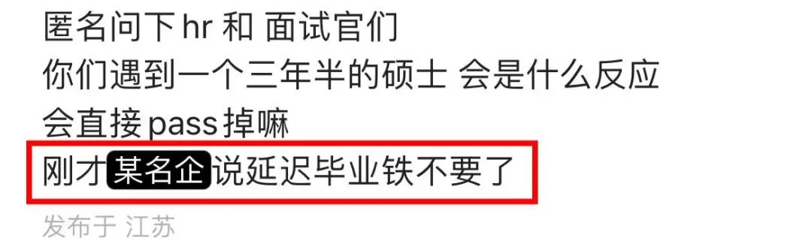

*·来自脉脉网友*

 

***就像大家谈论的所有延毕的好处，实则都是应届生们恐惧的倒影。***

 

他们担心找不到工作，他们更担心找不到好工作。

 

毕业即失业的群体恐慌，构造了一架两害相权取其轻的威慑天平。

 

现在一些应届生就处在毕业了又没毕，失业了又没失的叠加状态中，等待着随时被社会开盒。

 

延期毕业，恰是他们的薛定谔。

 

***一切恐惧的根源，都指向了年轻人关于未来的高度不确定性。***

 

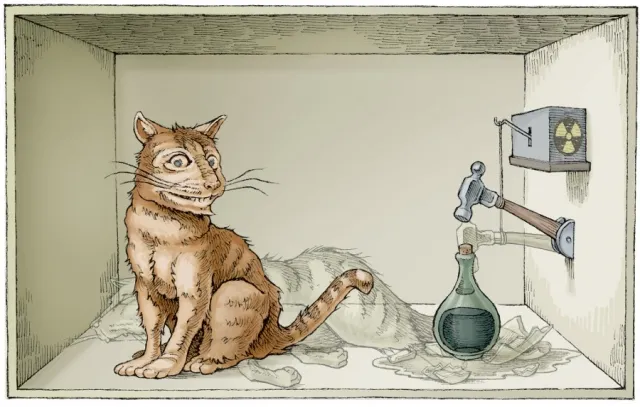

 

***“遇事不决，继续上学”***，《2022年中国大学生就业报告》显示，2021届本科毕业生国内外读研比例高达19.2%。

 

就在“挂科延毕”被编成网络段子的此刻，以指数级逐年增长的学历提升大军中，又有多少人实际上是选择了***另一种形式的延期毕业呢？***

 

 

考上了研究生，有人变相延毕去跟本科应届生卷。

 

没考上研究生，有人直接延毕跟下一届应届生卷。

 

***今年，2022届延毕的人要跟2023届的抢饭碗；到了明年，又会有2023届延毕的人加入其中继续卷。***

 

据统计，到2018年，硕士研究生的延毕率已经一路涨到了近10%，博士研究生的延毕率更是已经超过了64%。

 

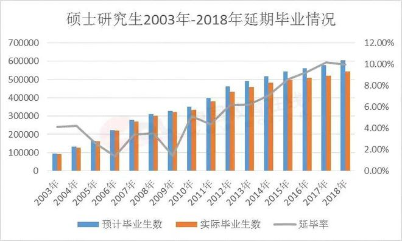

 

应届生延迟毕业，本是想躲过“最卷的一年”。

 

***最终，延期毕业的本质，却更像是一场无期内卷。***

 

# **一次应届　一生毕业**

 

前阵子，微博上有一个热点话题，叫*** 今年的应届生有多难 ***

 

有2022届的会计硕士说自己在卖烤肠.

像他这样没有工作的硕士，在当地大概能组个炊事班。

 

 

有应届本科生兄弟为了得到一份进厂打包装的工作，谎称自己的学历是大专。

 

 

延期毕业可以写进段子，失业见闻可以变为笑谈。

而关于“今年的应届生到底难不难”这个严肃话题，我们可以去广阔的社会生活里找找答案。

 

***2022年，是全国高校毕业生人数首次突破千万大关的一年。***

 

今年，预计有1076万名应届生站在了学校与社会的分割线上。

 

*·来自小红书网友*

 

就在广大应届生准备涌向社会岗位的时候，很多巨型企业却在将许多人从公司工位上解散。

 

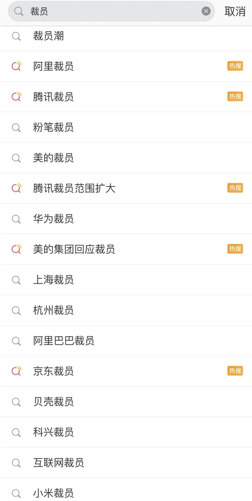

 

就在这批00后应届生准备全面整顿职场之前，有些小老板已经在艰难处境中先一步破产。

 

 

或者，当他们想在风口行业的转向和世界经济的动荡中登船靠岸，却发现等的人已经越来越多，各个拔剑四顾心茫然。

 

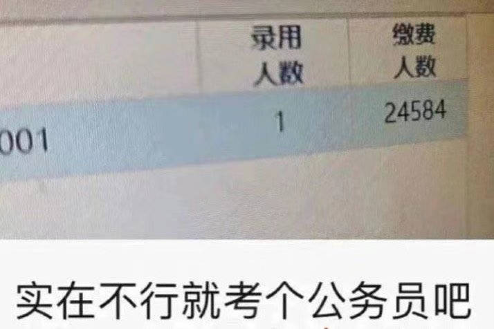

 

毕业后，理想和现实的巨大差距，一拳把他们对安身立命的全部预设捶了个稀巴烂。

 

于是，我发现***“破防”***就成了今年很多应届生常常在社交媒体上提起的词汇。

 

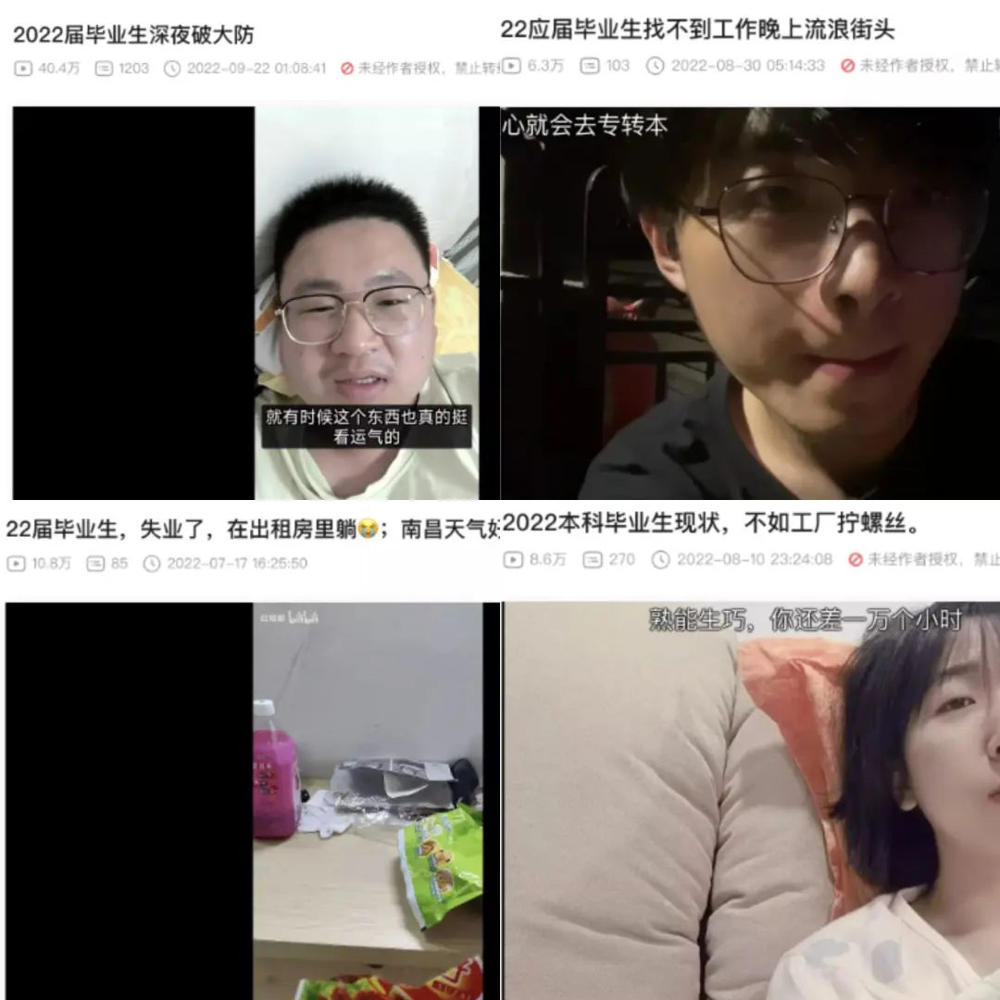

*·来自B站网友*

 

在#应届生找工作#的tag下，你甚至会担心起很多应届生网友的精神状态。

 

***不过，也有人说，这届应届生其实根本没有那么难。***

 

***他们的难，不过是自己眼高手低，抑或能力不济。***

 

然而，就在大众批评或许是应届生不够努力的时候，他们中的一些人已经跟固有的社会印象产生了冲突，直接当保安去了。

 

*·来自B站网友*

 

你以为不得志的应届生都已经躺平了，殊不知，有人早爬起来开始了对生存的伟大尝试。

 

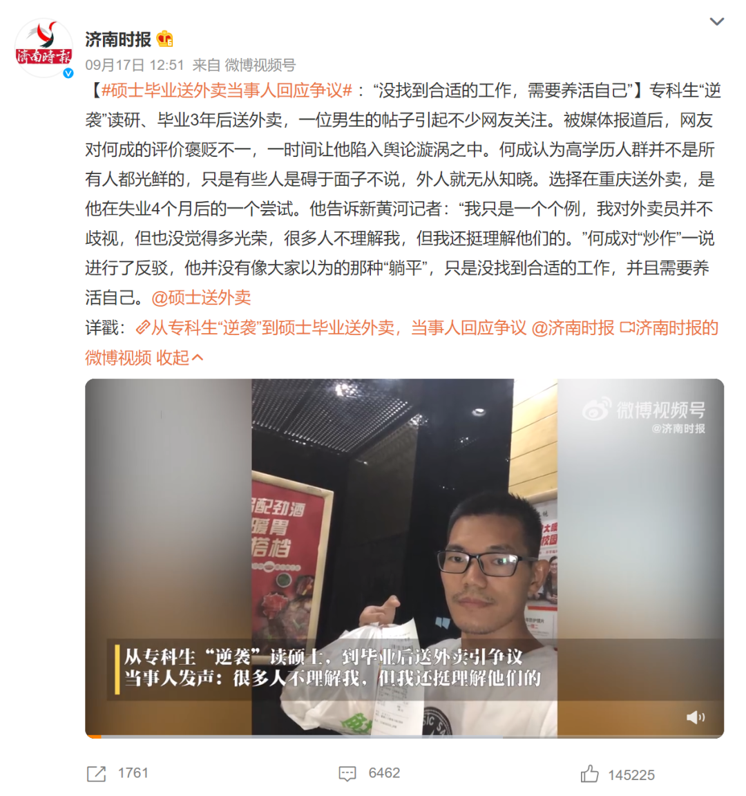

*·来自@济南时报*

 

尽管从内心里接受“面试造火箭，入职拧螺丝”，大概是要比决定延期毕业更难的一关。

 

但这届应届生中，也有人在向我们证明，***晒过图书馆的阳光，也能咽下铁做的月亮，那些高于课桌的青春，也同样能低于机床。***

 

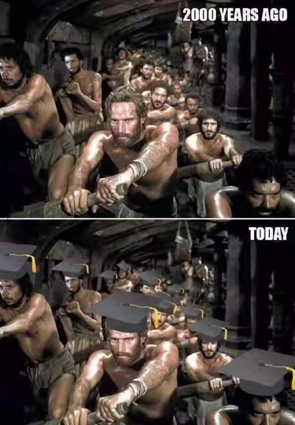

 

而至于哪一届应届生最难，或许每一代人都有自己的标准。

 

这个问题，总是伴随着举不尽的幸存者偏差和吵不完的口水架。

 

***但有一点大家已达成共识，那就是应届生身份，是大多数人与这个社会的最后一层窗户纸。***

 

很多幸运都是限时留给应届生的，这是社会对我们仅有一次的礼貌性宽容。

 

捅破这层窗户纸之后，人生就只剩下勇敢者的游戏。

 

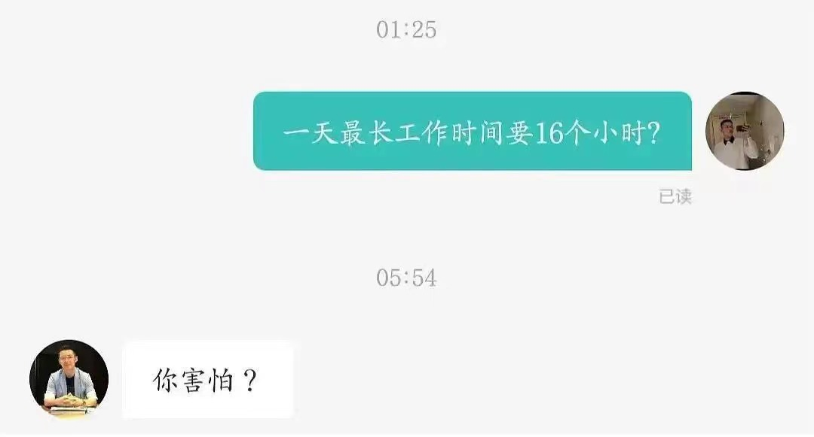

 

***你拿延毕赌明天，我用应届换此生。***

 

***多数人一生中只能做一次应届生，但却可以毕业很多次。***

 

唯一的区别是：

 

有的毕业，你能决定延期。

 

***有的毕业，来得悄无声息。***

 

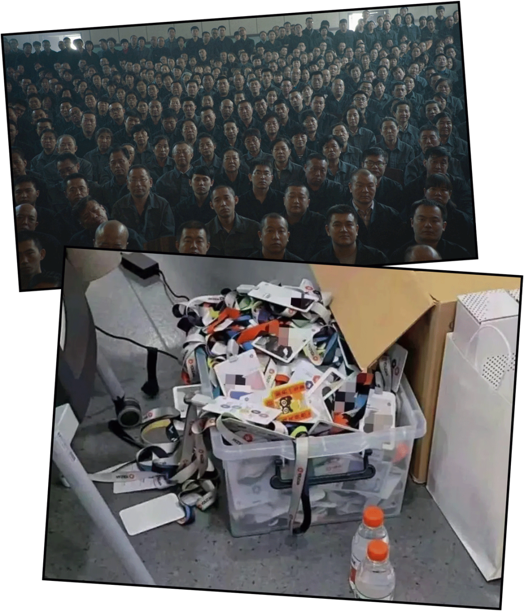

*·《“毕业”的历史变化》*