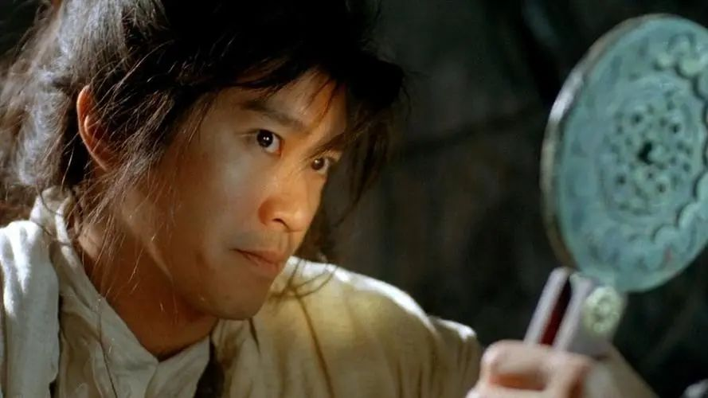
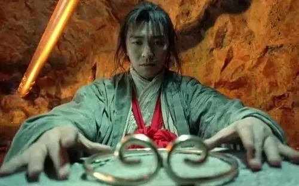

**文/德鲁伊**

关于人生技能和傍身绝技，我相信打小都幻想过。大致离不开隐身术、读心术、照妖镜。隐身么，除了对逃避的渴望之外，应该有偷窥的欲望原罪，或是不劳而获的渴望。

读心这个也热门，看到你的想法、你的内心，虽然没什么卑劣的目的，但起码自己可以省点猜的精力，也可以有所防备。

照妖镜呢？妖这个东西，总不愿意以妖的形象出现，过于擅长cos和扮演角色。生活里，总是不怕小人不怕君子，怕就怕妖精。人鬼殊途，搞不定了就给他照出来，金光一闪，原形毕露。

及至大了，隐身这个事情，除了猥琐的想法还存在之外，也知道球用没有。任何的逃避，遇到的问题只会更加难解决。至于读心，你自己都明白，现在的想法和潜意识的想法，天壤之别，读了也是白读。

可怜的你只好祈求有个照妖镜，能把身边的牛鬼蛇神一一鉴别出来，最好顺路也能找几个狐狸精，自己好假扮书生，风花雪月。关于“鉴”，说头很多，从临水自怜，到“鉴”中水的倒影，再到青铜，反正是为了认清自己的。升华一下，以人为鉴，善莫大焉。

能不能照妖不知道，但起码要认清自己的模样。“魔镜魔镜告诉我” 的咒语，起码里面的魔镜很诚实。但现如今，拍照都自带滤镜，朋友圈照片没有加效果滤镜的，想想要么是不谙此道，要么还真值得深交。俗世皆妖魔，要什么照妖镜呢？

也还需要的，虽然世人皆妖，也比不上你自己作妖啊。自己作的妖，还要自己受，所以照妖镜很有必要，随时了解自己是不是妖，或是否正在作妖也很重要。

这几日，两个事儿。一个是终于让一个姑娘明白，她追求的所谓爱情、婚姻，骨子里其实就是亟需一场陪伴。爱情、婚姻，是属于特定某个人的，陪伴就不一定。

虽然姑娘骨子里，是逃避曾经的青少年时代的创伤，倒是成了一个最典型的例子。你以为逃避能躲开问题，殊不知，逃避成了你新的问题。自身还以为战胜了过去的创伤，不再应激。

只要你愿意倒腾，大概率你还是能找到所谓原生家庭或是青少年时代的伤。但你会发现，真要祭出照妖镜，多半这个伤造成的后果，更多的不是你正视它，而是要么非此即彼的斗争，要么是无比刻意的逃避。凝视深渊，要么你复刻一个深渊，要么你开始恐水，要么你以不渴的原因远离水，要么你会说我不是不喜欢水、但我更喜欢山。

再一个的是老掉牙的中年危机。青春总是在一瞬间里走掉的。所谓的一瞬间，大约是被生活琐事填满后，突然发现，年不年轻无所谓，关键是似乎我没什么能力和技巧去面对这个不年轻。青春可以靠闯，青春本身就是资本。现在呢？

抛开俗世的标准，或是人老珠黄的哀叹。跟疫情被静默一样，原先以为自己很重要，世界缺谁都行就缺不了你，静默了居家了，发现，需要刷存在感的是你。因为面对自我，你晓得了，你跟谁都能长袖善舞、五马长枪，就是面对不了自己。

能在意中年危机的，说实话，应该前边混得还不错。那些从青春期就泡在危机里的人，中年不中年的其实无所谓。我说，搞个个人爱好吧。没有。家庭里有责任、有义务，有没有共同的爱好或项目可以一起做？没有。那就先止思，不刷存在感，去疑。或许能不那么焦虑。

昨天的成功，或许造成你今天最大的失败。比如说爱好这事，求学时代或是拼搏时期，刻意的控制。到不用社会化认可了，需要自我存在感的时候，笨拙的无从下手。

于是想，原生家庭、青少年时代，在今天似乎成了过不去的坎，可以随意装垃圾的筐。其实青年时代呢？老年时代呢？一样在种因得果。

照妖镜在手，不照别人，先照自己。

**左岸记：**身是菩提树，心为明镜台。明镜本清净，何处染尘埃！生活就像一把照妖镜，让人无所遁形。它能把理想照出实现，也能照出现实的分崩离析。谁手中要是有照妖镜，那是用来照别人，还是照自己呢？用来照别人，会不会会见到满世界的小妖大怪？用来照自己，会不会不敢相信自己的真实样子。所以，菩提本无树，明镜亦非台。佛性常清净，何处有尘埃！