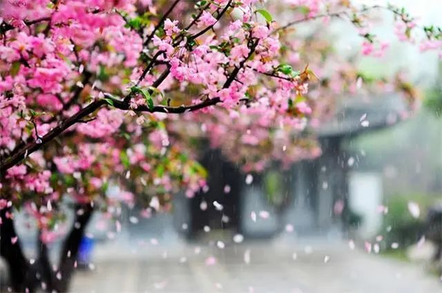
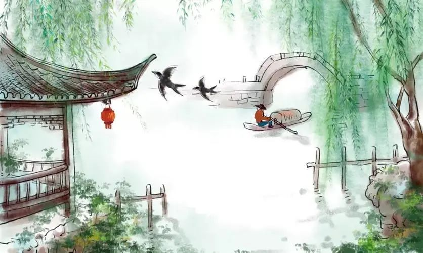

****

**文/廖超国**

人生中的很多事情或很多道理，是必须要到了一定的年龄，有了一定的人生经历才能理解和明白的。童年不知苦，少年不识愁，年轻不觉难。只有过了中年，经过了生活的碾压，人生的锤打，世事的磨炼，才会懂得人生有太多的无可奈何。

能否理解和明白人生的无可奈何只能无可奈何，也是衡量一个人是否成熟标志。成熟的人会懂得，世界上的事并非是仅靠自己努力就能达成的。成熟的人知道，任何人都有力所不及的地方。一个人只能尽自己的力量朝成事的方向去努力，至于最后的结果，只能是“尽人事，听天命”。就人类而言，也是如此。人类在大自然面前既是伟大的也是渺小的，伟大表现在通过长期的基因进化，站稳在食物链的顶端，说其渺小，是指人类在大自然的很多领域还只是揭开了冰山一角，还有很多很多的未知。如流行了三年的新冠病毒依然这么猖狂，人类到目前还没找到治它的好办法。当然随着人类生产力的发展和人的认知能力水平的提升，会以渐进的速度和方式由未知向已知迈进，但这是相当长的历史时期。人的一生中，会遇到很多事情，无论我们如何努力，都难以企及。也就是说，人生有太多的无可奈何。

无可奈何，这一成语典故，最早出自于《庄子》内篇《人世间》。是由一则故事引出的。故事讲的是楚国的叶公子高受楚王的派遣将要出使齐国。听说齐国的使节刁钻难缠，而叶公子高又不擅长斡旋外交事务，还没去就恐惧害怕。他既担心完不成任务，又惧怕楚王的责罚，茶饭不思，坐卧不宁，焦虑无比。便去向孔子请教。他对孔子说了自己的很多苦闷，孔子安慰他说：“**知其不可奈何而安之若命，德之至也**”。人都有无能为力而不得已的时候，既然，楚王把这事安排给了你，这就是你的工作职责了。你要认真地去尽职，全心全意把全部心思放在这件事上，就不会焦虑了。你现在焦虑是因为你把事情之外还没有发生的事情考虑的太多。即使是圣人孔子，在劝慰别人面对自己无能为力的事情时，除了鼓励别人尽力去做之外，对其不能左右的结果也只能劝人少去思虑而安之若命坦然接受。

人这一生中，很多时候，总有遗憾无法弥补，总有心愿难以满足，总有意外躲避不开，总有无奈不可释怀，总有纠结不能畅平，总有心酸无处诉说。没有谁不是身不由己活着，很少有人可以随心所欲。没有谁不是顶着艰难过着，很少有人能够轻松自如。人生中的无可奈何，最终都表现在，事情已经发生了，除了接受，真的无能为力；除了苦笑，就是咬牙熬和挺；除了翻篇，就是整整行装重新上路。

网上有个段子，列举了人生10种无能为力的事。分别是：倒向你的墙、离你而去的人、留不住的时间、没有选择的出身、莫名其妙的孤独、无可奈何的遗忘、无法再现的过去、别人的嘲笑、不可避免的死亡、不可救药的喜欢。

人生何止只有这些无可奈何。事业上仕途无缘，感情上恋爱失意，生活中婚姻受挫，家庭里教子无方，人生中困顿迷惑，理想与现实总是存在那么大的差距，期望与结果总是那么令人失望。英国诗人雪莱曾说：“人世的明日绝不会雷同于今朝，万古不变的，却唯独只有无常。”中国当代著名作家林清玄先生说：“人生不如意之事十有八九”。活过百岁的杨绛老人也说过“**岁月静好是片刻，一地鸡毛是日常**”。很多时候，这些“不意之事”和“一地鸡毛”就让你无可奈何。人生中，有太多的无可奈何。失去是无可奈何，错过是无可奈何，离别是无可奈何，后悔也是无可奈何。人生最大的无可奈何就是人生无常。

**爱而不得是人生的常态。**爱是人须臾不可少的东西，如水之于生命。人若缺了爱，心灵会枯死而人将不人。情是人生中和面包同等重要的需求，人若少了情，会很难活得健康。爱和情是构成人生的全部意义。但就是这样一个主题，于人生也常常是无奈的。人这一生，在不断的遇见，也在不断的告别，谁是谁的人生归宿，谁是谁生命中的过客，谁也难以说清。“有情人终成眷属”只是一种美好的祝愿和期望。现实是很多相爱的人却最终难以走在一起。不是不爱，而是爱而不得。每个人都曾在自己的心里刻过一个人的影子，总希望相守一生，但后来的后来，不过也只能看到对方悄然转身离去。所以，情种诗人徐志摩不得不写道：“得之我幸，失之我命，如此而已”。

**求而不成是人生的常事。**每个人都有自己的所求，但能否求而所成却不完全由我们自己决定。台湾作家白先勇说：“拥有的从来都是侥幸，无常才是人生的常态，所有的成熟都是从失去开始的。”人生不如意之事太多。古人说，万事只求半称心。能半称心已经是高香敬菩萨得到命运的眷顾了。残酷的现实是，人来到这个世界都很难，苦是当然，累是必然，不如意更是显然。含着金钥匙来的人少之又少，大多数人都普通平凡，还有不少穷苦人。人人都有自己的难言之隐，个个都有个人的难诉心酸。成年人的世界没有“容易”二字，责任不能不担，家人不能不养，工作不能不管，钱财不能不赚。千人千般苦，万人万般难。人生所求的过程中，失败是常事，成功是偶然。很多时候，不属于你的东西，无论你怎么努力，都会与你无缘。就像有一句话所言，命里不是你的东西，即使十指紧扣，仍会漏掉。命里是你的东西，无论怎么失手，都会拥有。我是无神论者，我不迷信。但我信命。我把这里的“命”权且理解为我们人类还没有认识到有一种神奇力量，相信暗物质的发现，再往前推进，一定会对此有解释。

**企而不及是人生的常理。**希望总是好的，但只有能实现的希望才算真正的好。实现不了的希望与没有希望本质上没有不同。其区别在于没有实现的希望还会增加人的烦恼带来痛苦。人生有很多企而不及的事。企而不及也可以说是一种常理。很多道理，咋一听，非常有道理。若你按那个道理去行事，通常会被生活打脸。因为任何道理都有其作用的特定环境条件和范围，比如：越努力，越幸运。很多人努力了一辈子，但并未见到幸运降临。如果认知达不到一定的高度，对事物的认识不能透过现象抓住本质，没弄清事物发展变化的规律，出现方向偏差，越努力离目标越远。还有我们不得不承认“运气”的存在。运气这东西很难说明白，但它确实存在而且深深地影响着我们。如生活中那些彩票中奖的人，还有实力相当的两只足球队的胜负，是很难用什么科学的理论解释清楚的。有人说，运气是机会碰巧撞上了努力。那机会又是怎么来的呢？若把机会说明白了，那“巧”又怎么说呢？

**付而不获是人生的常例。**我们常说，没有耕耘就没有收获。这无疑是十分正确的。但作为成年人还应知道，不是所有的耕耘都会有收获的。当你到了一定的年龄。经历了世事的风霜，便会渐渐明白，付出与回报之间并非完全的绝对的正比例的线性关系。对于付出和回报正确的认识至少包括四点，第一、不付出一定不会有回报，回报是付出的结果；第二、付出和回报不一定成比例，出了十分力并不就一定有十分回报；第三、付出和回报在时间上可能存在时滞，也就是说，付出并非立竿见影得到回报；第四、不是所有的付出都会有回报。世界上最可怕的就是努力了结不出硕果，付出了得不到回报，可生活时常会这样。“四大天王”之一的著名歌手刘德华在他的《都怪我》那首歌中不也唱到，付出等于收获那是自以为是。人生中，付出可真得不等于收获。付出没有收获并不是倡导和鼓励不用付出，恰恰相反，指出付出而没回报，是想提示人们，回报不易，更应注重从多方努力而得到回报。

**人生就是如此，有太多的无可奈何。**但并不能因为这些无可奈何，我们就消极以待，坐以待毙，颓废人生。对待人生中无可奈何的态度，也正检验着我们是一个什么样的人。有的人因无可奈何消沉，有的人因无可奈而思辩，有的人因无可奈何而奋起，有的人因无可奈何而改变。如果把人生比作一次战斗的话，在生命的战场上，一方是我们的心灵，一方是人生的无奈。或许，生活的艰辛和坎坷，磨碎着我们的斗志；命运的沉重和无奈，摧毁着我们的决心。但我们依然得忍让着、对恃着默默与其进行着较量。因为我们回避不了，躲避不成，只望他人不可能，只有自己正确面对。正确面对是人生的必然，正确面对是人生的态度，正确面对是处世方法。那么，我们该如何正确的面对人生的无可奈何呢？

**理清认知，理解无常才是有常。**人生是无常的。无常即不确定，没有所谓的永恒，一切都在变化中并且难以控制。这个世界唯一不变的是一切都在变。生命的本质是无常。生命是一种物质，既不快乐也不痛苦，它是由一系列事实构成的存在。这个事实本身的好坏全是我们主观上的一种观念的判断。因事情引发的真正折磨我们的痛苦其实是我们的想法。由此我们可知，这个世界不是以我们某一个人为中心展开的，它是一个遵循各种自然规律的客观世界。这种客观性表现为不是某一种力量造就了它，而是整合世界上所有时空力量的结果。别因为事物违背了我们的意愿而抗拒其存在。我们唯一能控制的并让自己获得自由的是我们的内心，外在的事物不受我们控制。认识到这一点，我们才会真正放下以自我为中心的想法，开始接纳人生的不确定性，理解无常才是有常。

**改变心态，明白接纳才能翻篇。**面对人生的无常，我们要学会接纳。生活里发生在我们身上的任何事情，包括我们无法接受的事情，除了正视之外，就是接纳。因为事情的结果不以我们接受与否而改变。当代著名学者周国平说：“人无法支配自己的命运，但可以支配自己对命运的态度，平静地承受落在自己头上不可避免的遭遇”。当事情已经变得不可挽回时，聪明的人就会学会接纳。美国作家迈克·辛格在他的《清醒地活》一书中讲到，当事情已经不可改变，如果你不接受它，甚至抗拒它，抓住这个状况不放，那其实是在制造堵塞心灵的能量，我们会纠缠于这件事或者依恋于这件事情，这件事情引发的能量无法通过你而造成你心灵的堵塞。这种堵塞的能量不会消失，它会带给人各种情绪和内耗，让人困在此事之中郁闷焦虑不快乐，直到你接受这件事情的结果为止。接纳不是无谓的对抗，接纳是正视，接纳是反思，接纳是释然，接纳是结束。事过，当即斩绝，是处世的智慧。痛快翻篇，是做人的格局。只有告别才能翻篇，只有翻篇才可以重新开始。

**调整行为，懂得豁达才是解药。**对待人生的无常，与其一味地纠结焦虑和对抗较劲，不如从心态上接受释然。只有这样，山重水覆的无路才能见到柳岸花明的新村。被誉为京派代表人物的汪曾祺老先生在他的《万事有心人间有味》一书中写道：有人问我：“这些年你是怎么过来的？”他们大概觉得我精神状态不错，有些奇怪，想了解我是凭什么力量支持过来的。我回答：“随遇而安”。他老人家经历了那么多人生的磨难，依然活的那么神情抖擞，有滋有味。秘诀就是顺其自然，随遇而安。顺其自然，是一种境界。顺其自然，并不是不作为，而是明知不可为而不强作为。爱而不得，改变不了别人，但可改变自己；求而不成，无法左右命运，但可调整心态；企而不及，解不开的结暂缓，岁月自会让你释然；付而不获，想不通的可不想，时间自会有答案。心安是一种格局。随遇而安，不是随波逐流，而是审时度势的睿智；随遇而安，不是守株待兔，而是真心付出的坦然。安，即心安。心安则身安。无论身处什么环境，阳光灿烂也好，风吹雨打也罢，保持一份随心所遇的心态是明智的人生态度。而顺其自然，随遇而安最终将人引入超脱豁达山顶。超脱和豁达才是人生无常的真正解药。

总之，**对待人生的无常总的策略是，****如果遇到了，就想办法去改变，如果改变不了，那就去适应。如果做不到适应，那就回避。如果连回避也做不到，就只有放手。**但通常的情况是，能干的人选择改变，懒惰的人选择适应，懦弱的人选择回避，勇敢的人选择放手。

人生漫漫，生命短暂。生活不易，抵砺向前。无可奈何也好，无能为力也罢，用真心做自己，放宽心去生活。无可奈何也能快乐，无能为力也幸运。

人生无常，无常人生，坦然面对挺过去就是精彩人生。

2022年12月3日

写于南湖之畔水域天际

****

**左岸记：** 对无可奈何的事总是分析一下的，到底是自己的原因还是外界的因素，是自己的原因要么就改变自己，要么就随之而去，是外界的因素要么等待时机改变，要么改变环境。把人生看悲观了，容易接受现实，却也意志消沉；把人生看成可变化的，就不会囿于困境，也往往更会带来转折。无可奈何花落去，花要落就让它落去，但我们依然好好耕种，来年花会开得更艳，似曾相识的燕儿也会如期而归。