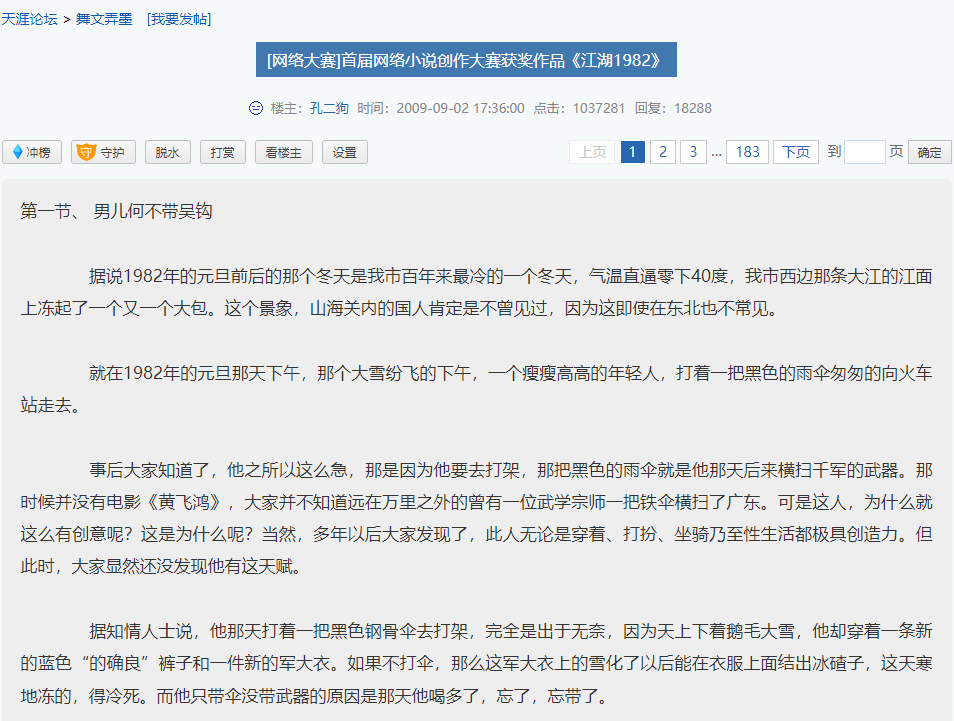
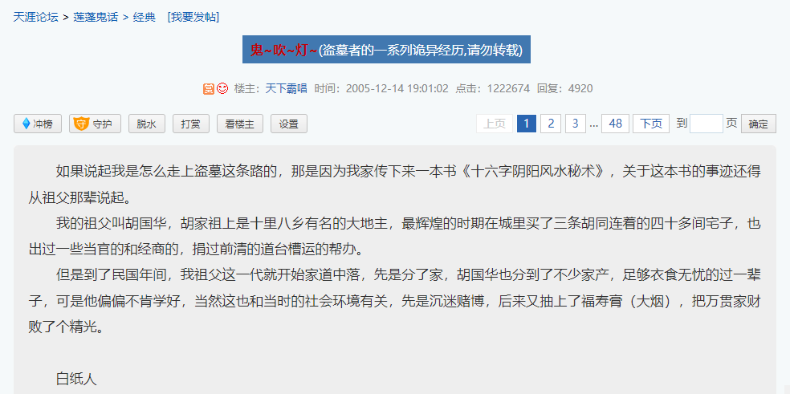
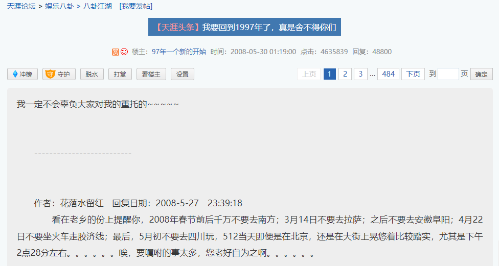
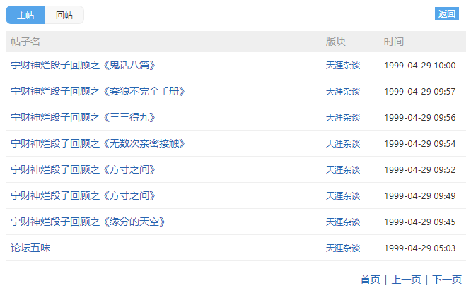
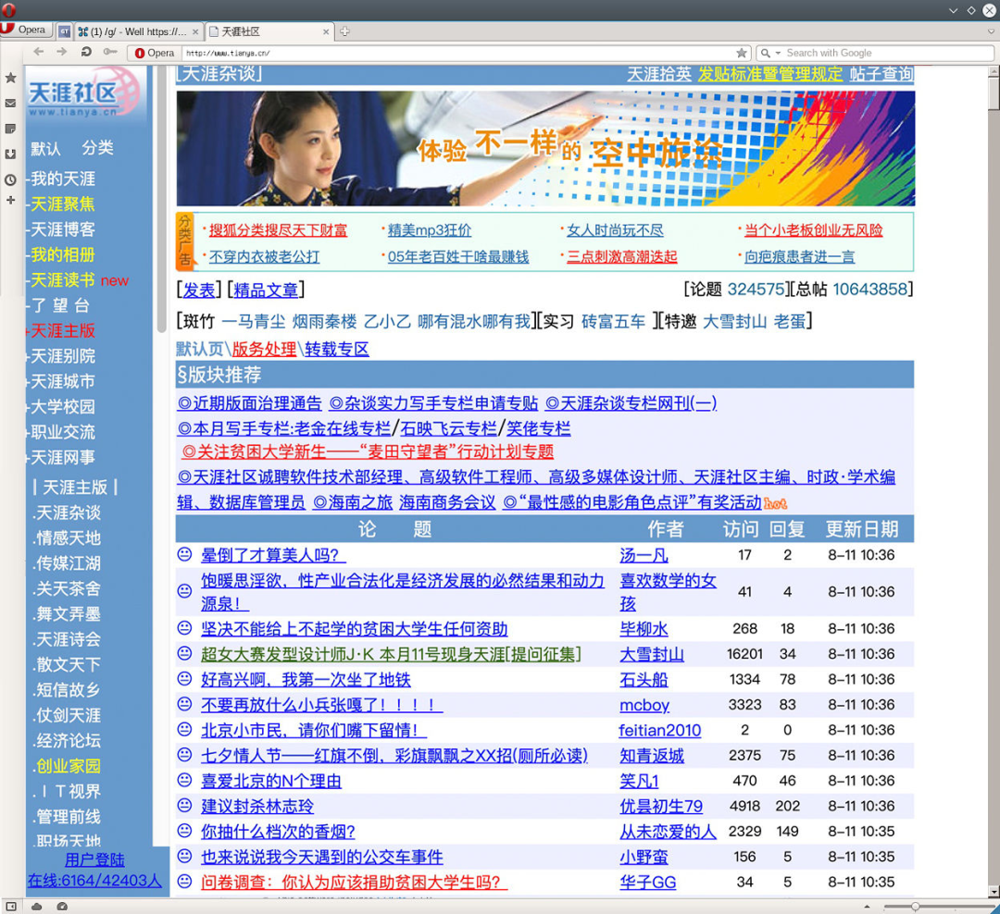
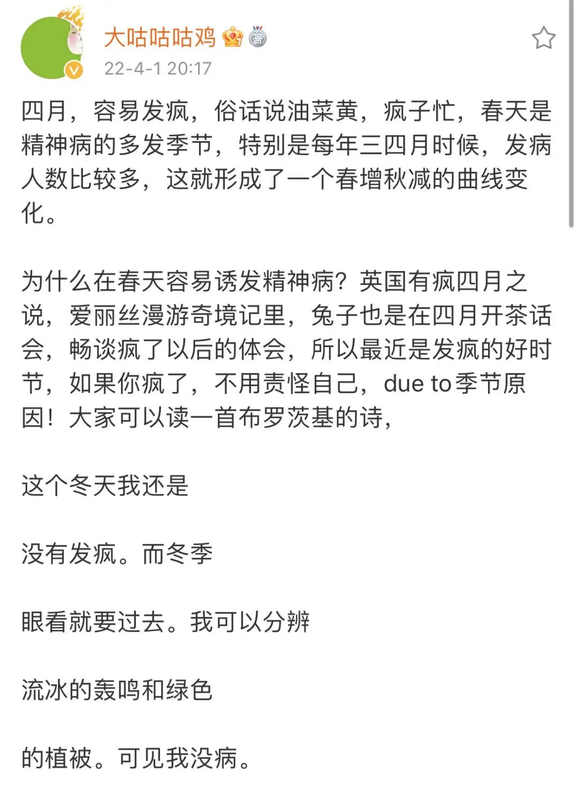

这两天网上有个话题很热。

 

***那就是——中文到底死没死？***

最近一时间，大家忽然集中关切起了中文的命运。

 

 

有人说：“对，中文死透了。”

 

有人说：“没死，说中文已死的脑子坏了。”

 

还有人说：“中文只会半死不活。”

 

中文的死去活来现在能拥有如此高的讨论热度，说明我们确实感受到了***中文正在发生一些令人不太愉悦的变化。***

 

 

中文在互联网上最鲜活的时候，曾发挥出极大的技术性和艺术性。

 

人们应用简体中文，在赛博广场创造出了诸多美妙的作品和崭新的语境，其文化遗产以书籍、影视、IP等形式影响我们至今。

 

***这一切，曾经都发生在一个叫天涯社区的网站上。***

 

# 

 

 

创办于1999年3月1日的天涯社区，早期在中文互联网拥有统治级的影响力。

 

有这样一组数据：

 

***截至2013年8月，天涯社区注册用户数达8500万，是全球最大的中文互联网社区。\***

 

2013年，中国网民规模才6亿多，也就是说，当年平均7个中国网民差不多就有1个是天涯用户。

 

***天涯社区揭开了一个中文创作环境下百家争鸣的年代。***

 

***无数网民都前来这里朝圣，有人创造思考，有人汲取营养。***

 

 

早期天涯社区由各个版块组成，从政治到历史，从经济到文学，从天地玄黄到菜市场。

 

这些版块几乎用中文把现实世界和不存在的事物都说了个遍。

 

在国际观察版块，不乏***措辞毒辣、用词大胆***的民间政治观察家，他们转播世界时事，并以***特约评论***一般的素质分析作答。

 

*·还有人通过政治理论扬言要拯救当时的国足*

 

在煮酒论史版块，潜藏着诸多文史大拿。

 

其中最负盛名的，就是从2006年在该版块连载***《明朝那些事儿》的当年明月。***

 

当时人们之所以狂热追捧《明朝那些事儿》，是因为当年明月***用中文开创了一种“心灵历史”***，以小说的笔法构筑宏大历史与人物内心的参差，通俗而幽默地讲完了明朝兴亡三百年。

 

他概括明朝开国团队复杂的宿命，只用了一个金句：

 

*“在中国历史上，共同创业的人大都逃不出‘四同’的结局：同舟共济——同床异梦——同室操戈——同归于尽。”*

 

当年明月用3年时间连载了近百万字，集结成书后多达7册，销量超过千万，他本人也拿到了4000万的版税。

 

*·2021年，某校教职工仍在推荐学生阅读此书*

在当年明月来到天涯社区的第二年，天涯杂谈出了一号人物叫孔二狗，他的连载长贴名叫《东北往事：黑道风云20年》。

 

*·电视剧版很好地还原了本书的文学特点*

 

孔二狗在天涯上连载了两年后成书四部，而《东北往事：黑道风云20年系列》至今仍被很多网友誉为最好的黑道小说。

 

*·后来孔二狗还在天涯刊载了以刘海柱为视角的获奖作品《江湖1982》*

 

而莲蓬鬼话版块更是雄文辈出，可以说得上是中文悬疑惊悚文学的传奇高地。

 

 

这里是如今已成为巨型吸金IP，影视化作品无数的“鬼吹灯”系列开始的地方，天下霸唱以老道的文字水准和精妙的故事设计，在天涯开启了一个中文盗墓文学纪元。

 

 

他硬是把跟日常生活没什么关联的“鸡鸣灯灭不摸金”“寻龙分金看缠山”科普成了当时互联网的流行语。

 

一度曾是天涯社区上《鬼吹灯》同人文的《盗墓笔记》，后来也同样成长为一个超级IP。

 

而此时在天涯上一边炒股一边写文的紫金陈，已经创作出了《坏小孩》，中文悬疑首次将目光移向了儿童犯罪。

 

*·后改编为电视剧《隐秘的角落》*

 

有人以金庸文风结合量子物理写武侠，有人用伤痕文学融入市场经济讲爱情，有些作品完结成名，有些奇文无疾而终。

 

 

天涯时期互联网中文的创生词不但具有旺盛的生命力，还有些优雅亲和的气质。

 

论坛版主被称为“斑竹”，而天涯“观光团”和“求真相”等等实用向的老梗，至今也在被吃瓜网友们沿用。

 

甚至现在自媒体常用的中文流量密码，天涯社区的人们也早已经玩过了，这篇回忆怀旧向的帖子放到如今，就是一篇起步百万+的推送文章。

 

 

***硬核而优质的中文内容在天涯社区持续井喷，使这里俨然成为一个中文网络文化的日不落帝国。***

 

有网友回忆，当时的天涯社区是大学老师熬夜必追的言论道场。

 

 

而武林外传的编剧，1999年就在天涯上写段子的宁财神，他在千禧年前的一篇帖子里说：“我几乎所有的业余时间都是在天涯浪费掉的。”

 

 

***然而，这个如今看起来有些梦幻的中文黄金时代，在自媒体大潮淹没触摸屏之后，就彻底崩塌了。***

 

天涯社区，现在是信息流边缘一座鲜有人问津的赛博遗迹。

 

互联网上的中文佳绩日稀，大家仍在炒前几个十年的冷饭。

 

中文被装进盒子，隔段时间就会有人好奇：***“它是不是死了？”***

 

# 

 

***我们也许都被自媒体时代给骗了。***

 

“每个人都能出名十五分钟”——这是自媒体时代为普罗大众编造的集体幻梦。

 

可事实果真如此么？

 

我们现在确实可以随时随地掏出手机，在任意一个App上发表看法。

 

但问题是：***你的表达，有人看么？***

 

你精心编辑半小时的朋友圈文案配上高P图片，最后发现算上爸妈一共获得了3个赞。

 

 

***本质原因是，互联网的语言生态，就是一个丛林法则。***

 

语言的丛林法则，只有活着和速朽，语言没有高低，只有是否暴力。

 

你还在对“绝绝子”“跺jiojio”感到不适的时候，有人已经贴在你的耳边，念着“我真的会xie”“拴Q拴Q”。

 

是的，这就是流行用语，它可以经不起推敲，但它一定能极致地占据你的语言空间。

 

很明显的是，只要你带上一些直接而淋漓尽致的词汇，如“绝绝子”，至少你能在流量区内割据一亩三分地。

 

*·某App上关于“绝绝子”有超过497万篇笔记*

 

天涯社区的时代，是少数意见领袖制作出具有深度思考的优质内容，然后分享给许多网民。

 

这种中文生产方式，确实能创造出好内容，但它的利益收割一定没有短视频里频繁爆闪炸出的“我真的会谢”来得精准猛烈。

 

*·2005年，天涯社区的内容尺度在今天看来确实是无法想象的*

 

***丛林法则下，逐利的前提，是安全。***

 

***安全的本质，就是多用思考浅显的词汇，换言之，就是不深思。***

 

深思有两个结果：1.你讲的话太晦涩了，被别人骂看不懂了 ；2.你吵醒了一些沉睡的人，被骂得更惨了。

 

于是，想要用好中文说好中文故事的，要么更加谨慎，要么更加疯癫。

 

如果有人把“死”变成了“口”，那么就有人将“裁员”说成“毕业”。

 

 

***如果大部分人无法深度撰写这个时代，就会有人无尽缅怀过往的时代。***

 

天涯社区短暂带来了中文内容的百家争鸣，无数有能力丰富中文世界的人共同参与了这场轰轰烈烈的文化大潮。

 

但是，黄金时代里诞生的那些金子般的人物，他们并没死在2022年。

 

***只是面对更加复杂而暴力的变现逻辑，相对收紧和模糊的风气，他们缄默了。***

 

***中文精英们被困在小圈层中，以愈发荒诞、抽象和讽刺的语言来消解21世纪不适应症。***

 

 

过去我们一直以为，疫情过去了，生活就会重新步入正轨，人与人之间的沟通效率会越来越高。

 

但现在看来，全世界的人们不再相信“地球村”了，世界经济碎裂了，文明的列车朝着未曾设想的道路奔去，与此同时，有人妄图躲在一种虚无的语言里保持安全。

 

而少数者却在思索着“中文死了没”。

 

我只想说，笑一笑就好。

 

