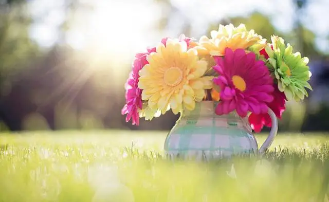
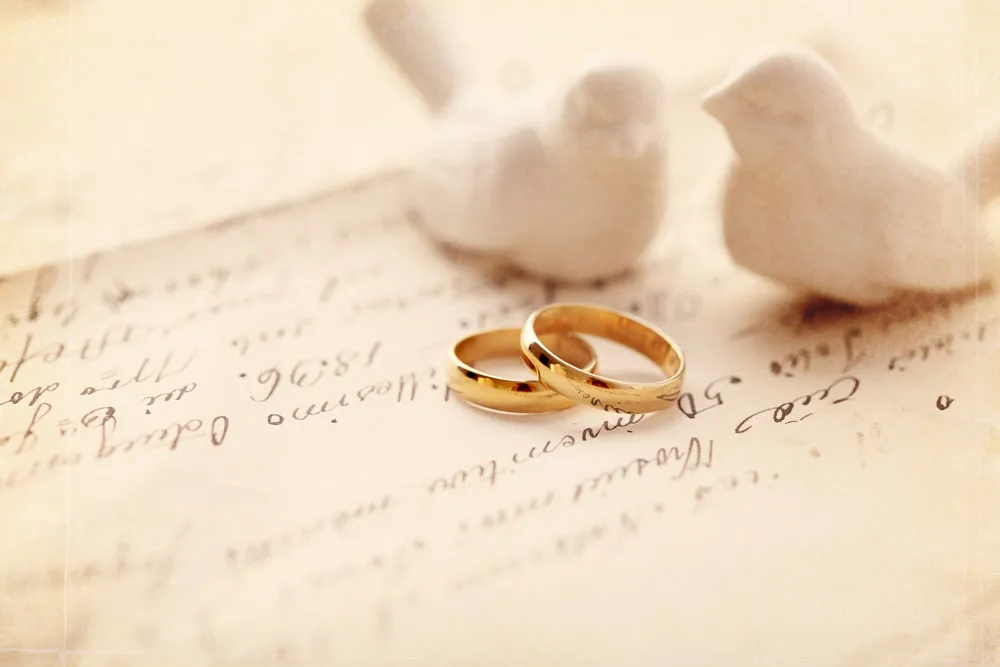

# 以为有钱有权就能过上幸福的生活，那是我们误解了幸福

读《真实的幸福》——心理学笔记（四） 

文/谢慧敏 

近期王思聪的表现着实娱乐了大家一番，混迹于美女堆里的超富二代变身为地主家的傻儿子，竟然很没出息地骚扰一位名不见经传的小女网红，女网红被烦到差点要去报警。 

王思聪自损英名倒不说，还暴露了他的生活的状态——无聊，一个隔三岔五有事没事去撩女人的人，生活是不会充实到哪里去。无聊可不是什么好的生活状态，我们每个人都不愿意无聊地生活。 

年轻、受过高等教育、长相不赖、独子、有多到十八辈子都花不完的钱。条条大路通罗马，王思聪直接长在了罗马。 

在我们的观念里，这样的人的生活肯定是无可争议的幸福。然而事实并非如此，娱乐圈里的很多事例都证明这一点。 

这也印证了积极心理学《真实的幸福》的论断。《真实的幸福》以权威数据和精细研究更正人们固有的观念：收入丰厚、年轻、健康身体、受过高等教育和有信仰不是幸福的保证。 

如何提升幸福?传统心理学致力于如何修补心灵的创伤，积极心理学则专注于如何让平凡的人生活得更幸福。《真实的幸福》被誉为提升幸福不可不读的心理学经典，以下是观点摘录。 

**人的幸福一半是天注定的** 

\1. 一个人的幸福测验分数有一半是基因决定的。

\2. 同卵双胞胎的心理特质比异卵双胞胎更相像。被人收养的孩

子的人格特质更像亲生父母而不像养父母，这类报告研究现已超过百篇，并且都显示同一结论：大约50%的人格特质是由基因决定的。但是高遗传性并不代表不可改变，有些遗传特质（如性取向和体重）是不可改变的，而其他遗传特质（如悲观、恐惧）则是可以改变的。

\3. 明尼达大学的研究显示：积极情绪是人格特质，具有遗传性。一对同卵双胞胎不论是爱哭是爱笑，只要有一个具有某种情绪个性，另一个也必然差不多。

\4. 有一个叫露丝的单亲妈妈，有轻度抑郁。这种情况并非始于三年前露丝的先生遗弃她时，其实她的心情一直处于低潮，至少从25年前，她还在念中学时就是如此了。有一天，露丝中了2200万美元的乐透奖，她高兴得简直要发疯了，她立刻把工作辞去，跑到大百货公司去血拼，接着又买了豪宅，还有最名贵的跑车。但是很奇怪，随着时间的流逝，她的情绪又低落。最后，到年底时，露丝的心理医生诊断她为慢性抑郁症，虽然她没有任何抑郁的原因。

\5. 我们天生就有一个幸福的范围，而且是固定的、不可改变的。这个天生的范围就像恒温仪，即使有高兴的事情使我们的情绪高涨，它也会尽忠职守地把我们的幸福感拉回到平常的设定。有一个研究追踪了22个中了乐透大奖的人，结果发现，最终他们都降回到原来的幸福指数附近，赢得大奖并没有使他们比控制组的人更幸福。但是，好消息是，假如有不幸的事发生，这个恒温仪也会把你从低潮中拉出，让你回到原来设定的地方。其实，抑郁（指轻微的）都像是插曲，在发作后几个月，情绪便会回到原来的设定。即使在车祸中受伤导致半身不遂的人也能很快适应自己身体的新情况。在车祸或意外后的八周内，这些人的积极情绪就开始超越消极情绪；84%的严重残障者认为，他们的生活处在平均值，甚至比平均值更高。

\6. 不过，适应也是有限度的，有些坏的事件我们永远没有办法适应，或适应得很慢。孩子的死亡或是配偶意外身故都是明显的例子，在事件发生后的4--7年，当事人还是比控制组的幸福感低。（以此推断，杭州保姆纵火案全家几遭灭门的男主的行迹情绪不可疑？）

\7. 有些人拥有相当积极的情绪，这种个性会伴随他们一生。拥有积极情绪的人大部分时候都觉得很好，好事会带给他们幸福感，而且这个幸福感相当持久。

\8. 当然，也有很多人没有幸福感，他们即使成功了，也不会雀跃。

\9. 但是大部分人落在这两个极端的中间。

\10. 人体里有一种“幸福的跑步机”的机制，它使你很快就适应了好事情，然后认为那是理所当然的，不再心存感激。当你收集到越来越多的珍奇之物，职位越爬越高时，你的预期也越来越高，过去的努力带给你的名望和财富不能再为你带来幸福，你必须拥有更多、更好的，否则就感觉不到幸福。但是一旦达到那个层次，很快你又适应了，又必须追逐更多、更好的，如此循环。

\11. 假如没有这个“跑步机”，鸿运当头的人应该比普通人幸福

得多。但实际上，一般老百姓比达官贵人更幸福。（王思聪生活不那么幸福也是大有可能的）。 

****

**还有一半靠打拼，但是方向很重要**

\1. 人类发明了许多捷径去取得暂时性的感官愉悦：美食、肉欲、购物、游戏以及电视等，我并不是说你应该戒掉所有的捷径。我们误以为自己可以通过这些捷径获得幸福、愉悦、舒适、狂喜，但是实际上，这些捷径无法带给我们真正的幸福，所以许多人虽然坐拥亿万家财，但心灵一片空虚。没有意义的寻欢只会带来更大的空虚、更多的虚伪，使你沮丧，当年老时才意识到自己虚度了一生。

\2. 在1967年，关于幸福的研究刚刚开始，当时心理学界认为幸福的人必须具备这些条件：高薪、已婚、年轻、健康、受过良好的教育、不论男女，不论智商高低，有宗教信仰。

**3.** **关于金钱，**调研证明，购买力强的国家，人民生活满意度也高，一旦国民收入超过人均8000美元之后，这个相关开始消失，财富的增加并不能继续增加生活的满意度。所以富庶的瑞士国民比穷困的保加利亚人更幸福，但是与爱尔兰、意大利、挪威或美国人比起来就不一定了。

\4. 金钱不一定买到幸福。20世纪的后50年，富庶国家的购买力的改变也带给我们同样的信息：美国、法国和日本的购买力已经翻了一倍，但是生活的满意度却没有变化。

\5. 在美国，非常穷的人的确不幸福，但是一旦实现温饱后，金钱的增加只能增加一点甚至不能增加幸福感。跻身《福布斯》富豪榜的前100位富人，只比普通美国人幸福一点点而已。

\6. 从20世纪60年代至今，每一个富有国家的资料都显示抑郁正急速蔓延，当今抑郁症的比率是40年前的10倍，而且患者年龄也越来越小。这是一个令人困惑的问题，因为所有客观的幸福指标都比以前好，我们有更强的购买力、更高的教育程度、更好的营养和医疗设备、更普及的文艺娱乐，但是人们主观的幸福感却一路走低。

\7. 你对金钱的看法比金钱本身更能影响你的幸福。物质主义似乎有反作用：在所有阶层中，越看重金钱的人对他们的收入越不满意，也对他们的生活越不满意。

**8.** **关于婚姻**。有人说婚姻是脚镣手铐，但也有人说它是永恒的幸福。当然两者都不对，一般来说，实证数据支持的是后者。婚姻不像金钱，婚姻跟幸福的关系非常强。

\9. 美国的全国民意研究中心在过去30年调查了35000名美国人，40%的已婚者说自己非常幸福，而只有24%的未婚者、离婚者、分居者或者丧偶者说他们幸福。

\10. 结婚的人最少得抑郁症，从来没有结过婚的次之。同样，情人分手或失恋也是最主要的情绪压力来源。当访谈者请人们指描述“上一次发生在你身上的不幸事件”时，一半以上的美国人的答案是失恋。现在因为结婚率下降、离婚率上升，抑郁症的发病率也高涨起来了。

\11. 结婚可以帮助人们抵抗不幸的打击。结了婚的人更能忍受贫穷、经济大萧条以及战争。

\12. 所以，婚姻是进化形成的，不是文化发展出来的。

\13. 如果你每天都展示自己的优势，你的婚姻就会比较美满，配偶会与我们坠入爱河，通常是因为他们看到了我们的优势与美德，但是爱情会逐渐褪色，即使是最强烈的爱情，在结婚十年后也会逐渐走下坡路。那些当初吸引我们的优势随着时间的流逝就变成理所当然的了，时间长了，那些令人倾慕的人格特质就变成了习惯。如果相处得不好，这些更变成了蔑视的目标。

\14. 婚姻比工作满意、金钱或社群对幸福的人影响都大。就如麦尔斯在他的《美国的矛盾》一书中所说：“事实上，没有什么因素比你的亲密、平等、互相忠诚的终身伴侣更能预测到幸福了。”

\15. 但是，恶婚不如好死。处于不幸福婚姻中的人，他们的幸福指数比未婚的或离异的更低。

**16.** **关于年龄**，我们比较刻板印象是：老人拄着拐杖，抱怨着每一件事情，这其实跟真实情况不符。有一项对40个国家、60000名成人进行的研究，该研究将快乐分成三个子部分：生活的满意度、愉快的情绪及不愉快的情绪。研究发现，随着年龄的增长，生活满意度略微上升，愉快的情绪略微下降，而不愉快的情绪则没有改变。当我们年老时，改变是的我们情绪的强度。“感觉站在世界顶端般的幸福感”和“掉入万丈深渊般的不幸感”到老的时候都比较少。

\17. 性别跟情绪有关系。一般来说，男性和女性在平均值上没有差别，但是女性的幸福感和不幸感都比男性强烈。

\18. 有调查资料显示，有宗教信仰的人比无神论者的生活满意度更高，也更幸福。在行为主义极盛时期，宗教被当作社会支持，有信仰的人都要做礼拜，这使他们形成了一个相互支持的团体，所以信徒会觉得比较幸福，还有这中间有更基本的关系：宗教带给信徒希望，因为对未来有希望，所以使现在的生活更有意义。

\19. 研究发现，幸运的事和高成就不能带给人们长久的幸福，只是短期效果而已。

1. 一个重要事件（失业或是晋升）在三个月之后就会失去它对快乐程度的影响力。
2. 财富虽然可以带来物质的占有，但它跟幸福的相关却很低。一般来说，富有的人只比贫穷的人幸福一点点。
3. 过去50年，富庶国家的人民收入显著上升，但是生活满意度并没有随之上升，还是跟以前一样。
4. 外表的吸引力对幸福没有任何作用。
5. 健康跟幸福的相关相好达到显著性，而身体健康是所有资源中最有价值的。

\20. 为了更幸福，我们应该做下面的事情：

1. 住在富有的民主社会里，不要住在贫穷的极权社会里（和幸福有密切关系）
2. 结婚（有紧密关系，但可能不是因果关系）
3. 避免消极事件和消极情绪。（有一点关系）
4. 社交丰富，朋友多（有紧密关系，但可能不是因果关系）
5. 有宗教信仰。（有一点关系）

\21. 就幸福和生活满意度而言，你**不需要去做下列事情**。赚更多的钱（钱和幸福只有一点或几乎没有关系，如果你**生活无缺**的话，物质欲越高的人越不幸福。）尽量去接受教育。（没有任何关系。）

\22. 以上这些跟幸福有关的因素有些不可能改变，有些不方便改变。即使你可以改变所有的外在因素，它可能对你也没有什么很大帮助，因为它们全部加起来也只能解释8％--15％的幸福。 

**提升内在因素才是提升幸福的关键** 

\1. 虽然我们比古人活得更长久、更健康，普通人也享受到数十年前连做梦都想不到的奢侈品，但仍然有许多人觉得生命是种浪费，漫长的人生岁月不仅幸福难求，还时时处于焦虑和倦怠之中。

\2. 从20世纪60年代至今，每一个富有国家的资料都显示抑郁正急速蔓延，现在抑郁症的比率是40年前的10倍，而且患者年龄也越来越小。40年前，第一次患抑郁症的平均年龄是29岁，现在则是14岁，这真是一个令人困惑的问题。因为所有客观幸福指标都比以前好，我们有更强的购买力、更高的教育程度、更好的营养和医疗设备、更普及的文艺娱乐等，但是人们主观幸福却一路走低。

\3. 抑郁症跟生活条件也无关，因为越富有的国家，患病情况越严重。在美国，黑人或墨西哥裔美国人患病率比白人低，虽然他们的生活条件不如白人。

\4. 愉悦是立即的，来自你的感官，而且是暂时。母乳和法国香草冰激凌会引发婴儿的微笑。当你一身泥浆，冲个热水澡便会使你通体畅快。对很多人来说，畅快地上个厕所，把身体里的废物排出去，也会觉得非常愉悦。视觉和听觉也跟积极情绪连在一起：一个万里无云的春天，听着英国摇滚乐团的歌；下雪的夜晚坐在熊熊火炉前面取暖，这些都是身体愉悦的例子。

\5. 虽然你感到愉悦，但是你很难将生活的乐趣建立在感官的满足上，因为这些都是暂时性的，一旦外在刺激消失，它们便很快跟着褪去。而且我们会对这些感觉产生习惯化效应，以后就需要更强、更多的刺激才能带来相同程度的愉悦。第一次吃法国香草冰激凌时，你感觉那是人间美味，但如果一直吃也就觉得不怎么样了。

\6. 不管身体的还是更高层次的愉悦，都有一个共性。这个共性使它们不能成为永久的幸福来源。让学生去看电影很有趣，但是电影看完，趣味也就终止了。一旦外界的刺激停止，积极情绪就是沉入到日常生活之中，看不见了。

\7. 我吃着百吉饼，上面涂了黄油和蓝莓酱。百吉饼不是我烤的，黄油不是搅的，蓝莓不是我摘的，我的早饭都是“捷径”——别人替我做好了，不需要我有任何技术或付任何努力。如果我的人生充满了这种容易获得的愉悦，不需要面对挑战，不需要我发挥优势。我永远不知道自己有什么优势、潜能，永远不知道该如何面对挑战，这种生活注定会导致抑郁，在一切都有捷径的生活里，优势和美德会枯萎，因为我们没有可能会去使用它们。

\8. 晚上在面临选择看一本好书，还是看无聊的电视剧时，我们通常后选择后者，虽然研究结果一再显示，看电视带来的平均体验是轻微抑郁，但我们还是选择容易的“愉悦”而不是“满意”。

\9. 愉悦来自感官和情绪的，而“**满意”**来自于施展个人的优势和美德。愉悦是感官和情绪的，而满意来自于施展个人的优势和美德。

**10.** **“满意”**无法从身体的愉悦中获得，也无法来自于吸毒或任何捷径，只有在高尚行为做完后才会自然产生。

\11. 愉悦是个有效的动机来源，但是它不会给你带来改变。我们天生就会满足自己的本能欲望和需求，获得舒适和放松。享受“满意”却不一定是令人愉悦的，它很可以是非常紧张的、有压力的。登山者常面临着冻死或掉落山谷的危险，常会筋疲力尽，但他们乐在其中。在蔚蓝的海边，躺在棕榈树下喝鸡尾酒当然很好，但这与在冰天雪地的山脊上的狂喜是不能相提并论的。

\12. 幸福不是竞争，真实的幸福来自于提升精神层次，而不是与别人相比。

\13. 幸福感来自于自己的优势与美德，通过自己努力获得的幸福才会有真正的幸福感受。

\14. 幸福的源泉是24项优势，它们分别是实现智慧与知识美德的好奇心、热爱学习、判断力、创造性、社会智慧和洞察力；实现勇气美德的勇敢、毅力和正直；实现仁爱美德的仁慈与爱；实现正义美德的公民精神、公平和领导力；实现节制美德的自我控制、谨慎和谦虚；实现精神卓越美德的美感、感恩、希望、灵性、宽恕、幽默和热忱。

\15. 工作可以是“满意”的来源，其重要性远于金钱带来的满足，它使工作变成了事业，展现了人类可以作出深层承诺的能力，而爱又比这更进一步。

\16. 工作有三种不同层次：**工作、职业及事业。**你为了薪水做这份工作，并不期待从中得到其他的东西，**工作**只是达到目的手段（你要养家糊口），没有薪水你肯定就不干了。**职业**表示你这对份工作有更深的投入，你不仅通过金钱来显示成就，也通过升迁来彰显成功。**事业**是对这份工作本身充满了热情，事业导向的人认为他们的工作有价值，这很像对宗教的奉献。这种工作本身就能带来满足感，跟薪水或升迁无关，当没有薪水，不再升迁时，工作仍然能进行。

\17. 工作是可体验心流的最好场所，因为它符合心流出现的许多条件。通常工作都有清晰的目标，工作通常要求你专心，尽量减少无关刺激，很多时候，工作的要求与你的天赋或优势旗鼓相当，所以人们通常会觉得在工作中比在家中投入更多的精力。

爱有三种：第一种爱能给我们舒适、接纳与帮助，可以提升我们的信心，指引我们的方向，我们也会爱对方，最典型的例子是孩子爱他们的父母。第二种爱是我们会爱那些依赖为生的人，如父母对子女的爱。第三种爱是浪漫的爱，把对方理想化，将双方的优势和美德放大，将双方的缺点缩小。结婚真是个奇妙的安排，它使我们在一把伞下收获三种爱，这使得婚姻历久不衰。

**左岸记：** 幸福是一种实实在在的美好感觉，需要一个适当的努力创造的过程，这个过程不是轻而易举,也不能一生难求。唾手可得往往只会是短暂的愉悦，一生难求要么超出自己的能力范围，要么运气太差，那就算再努力、再喜欢也是白搭。